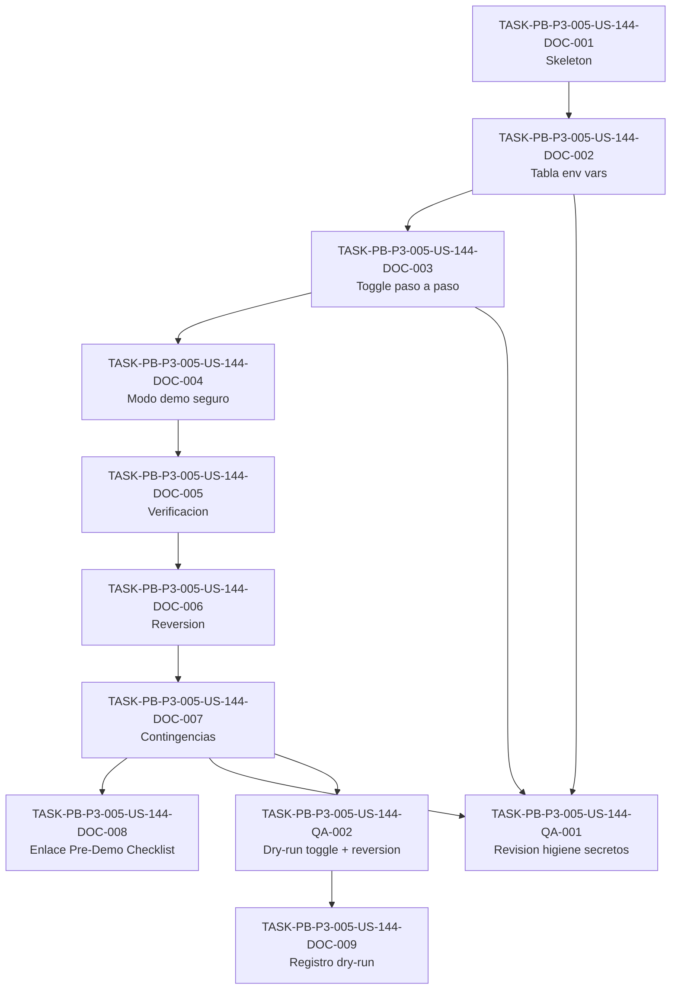

# Development Tasks — PB-P3-005 / US-144: Runbook del toggle `LLM_PROVIDER` y `AI_DEMO_MODE`

## 1. Metadata

| Field | Value |
|---|---|
| User Story ID | US-144 |
| Source User Story | `management/user-stories/US-144-toggle-mock-openai-provider.md` |
| Source Technical Specification | `management/technical-specs/P3/PB-P3-005/US-144-technical-spec.md` |
| Decision Resolution Artifact | No existe (no requerido) |
| Priority | P3 |
| Backlog ID | PB-P3-005 |
| Backlog Title | Toggle Mock/OpenAI documentado — Runbook del toggle `LLM_PROVIDER` y `AI_DEMO_MODE` |
| Backlog Execution Order | P3 #5 (quinto item del bloque P3 por posición: PB-P3-001..005) |
| User Story Position in Backlog Item | 1 de 1 (única US del backlog item) |
| Related User Stories in Backlog Item | US-144 |
| Epic | EPIC-DEMO-001 — Demo Readiness |
| Backlog Item Dependencies | PB-P0-009, PB-P0-010, PB-P0-011 (fundación IA), PB-P2-022 (deploy backend App Runner) |
| Feature | Runbook de toggle de proveedor IA (documentación operativa) |
| Module / Domain | Demo / AI (documentación operativa) |
| Backlog Alignment Status | Found |
| Task Breakdown Status | Ready for Sprint Planning |
| Created Date | 2026-07-08 |
| Last Updated | 2026-07-08 |

---

## 2. Source Validation

| Source | Found | Used | Notes |
|---|---|---|---|
| User Story | Yes | Yes | `US-144-toggle-mock-openai-provider.md`, Status: Approved with Minor Notes (2026-07-08). |
| Technical Specification | Yes | Yes | `US-144-technical-spec.md`, Status: Ready for Task Breakdown. Fuente primaria. |
| Decision Resolution Artifact | No | No | No existe; confirmado no requerido. |
| Product Backlog Prioritized | Yes | Yes | `management/artifacts/4-Product-Backlog-Prioritized.md`, PB-P3-005 confirmado (Related US: US-144). |
| ADRs | Yes | Yes | ADR-AI-001..004, ADR-DEVOPS-001 referenciados como contexto (no se reabren). |

---

## 3. Backlog Execution Context

### Parent Backlog Item

**PB-P3-005 — Toggle Mock/OpenAI documentado** (Runbook del toggle `LLM_PROVIDER` y `AI_DEMO_MODE`), bloque **P3 — Demo Polish / Academic Evidence**, Epic **EPIC-DEMO-001 — Demo Readiness**. MoSCoW: **Must Have**. Dependencias: PB-P0-009..011 (fundación IA) y PB-P2-022 (deploy App Runner). Entregable: **runbook operativo versionado en markdown** (`/management/artifacts/AI-Provider-Toggle-Runbook.md`), no software ejecutable.

### Execution Order Rationale

El orden de ejecución lo define la posición dentro del Product Backlog Prioritized, no el número de la User Story. Por posición de listado en el bloque P3, PB-P3-005 es el **quinto** item (PB-P3-001 #1, PB-P3-002 #2, PB-P3-003 #3, PB-P3-004 #4, PB-P3-005 #5), por lo que su orden de ejecución dentro de P3 es **#5**. El runbook documenta el mecanismo entregado por la fundación IA (PB-P0-009..011) y se apoya en el entorno Demo desplegado por PB-P2-022; por ello debe redactarse una vez que esas piezas existen o están especificadas. Nota de dependencia inversa: PB-P3-004 (US-143, Pre-Demo Checklist) referencia este runbook como acción correctiva del toggle IA.

### Related User Stories in Same Backlog Item

| User Story | Role in Backlog Item | Suggested Order |
|---|---|---|
| US-144 | Redactar el runbook del toggle `LLM_PROVIDER`/`AI_DEMO_MODE` y registrar el dry-run en Demo | 1 (única US del backlog item) |

---

## 4. Task Breakdown Summary

| Area | Number of Tasks | Notes |
|---|---:|---|
| Documentation / Traceability (DOC) | 9 | Núcleo: redacción del runbook (skeleton, tabla de env vars, toggle, modo demo seguro, verificación, reversión, contingencias), enlace desde Pre-Demo Checklist y registro del dry-run. |
| QA / Testing (QA) | 2 | Revisión documental de higiene de secretos (TS-03/VR-02) y dry-run del toggle + reversión en Demo (TS-01/TS-02, NT-01/NT-02). |
| Backend / Frontend / Database / API / AI / Security-impl / Seed / Observability-impl (OBS) | 0 | `No aplica` — mecanismo de toggle/providers/fallback propiedad de PB-P0-009..011; deploy propiedad de PB-P2-022. Ver Secciones 8–10. |
| **Total** | **11** | Rango: `TASK-PB-P3-005-US-144-DOC-001` … `TASK-PB-P3-005-US-144-DOC-009`. |

---

## 5. Traceability Matrix

| Acceptance Criterion | Technical Spec Section | Task IDs |
|---|---|---|
| AC-01: Runbook versionado en el repositorio | §6, §18 (estructura §1), §16 | TASK-PB-P3-005-US-144-DOC-001, TASK-PB-P3-005-US-144-DOC-008 |
| AC-02: Procedimiento de toggle documentado paso a paso | §6, §18 (estructura §2–§3), §11 | TASK-PB-P3-005-US-144-DOC-002, TASK-PB-P3-005-US-144-DOC-003, TASK-PB-P3-005-US-144-DOC-007 |
| AC-03: Activación del modo demo seguro documentada | §6, §18 (estructura §4), §15 | TASK-PB-P3-005-US-144-DOC-004 |
| AC-04: Verificación del cambio documentada | §6, §14, §18 (estructura §5) | TASK-PB-P3-005-US-144-DOC-005, TASK-PB-P3-005-US-144-DOC-007 |
| AC-05: Procedimiento de reversión documentado | §6, §18 (estructura §6), §15 | TASK-PB-P3-005-US-144-DOC-006 |
| AC-06: Procedimiento testeado en Demo (dry-run registrado) | §6, §13, §18 (estructura §8) | TASK-PB-P3-005-US-144-QA-002, TASK-PB-P3-005-US-144-DOC-009 |
| EC-01 / NT-02: OpenAI caído/sin cuota (fallback vs. toggle manual) | §11 (Fallback), §14, §18 (estructura §7) | TASK-PB-P3-005-US-144-DOC-007, TASK-PB-P3-005-US-144-QA-002 |
| EC-02 / NT-01: Env var mal configurada (fail-fast) | §11, §14, §18 (estructura §7) | TASK-PB-P3-005-US-144-DOC-007, TASK-PB-P3-005-US-144-QA-002 |
| VR-01: `LLM_PROVIDER` sólo `openai`/`mock` en MVP | §11 (Provider), §16 (fila `anthropic`) | TASK-PB-P3-005-US-144-DOC-002, TASK-PB-P3-005-US-144-DOC-007 |
| VR-02 / SEC-01..04 / TS-03: Higiene de secretos (sólo nombres) | §12 (Sensitive Data), §13 (Security Tests) | TASK-PB-P3-005-US-144-DOC-002, TASK-PB-P3-005-US-144-DOC-003, TASK-PB-P3-005-US-144-QA-001 |
| TS-01: Dry-run toggle `openai`→`mock` + determinismo Mock | §13 (Seed/Demo Tests) | TASK-PB-P3-005-US-144-QA-002 |
| TS-02: Dry-run reversión `mock`→`openai` + healthcheck/smoke | §13 (Seed/Demo Tests) | TASK-PB-P3-005-US-144-QA-002 |

Cada Acceptance Criterion mapea a al menos una tarea, y cada tarea mapea a al menos una sección del Technical Spec.

---

## 6. Development Tasks

### TASK-PB-P3-005-US-144-DOC-001 — Crear skeleton del runbook (título, propósito, estructura)

| Field | Value |
|---|---|
| Area | Documentation / Traceability |
| Type | Documentation |
| Priority | Must |
| Estimate | S |
| Depends On | — |
| Source AC(s) | AC-01 |
| Technical Spec Section(s) | §6 (AC-01), §18 (estructura §1), §16 |
| Backlog ID | PB-P3-005 |
| User Story ID | US-144 |
| Owner Role | DevOps |
| Status | To Do |

#### Objective

Crear el archivo markdown versionado `/management/artifacts/AI-Provider-Toggle-Runbook.md` con el título "Runbook del toggle `LLM_PROVIDER` y `AI_DEMO_MODE`", el propósito, la naturaleza (documentación operativa) y el esqueleto de las 8 secciones definidas en el Technical Spec §18.

#### Scope

##### Include

* Archivo en la ruta canónica propuesta `/management/artifacts/AI-Provider-Toggle-Runbook.md`.
* Título y sección de propósito/alcance operativo.
* Índice/encabezados de las 8 secciones: tabla de variables, toggle, modo demo seguro, verificación, reversión, contingencias, registro del dry-run.
* Nota de naturaleza: documentación, no software runtime; el mecanismo es propiedad de PB-P0-009..011.

##### Exclude

* Contenido detallado de cada sección (tareas DOC-002 a DOC-007).
* Cualquier implementación de código de toggle/providers/fallback.

#### Implementation Notes

Alinear títulos y numeración con la estructura del Technical Spec §18. Español LATAM neutral; identificadores técnicos en inglés. No incluir valores de secretos.

#### Acceptance Criteria Covered

AC-01 (existencia del runbook versionado con título correcto).

#### Definition of Done

- [ ] Archivo `/management/artifacts/AI-Provider-Toggle-Runbook.md` creado y versionado en el repo.
- [ ] Título y propósito presentes; nota de naturaleza documental incluida.
- [ ] Encabezados de las 8 secciones del Technical Spec §18 presentes como esqueleto.

---

### TASK-PB-P3-005-US-144-DOC-002 — Redactar la tabla de referencia de variables de entorno IA

| Field | Value |
|---|---|
| Area | Documentation / Traceability |
| Type | Documentation |
| Priority | Must |
| Estimate | S |
| Depends On | TASK-PB-P3-005-US-144-DOC-001 |
| Source AC(s) | AC-02 |
| Technical Spec Section(s) | §6 (AC-02), §18 (estructura §2), §12, §11 |
| Backlog ID | PB-P3-005 |
| User Story ID | US-144 |
| Owner Role | DevOps |
| Status | To Do |

#### Objective

Autorar la tabla de referencia de las 6 variables de entorno IA (`LLM_PROVIDER`, `OPENAI_API_KEY`, `OPENAI_MODEL`, `AI_TIMEOUT_MS`, `AI_DEMO_MODE`, `AI_USE_MOCK_FALLBACK`) con valores admitidos y uso, alineada a `docs/21` §13.1 (§513–§518).

#### Scope

##### Include

* Tabla `Variable | Valores | Uso` con las 6 env vars (sólo **nombres**, nunca valores de secretos).
* `LLM_PROVIDER`: `openai`/`mock` (`anthropic` = stub/futuro no funcional, VR-01).
* `OPENAI_API_KEY` descrito por nombre como secreto en AWS Secrets Manager; nunca al frontend (SEC-02/SEC-03).
* Cita explícita a `docs/21` §13.1 como fuente autoritativa.

##### Exclude

* Valores reales de secretos o del modelo específico.
* Procedimiento de toggle (DOC-003) y modo demo (DOC-004).

#### Implementation Notes

Tomar `docs/21` §13.1 (§513–§518) como fuente autoritativa y citarla. Marcar `anthropic` como valor futuro/stub. Higiene de secretos VR-02/SEC-01.

#### Acceptance Criteria Covered

AC-02 (referencia de variables); soporte a VR-01, VR-02, SEC-01..03.

#### Definition of Done

- [ ] Tabla de las 6 env vars presente con columnas Variable/Valores/Uso.
- [ ] `anthropic` marcado como stub/futuro; `OPENAI_API_KEY` sólo por nombre.
- [ ] Cita a `docs/21` §13.1 incluida; sin valores de secretos.

---

### TASK-PB-P3-005-US-144-DOC-003 — Redactar el procedimiento de toggle `openai`↔`mock` paso a paso

| Field | Value |
|---|---|
| Area | Documentation / Traceability |
| Type | Documentation |
| Priority | Must |
| Estimate | M |
| Depends On | TASK-PB-P3-005-US-144-DOC-002 |
| Source AC(s) | AC-02 |
| Technical Spec Section(s) | §6 (AC-02), §18 (estructura §3), §11 |
| Backlog ID | PB-P3-005 |
| User Story ID | US-144 |
| Owner Role | DevOps |
| Status | To Do |

#### Objective

Escribir el procedimiento paso a paso para conmutar `LLM_PROVIDER` entre `openai` y `mock` en App Runner (a nivel de servicio), indicando qué variables ajustar y en qué orden, incluyendo el rol de `AI_DEMO_MODE`, `AI_USE_MOCK_FALLBACK`, `OPENAI_MODEL`, `AI_TIMEOUT_MS` y `OPENAI_API_KEY` (por nombre).

#### Scope

##### Include

* Pasos numerados `openai`→`mock` y `mock`→`openai` en la configuración de env vars del servicio Demo (App Runner).
* Qué variables acompañan cada dirección y el orden de aplicación.
* Referencia a que `OPENAI_API_KEY` es secreto en Secrets Manager (por nombre).

##### Exclude

* Configuración del modo demo seguro (DOC-004) y verificación (DOC-005).
* Implementación del toggle (PB-P0-009..011) o del deploy (PB-P2-022).

#### Implementation Notes

No detallar la mecánica interna de selección/fallback (propiedad de PB-P0-009..011); documentar sólo la operación de env vars a nivel de servicio. Sin valores de secretos.

#### Acceptance Criteria Covered

AC-02 (procedimiento de toggle paso a paso).

#### Definition of Done

- [ ] Pasos numerados para ambas direcciones del toggle presentes.
- [ ] Rol de las env vars acompañantes documentado.
- [ ] Higiene de secretos preservada (sólo nombres).

---

### TASK-PB-P3-005-US-144-DOC-004 — Redactar la configuración del modo demo seguro

| Field | Value |
|---|---|
| Area | Documentation / Traceability |
| Type | Documentation |
| Priority | Must |
| Estimate | S |
| Depends On | TASK-PB-P3-005-US-144-DOC-003 |
| Source AC(s) | AC-03 |
| Technical Spec Section(s) | §6 (AC-03), §18 (estructura §4), §15 |
| Backlog ID | PB-P3-005 |
| User Story ID | US-144 |
| Owner Role | DevOps |
| Status | To Do |

#### Objective

Documentar la configuración del modo demo seguro según `docs/21` §13.2 (§520–§523): preferida `LLM_PROVIDER=openai` + `AI_USE_MOCK_FALLBACK=true`; contingencia offline `LLM_PROVIDER=mock` + `AI_DEMO_MODE=true`; CI/Tests `LLM_PROVIDER=mock`.

#### Scope

##### Include

* Sección con la configuración preferida y la contingencia offline, con su justificación.
* Cita a `docs/21` §13.2 (§522).
* Referencia cruzada al soporte de UC-DEMO-001 / NFR-DEMO-006 (demo reproducible).

##### Exclude

* Verificación (DOC-005) y contingencias diagnósticas (DOC-007).

#### Implementation Notes

Tomar `docs/21` §13.2 como fuente autoritativa. Distinguir claramente fallback controlado (config preferida) vs. modo offline total (contingencia).

#### Acceptance Criteria Covered

AC-03 (modo demo seguro documentado).

#### Definition of Done

- [ ] Configuración preferida y contingencia offline documentadas.
- [ ] Cita a `docs/21` §13.2 incluida.
- [ ] Mención de CI/Tests → `mock`.

---

### TASK-PB-P3-005-US-144-DOC-005 — Redactar la sección de verificación del cambio

| Field | Value |
|---|---|
| Area | Documentation / Traceability |
| Type | Documentation |
| Priority | Must |
| Estimate | S |
| Depends On | TASK-PB-P3-005-US-144-DOC-004 |
| Source AC(s) | AC-04 |
| Technical Spec Section(s) | §6 (AC-04), §14, §18 (estructura §5) |
| Backlog ID | PB-P3-005 |
| User Story ID | US-144 |
| Owner Role | DevOps |
| Status | To Do |

#### Objective

Escribir la sección de verificación: qué observar en logs (`provider`, `fallback_used`, `correlationId`), el comportamiento determinista del `MockAIProvider` (NFR-AI-008) y la verificación vía healthcheck/smoke del servicio.

#### Scope

##### Include

* Descripción de los campos de log a observar (`provider`, `fallback_used`, `correlationId`) según `docs/21` §13.3 (§530).
* Cómo confirmar el determinismo del Mock (NFR-AI-008).
* Cómo verificar vía healthcheck/smoke (endpoints existentes).
* Nota SEC-04: no se registran prompts/respuestas completas con datos sensibles.

##### Exclude

* Creación de nuevos logs o métricas (propiedad de PB-P0-009..011).
* Ejecución real del dry-run (QA-002).

#### Implementation Notes

Los campos de log ya son emitidos por la fundación IA; el runbook sólo los usa como criterio de verificación. No introducir herramientas nuevas de tracking.

#### Acceptance Criteria Covered

AC-04 (verificación documentada).

#### Definition of Done

- [ ] Sección de verificación con logs (`provider`/`fallback_used`/`correlationId`) presente.
- [ ] Determinismo del Mock (NFR-AI-008) y healthcheck/smoke documentados.
- [ ] Nota SEC-04 incluida.

---

### TASK-PB-P3-005-US-144-DOC-006 — Redactar el procedimiento de reversión

| Field | Value |
|---|---|
| Area | Documentation / Traceability |
| Type | Documentation |
| Priority | Must |
| Estimate | S |
| Depends On | TASK-PB-P3-005-US-144-DOC-005 |
| Source AC(s) | AC-05 |
| Technical Spec Section(s) | §6 (AC-05), §18 (estructura §6), §15 |
| Backlog ID | PB-P3-005 |
| User Story ID | US-144 |
| Owner Role | DevOps |
| Status | To Do |

#### Objective

Documentar los pasos para revertir la configuración de env vars al estado previo de forma segura y verificable tras un cambio de proveedor.

#### Scope

##### Include

* Pasos de reversión al estado anterior (env vars a nivel de servicio en App Runner).
* Verificación post-reversión (reutiliza los criterios de DOC-005: logs/healthcheck/smoke).
* Nota de coordinación (referencia cruzada) con el reset del entorno Demo (US-140/PB-P3-001), sin implementarlo.

##### Exclude

* Ejecución real de la reversión (QA-002).
* Modificación de datos (el runbook opera sólo sobre configuración).

#### Implementation Notes

La reversión restaura la configuración previa sin tocar datos. Documentar cómo confirmar que el estado previo quedó restablecido.

#### Acceptance Criteria Covered

AC-05 (procedimiento de reversión documentado).

#### Definition of Done

- [ ] Pasos de reversión al estado previo documentados.
- [ ] Verificación post-reversión referenciada.
- [ ] Referencia cruzada a US-140/PB-P3-001 como nota, sin scope creep.

---

### TASK-PB-P3-005-US-144-DOC-007 — Redactar la sección de escenarios de contingencia

| Field | Value |
|---|---|
| Area | Documentation / Traceability |
| Type | Documentation |
| Priority | Must |
| Estimate | M |
| Depends On | TASK-PB-P3-005-US-144-DOC-006 |
| Source AC(s) | AC-02, AC-04 |
| Technical Spec Section(s) | §11 (Fallback/Provider), §14, §18 (estructura §7) |
| Backlog ID | PB-P3-005 |
| User Story ID | US-144 |
| Owner Role | DevOps |
| Status | To Do |

#### Objective

Documentar los escenarios de contingencia: OpenAI caído/sin cuota (fallback automático vs. toggle manual, EC-01/NT-02) y variable de entorno mal configurada (fail-fast, EC-02/NT-01/VR-01), incluyendo cómo diagnosticarlos y corregirlos.

#### Scope

##### Include

* EC-01/NT-02: degradación a `MockAIProvider` con `AI_USE_MOCK_FALLBACK=true` (observable `fallback_used=true`) y cómo conmutar manualmente a `mock`.
* EC-02/NT-01/VR-01: comportamiento fail-fast ante `LLM_PROVIDER` inválido u otra env var mal formada, y cómo diagnosticarlo antes de la demo.
* Cómo distinguir fallback automático de toggle manual en logs.

##### Exclude

* Implementación de la validación/fallback (referida a PB-P0-009/011).
* Failover automático a Anthropic (Non-Goal).

#### Implementation Notes

Documentar por separado fallback automático y toggle manual para evitar confusión (Riesgo §17). Referir la validación de configuración a la fundación IA; el runbook sólo documenta cómo detectar y corregir.

#### Acceptance Criteria Covered

Soporte a AC-02/AC-04; cubre EC-01, EC-02, NT-01, NT-02, VR-01.

#### Definition of Done

- [ ] Escenario OpenAI caído/sin cuota documentado (fallback + toggle manual).
- [ ] Escenario env var mal configurada documentado (fail-fast + diagnóstico).
- [ ] Distinción fallback vs. toggle manual en logs documentada.

---

### TASK-PB-P3-005-US-144-DOC-008 — Enlazar el runbook desde el Pre-Demo Checklist (US-143)

| Field | Value |
|---|---|
| Area | Documentation / Traceability |
| Type | Documentation |
| Priority | Must |
| Estimate | XS |
| Depends On | TASK-PB-P3-005-US-144-DOC-007 |
| Source AC(s) | AC-01 |
| Technical Spec Section(s) | §6 (AC-01), §18 (archivos impactados), §16 |
| Backlog ID | PB-P3-005 |
| User Story ID | US-144 |
| Owner Role | DevOps |
| Status | To Do |

#### Objective

Referenciar el runbook desde el Pre-Demo Checklist (US-143, `/management/artifacts/Pre-Demo-Checklist.md`) como acción correctiva del toggle IA, cerrando la dependencia inversa PB-P3-004 → PB-P3-005.

#### Scope

##### Include

* Enlace desde el Pre-Demo Checklist al runbook como acción correctiva del toggle IA.

##### Exclude

* Rediseño del Pre-Demo Checklist (propiedad de US-143/PB-P3-004).
* Cualquier cambio funcional al checklist más allá del enlace.

#### Implementation Notes

Si el archivo del Pre-Demo Checklist aún no existe en el momento de ejecución, dejar la referencia lista y coordinar con US-143; registrar la nota de alineación (§16). Editar sólo el enlace.

#### Acceptance Criteria Covered

AC-01 (referenciado desde el Pre-Demo Checklist).

#### Definition of Done

- [ ] Enlace al runbook agregado en el Pre-Demo Checklist (US-143) como acción correctiva.
- [ ] Sin cambios funcionales adicionales al checklist.

---

### TASK-PB-P3-005-US-144-QA-001 — Revisión documental de higiene de secretos

| Field | Value |
|---|---|
| Area | QA / Testing |
| Type | Review |
| Priority | Must |
| Estimate | XS |
| Depends On | TASK-PB-P3-005-US-144-DOC-002, TASK-PB-P3-005-US-144-DOC-003, TASK-PB-P3-005-US-144-DOC-007 |
| Source AC(s) | AC-02 |
| Technical Spec Section(s) | §12 (Sensitive Data), §13 (Security Tests) |
| Backlog ID | PB-P3-005 |
| User Story ID | US-144 |
| Owner Role | QA |
| Status | To Do |

#### Objective

Revisar el runbook (TS-03/VR-02) para confirmar que referencia sólo **nombres** de variables y no incluye ningún valor de secreto, verificando además la advertencia SEC-03 (`OPENAI_API_KEY` nunca al frontend) y SEC-04.

#### Scope

##### Include

* Revisión de todo el runbook: sólo nombres de variables, sin valores de secretos (SEC-01/VR-02).
* Verificar advertencia SEC-03 (secreto nunca al frontend) y nota SEC-04 (no loguear prompts/respuestas sensibles).

##### Exclude

* Ejecución del dry-run (QA-002).
* Pruebas de software automatizadas de producto.

#### Implementation Notes

Revisión previa al merge. Bloquear el merge si aparece cualquier valor de secreto. Sin herramientas nuevas.

#### Acceptance Criteria Covered

Cubre TS-03/VR-02/SEC-01..04; soporte documental a AC-02.

#### Definition of Done

- [ ] Confirmado que no hay valores de secretos en el runbook.
- [ ] Advertencia SEC-03 y nota SEC-04 verificadas presentes.
- [ ] Resultado de la revisión registrado antes del merge.

---

### TASK-PB-P3-005-US-144-QA-002 — Dry-run del toggle y la reversión en el entorno Demo

| Field | Value |
|---|---|
| Area | QA / Testing |
| Type | Test |
| Priority | Must |
| Estimate | M |
| Depends On | TASK-PB-P3-005-US-144-DOC-001, TASK-PB-P3-005-US-144-DOC-002, TASK-PB-P3-005-US-144-DOC-003, TASK-PB-P3-005-US-144-DOC-004, TASK-PB-P3-005-US-144-DOC-005, TASK-PB-P3-005-US-144-DOC-006, TASK-PB-P3-005-US-144-DOC-007 |
| Source AC(s) | AC-06 |
| Technical Spec Section(s) | §13 (Seed/Demo Tests), §6 (AC-06) |
| Backlog ID | PB-P3-005 |
| User Story ID | US-144 |
| Owner Role | QA |
| Status | To Do |

#### Objective

Ejecutar el runbook como ensayo en el entorno Demo (App Runner): toggle `openai`→`mock` (TS-01, determinismo del Mock NFR-AI-008), reversión `mock`→`openai` (TS-02, healthcheck/smoke), y comprobar los escenarios negativos NT-01 (`LLM_PROVIDER` inválido, fail-fast) y NT-02 (OpenAI caído, `fallback_used=true`).

#### Scope

##### Include

* Aplicar el toggle `openai`→`mock`→`openai` sobre las env vars existentes del servicio Demo (App Runner), como parte del dry-run.
* Verificar determinismo del `MockAIProvider` (TS-01/NFR-AI-008) y healthcheck/smoke post-reversión (TS-02).
* Comprobar NT-01 (diagnóstico de valor inválido) y NT-02 (degradación a Mock observable en logs).

##### Exclude

* Implementar el toggle/providers/fallback (PB-P0-009..011) o el deploy (PB-P2-022).
* Redacción del registro del dry-run en el runbook (DOC-009).

#### Implementation Notes

El dry-run usa el entorno Demo existente; el ajuste de env vars en App Runner se realiza como parte de la corrida (sin tarea OPS separada). Correlacionar solicitudes con `correlationId` para leer `provider`/`fallback_used`.

#### Acceptance Criteria Covered

AC-06 (procedimiento testeado en Demo); cubre TS-01, TS-02, NT-01, NT-02, EC-01, EC-02.

#### Definition of Done

- [ ] Toggle `openai`→`mock`→`openai` ejecutado en Demo end-to-end.
- [ ] Determinismo del Mock y healthcheck/smoke verificados.
- [ ] NT-01 y NT-02 comprobados y evidencia capturada para DOC-009.

---

### TASK-PB-P3-005-US-144-DOC-009 — Registrar el resultado del dry-run en el runbook

| Field | Value |
|---|---|
| Area | Documentation / Traceability |
| Type | Documentation |
| Priority | Must |
| Estimate | XS |
| Depends On | TASK-PB-P3-005-US-144-QA-002 |
| Source AC(s) | AC-06 |
| Technical Spec Section(s) | §6 (AC-06), §18 (estructura §8) |
| Backlog ID | PB-P3-005 |
| User Story ID | US-144 |
| Owner Role | DevOps |
| Status | To Do |

#### Objective

Registrar en el propio runbook (sección "Registro del dry-run") el ensayo ejecutado: fecha, responsable, secuencia (`openai`→`mock`→`openai`), resultado por paso y confirmación end-to-end.

#### Scope

##### Include

* Sección de registro del dry-run con fecha, responsable, secuencia y resultado por paso.
* Confirmación end-to-end del toggle y la reversión.

##### Exclude

* Ejecución del dry-run (QA-002).
* Valores de secretos en la evidencia.

#### Implementation Notes

Basarse en la evidencia capturada en QA-002. No incluir valores de secretos ni prompts/respuestas sensibles (SEC-04).

#### Acceptance Criteria Covered

AC-06 (dry-run registrado).

#### Definition of Done

- [ ] Sección de registro del dry-run completada en el runbook.
- [ ] Secuencia `openai`→`mock`→`openai` y resultado por paso documentados.
- [ ] Confirmación end-to-end registrada; sin secretos.

---

## 7. Required QA Tasks

| Task ID | Test Type | Purpose |
|---|---|---|
| TASK-PB-P3-005-US-144-QA-001 | Revisión documental | Higiene de secretos: sólo nombres de variables (TS-03/VR-02/SEC-01..04). |
| TASK-PB-P3-005-US-144-QA-002 | Dry-run / Manual | Toggle `openai`→`mock`→`openai` en Demo, determinismo Mock (TS-01), healthcheck/smoke (TS-02), NT-01/NT-02. |

---

## 8. Required Security Tasks

`No aplica` (tareas de seguridad runtime). La única superficie de seguridad es **documental** (higiene de secretos, VR-02/SEC-01..04) y se cubre en `TASK-PB-P3-005-US-144-DOC-002`, `TASK-PB-P3-005-US-144-DOC-003` y la revisión `TASK-PB-P3-005-US-144-QA-001`. No hay autenticación, autorización, endpoints ni escenarios 401/403 que diseñar.

---

## 9. Required Seed / Demo Tasks

`No aplica`. Esta historia no crea ni modifica datos seed. El dry-run (`TASK-PB-P3-005-US-144-QA-002`) depende de que el seed demo exista y sea reproducible (NFR-AI-008), pero no lo altera.

---

## 10. Observability / Audit Tasks

`No aplica` (observabilidad-implementación). Los campos de log (`provider`, `fallback_used`, `correlationId`) ya son emitidos por la fundación IA (PB-P0-009..011). La verificación por observación de logs se documenta en `TASK-PB-P3-005-US-144-DOC-005` y se ejerce en el dry-run `TASK-PB-P3-005-US-144-QA-002`. No se crean logs, métricas ni `AdminAction` nuevos.

---

## 11. Documentation / Traceability Tasks

| Task ID | Document / Artifact | Purpose |
|---|---|---|
| TASK-PB-P3-005-US-144-DOC-001 | `/management/artifacts/AI-Provider-Toggle-Runbook.md` | Skeleton: título, propósito, estructura de 8 secciones. |
| TASK-PB-P3-005-US-144-DOC-002 | Runbook (§2) | Tabla de referencia de las 6 env vars IA. |
| TASK-PB-P3-005-US-144-DOC-003 | Runbook (§3) | Procedimiento de toggle `openai`↔`mock` paso a paso. |
| TASK-PB-P3-005-US-144-DOC-004 | Runbook (§4) | Configuración del modo demo seguro (preferida + contingencia). |
| TASK-PB-P3-005-US-144-DOC-005 | Runbook (§5) | Sección de verificación (logs, Mock determinista, healthcheck/smoke). |
| TASK-PB-P3-005-US-144-DOC-006 | Runbook (§6) | Procedimiento de reversión. |
| TASK-PB-P3-005-US-144-DOC-007 | Runbook (§7) | Escenarios de contingencia (OpenAI caído; env var mal configurada). |
| TASK-PB-P3-005-US-144-DOC-008 | `/management/artifacts/Pre-Demo-Checklist.md` (US-143) | Enlace al runbook como acción correctiva del toggle IA. |
| TASK-PB-P3-005-US-144-DOC-009 | Runbook (§8) | Registro del resultado del dry-run. |

---

## 12. Dependency Graph

---

## 13. Suggested Implementation Order

### Phase 1 — Foundation

* TASK-PB-P3-005-US-144-DOC-001 — Skeleton del runbook.
* TASK-PB-P3-005-US-144-DOC-002 — Tabla de referencia de env vars.

### Phase 2 — Core Implementation

* TASK-PB-P3-005-US-144-DOC-003 — Procedimiento de toggle.
* TASK-PB-P3-005-US-144-DOC-004 — Modo demo seguro.
* TASK-PB-P3-005-US-144-DOC-005 — Verificación.
* TASK-PB-P3-005-US-144-DOC-006 — Reversión.
* TASK-PB-P3-005-US-144-DOC-007 — Contingencias.
* TASK-PB-P3-005-US-144-DOC-008 — Enlace desde Pre-Demo Checklist.

### Phase 3 — Validation / Security / QA

* TASK-PB-P3-005-US-144-QA-001 — Revisión documental de higiene de secretos.
* TASK-PB-P3-005-US-144-QA-002 — Dry-run del toggle y la reversión en Demo.

### Phase 4 — Documentation / Review

* TASK-PB-P3-005-US-144-DOC-009 — Registro del resultado del dry-run en el runbook.

---

## 14. Risks & Mitigations

| Risk | Impact | Mitigation | Related Task |
|---|---|---|---|
| El runbook expone accidentalmente un valor de secreto | Alto (fuga de credenciales) | Sólo nombres de variables (VR-02/SEC-01); revisión documental antes del merge. | DOC-002, DOC-003, QA-001 |
| Desincronización con `docs/21` §13 (nombres/valores de env vars) | Medio (procedimiento incorrecto) | Tomar `docs/21` §13.1/§13.2 como fuente autoritativa y citarla explícitamente. | DOC-002, DOC-004 |
| El dry-run no se ejecuta o no se registra | Medio (AC-06 incompleto) | Tareas explícitas de ejecución y de registro del dry-run `openai`→`mock`→`openai`. | QA-002, DOC-009 |
| Scope creep hacia implementar toggle/UI/failover automático | Alto (invade PB-P0-009..011) | Non-goals explícitos (Sección 15); el runbook sólo documenta el mecanismo existente. | Todas |
| Confusión entre fallback automático y toggle manual | Bajo/Medio | Documentar ambos por separado y cómo distinguirlos en logs (`fallback_used`). | DOC-007, QA-002 |
| El Pre-Demo Checklist (US-143) aún no existe al enlazar | Bajo | Coordinar con US-143; dejar la referencia lista y registrar nota de alineación. | DOC-008 |

---

## 15. Out of Scope Confirmation

No se debe implementar como parte de esta User Story:

* Implementación del toggle o de los providers (`LLMProvider`, `OpenAIProvider`, `MockAIProvider`): propiedad de PB-P0-009..011.
* Implementación del fallback automático o de la validación de configuración (fail-fast): PB-P0-009/011.
* El deploy del backend en App Runner: PB-P2-022 (el dry-run usa el entorno Demo existente).
* UI de selección de proveedor (sin selector dinámico, FR-AI-016).
* Cualquier endpoint, modelo de base de datos, migración, seed o invocación de IA.
* Promoción de `AnthropicProvider` a funcional o failover automático a Anthropic (permanece stub/futuro, ADR-AI-004).
* Creación de logs, métricas o `AdminAction` nuevos.

---

## 16. Readiness for Sprint Planning

| Check | Status |
|---|---|
| Product Backlog mapping found | Pass |
| Every AC maps to tasks | Pass |
| Technical Spec used when available | Pass |
| QA tasks included | Pass |
| Security tasks included if applicable | N/A (documental; cubierto en DOC/QA) |
| Seed/demo tasks included if applicable | N/A (no crea/modifica seed) |
| Observability tasks included if applicable | N/A (verificación en DOC-005/QA-002) |
| Documentation tasks included if applicable | Pass |
| Task dependencies clear | Pass |
| Tasks small enough | Pass (todas ≤ M) |
| Ready for Sprint Planning | Yes |

---

## 17. Final Recommendation

`Ready for Sprint Planning`

El desglose de tareas de US-144 (PB-P3-005) está completo y trazable. La historia es un entregable de **documentación/runbook operativo**: el núcleo son 9 tareas DOC (skeleton, tabla de env vars, toggle, modo demo seguro, verificación, reversión, contingencias, enlace desde Pre-Demo Checklist y registro del dry-run) más 2 tareas QA (revisión documental de higiene de secretos y dry-run del toggle/reversión en Demo). Cada Acceptance Criterion (AC-01..06), cada Edge Case (EC-01/EC-02), cada Validation Rule (VR-01/VR-02) y cada escenario de prueba (TS-01..03, NT-01/NT-02) mapea a al menos una tarea, y cada tarea mapea a al menos una sección del Technical Spec. No se generan tareas de Frontend, Backend, Database, API, AI-invocación, seguridad-runtime, seed ni observabilidad-implementación, pues el mecanismo de toggle/providers/fallback es propiedad de PB-P0-009..011 y el deploy de PB-P2-022. No existen bloqueadores.
