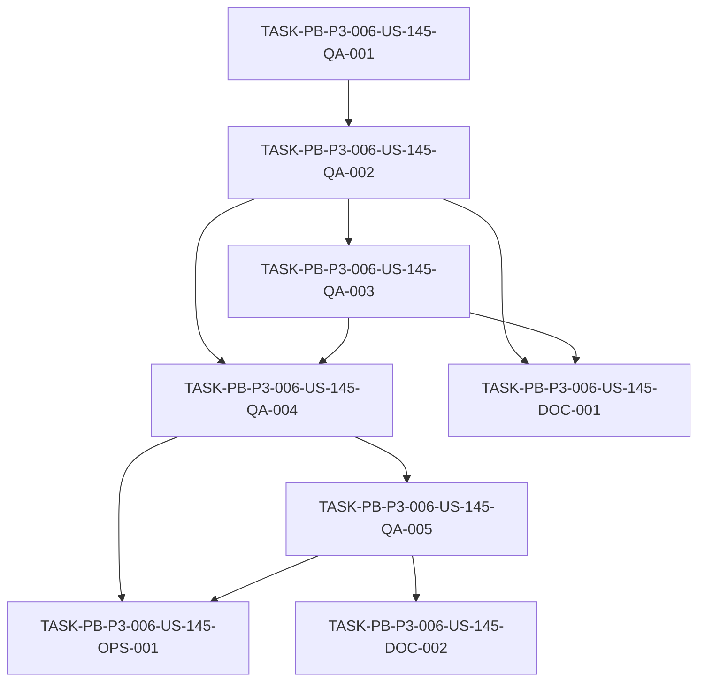

# Development Tasks — PB-P3-006 / US-145: Garantía verificada de `BookingIntent.confirmed_intent` + reseña visible del vendor demo principal

## 1. Metadata

| Field | Value |
|---|---|
| User Story ID | US-145 |
| Source User Story | `management/user-stories/US-145-ensure-confirmed-booking-visible.md` |
| Source Technical Specification | `management/technical-specs/P3/PB-P3-006/US-145-technical-spec.md` |
| Decision Resolution Artifact | No aplica — no existe artefacto de resolución de decisiones para US-145 (confirmado). |
| Priority | P3 |
| Backlog ID | PB-P3-006 |
| Backlog Title | Seed visible con BookingIntent + reseña demo (Seed garantiza ≥1 `confirmed_intent` + ≥1 reseña verificada para vendor demo) |
| Backlog Execution Order | P3 #6 (sexto ítem P3; posición PB-P3-001..006 por orden de aparición en el backlog priorizado) |
| User Story Position in Backlog Item | 1 de 1 (US-145 es la única User Story del ítem) |
| Related User Stories in Backlog Item | US-145 (única) |
| Epic | EPIC-DEMO-001 / EPIC-SEED-001 |
| Backlog Item Dependencies | PB-P0-014 (US-085 runner, US-086 reset, US-087 evento, US-088 fixtures BookingIntent/Review) |
| Feature | Demo readiness guard — seed verification |
| Module / Domain | `seed-demo` / QA (verificación automatizada post-seed, solo lectura) |
| Backlog Alignment Status | Found |
| Task Breakdown Status | Ready for Sprint Planning |
| Created Date | 2026-07-08 |
| Last Updated | 2026-07-08 |

---

## 2. Source Validation

| Source | Found | Used | Notes |
|---|---|---|---|
| User Story | Yes | Yes | `US-145-ensure-confirmed-booking-visible.md`, Status: Approved with Minor Notes. AC-01..04, EC-01/02, VR-01..03, TS-01..03, NT-01..03, SD-T-01/02. |
| Technical Specification | Yes | Yes | `US-145-technical-spec.md`, Status: Ready for Task Breakdown. Fuente primaria. |
| Decision Resolution Artifact | No | No | No existe para US-145 (confirmado). |
| Product Backlog Prioritized | Yes | Yes | `management/artifacts/4-Product-Backlog-Prioritized.md`, PB-P3-006 (línea 2262). |
| ADRs | Yes | Yes | ADR-TEST-001 (Vitest + Supertest) referenciado por el Tech Spec §5/§13/§18. |

---

## 3. Backlog Execution Context

### Parent Backlog Item

**PB-P3-006 — "Seed visible con BookingIntent + reseña demo"** (`management/artifacts/4-Product-Backlog-Prioritized.md`, línea 2262).

- Priority: **P3**. MoSCoW: **Must Have**. Type: **Demo**. Primary Role: **System**.
- Epic: **EPIC-DEMO-001 / EPIC-SEED-001**.
- Description: validar que el seed (PB-P0-014) incluye explícitamente ≥1 `BookingIntent.confirmed_intent` visible en demo y ≥1 reseña verificada del vendor demo principal.
- Acceptance Summary: Verificación automatizada del seed · Vendor demo principal con reseña · Mapeado al guion.
- Dependencies: **PB-P0-014**.
- Traceability: Decisión PO US-145.
- Related User Stories: US-145 (única).

### Execution Order Rationale

El orden de ejecución se deriva de la posición de los ítems P3 en el backlog priorizado: PB-P3-001 (reset), PB-P3-002 (monitoring), PB-P3-003 (guion de demo), PB-P3-004 (checklist pre-demo), PB-P3-005 (toggle Mock/OpenAI) y **PB-P3-006 (esta historia)**. Por posición, PB-P3-006 es el **sexto** ítem P3 → **Execution Order P3 #6**. El User Story ID no define el orden; lo define el Backlog ID.

La historia se trabaja después de que su dependencia dura **PB-P0-014 (US-085/086/087/088)** ya está entregada (fixtures de `BookingIntent`/`Review`, runner CLI `npm run seed`, endpoint de reset y evento demo): US-145 no puede verificar el estado post-seed hasta que el seed exista. Aporta además la garantía ejecutable que respalda el guion de demo de **PB-P3-003 (US-142)**.

### Related User Stories in Same Backlog Item

| User Story | Role in Backlog Item | Suggested Order |
|---|---|---|
| US-145 | Verificación / garantía de demo readiness (única historia del ítem) | 1 |

---

## 4. Task Breakdown Summary

| Area | Number of Tasks | Notes |
|---|---:|---|
| Product / Analysis (PO) | 0 | No aplica — alcance ya cerrado en Tech Spec y US aprobado. |
| Backend (BE) | 0 | No aplica — sin use cases de negocio nuevos (Tech Spec §7). |
| Frontend (FE) | 0 | No aplica — sin UI (Tech Spec §8). |
| API Contract (API) | 0 | No aplica — sin endpoints (Tech Spec §9). |
| Database / Prisma (DB) | 0 | No aplica — solo lectura, sin schema/migraciones (Tech Spec §10). |
| AI / PromptOps (AI) | 0 | No aplica — sin IA (Tech Spec §11). |
| Security / Authorization (SEC) | 0 | No aplica — solo lectura sobre datos seed ficticios (Tech Spec §12). |
| QA / Testing (QA) | 5 | Núcleo de la historia: verificación post-seed + guardias negativas. |
| Seed / Demo (SEED) | 0 | No se crean/modifican fixtures (propiedad de US-088); la coordinación de pinning es una nota DOC. |
| DevOps / Environment (OPS) | 1 | Integrar la suite como quality gate post-seed en CI. |
| Observability / Audit (OBS) | 0 | No aplica — mensajes de fallo cubiertos por las tareas QA (Tech Spec §14). |
| Documentation / Traceability (DOC) | 2 | Mapeo al guion US-142 + nota de coordinación US-088. |
| **Total** | **8** | |

---

## 5. Traceability Matrix

| Acceptance Criterion / Scenario | Technical Spec Section | Task IDs |
|---|---|---|
| AC-01 — `confirmed_intent` visible del vendor demo principal | §6, §7, §13 (TS-01), §15, §18 | TASK-PB-P3-006-US-145-QA-001, TASK-PB-P3-006-US-145-QA-002 |
| AC-02 — Reseña verificada del vendor demo principal | §6, §7, §13 (TS-02), §15, §18 | TASK-PB-P3-006-US-145-QA-001, TASK-PB-P3-006-US-145-QA-003 |
| AC-03 — Falla (rojo) ante ausencia; sin falso verde | §6, §7 (Error Handling), §13 (SD-T-01/02, NT-01..03), §14, §18 | TASK-PB-P3-006-US-145-QA-004, TASK-PB-P3-006-US-145-QA-005 |
| AC-04 — Mapeo al guion de demo (US-142) | §6, §13 (TS-03), §15, §18 | TASK-PB-P3-006-US-145-DOC-001 |
| EC-01 — Seed no cargado / incompleto | §13 (SD-T-02, NT-01/02), §17 | TASK-PB-P3-006-US-145-QA-005 |
| EC-02 — Reseña presente pero no verificada | §13 (NT-03), §7 (Validation Rules) | TASK-PB-P3-006-US-145-QA-005 |
| VR-01 — ≥1 `confirmed_intent` del vendor demo | §7 (Validation Rules), §15 | TASK-PB-P3-006-US-145-QA-002 |
| VR-02 — ≥1 reseña verificada del vendor demo | §7 (Validation Rules), §15 | TASK-PB-P3-006-US-145-QA-003 |
| VR-03 — Sin verde si VR-01/VR-02 fallan | §7, §13 | TASK-PB-P3-006-US-145-QA-004, TASK-PB-P3-006-US-145-QA-005 |
| TS-01 — Integration: `confirmed_intent` post-seed | §13 (Integration Tests) | TASK-PB-P3-006-US-145-QA-002 |
| TS-02 — Integration: reseña verificada post-seed | §13 (Integration Tests) | TASK-PB-P3-006-US-145-QA-003 |
| TS-03 — Documentation/Review: mapeo al guion | §13 (Seed/Demo Tests), §16 | TASK-PB-P3-006-US-145-DOC-001 |
| NT-01 — Sin `confirmed_intent` → falla | §13 (Negative Tests) | TASK-PB-P3-006-US-145-QA-005 |
| NT-02 — Sin reseña verificada → falla | §13 (Negative Tests) | TASK-PB-P3-006-US-145-QA-005 |
| NT-03 — Reseña `hidden`/`removed`/sin link → no verificada | §13 (Negative Tests) | TASK-PB-P3-006-US-145-QA-005 |
| SD-T-01 — Guardia verde solo si ambas condiciones | §13 (Seed/Demo Tests) | TASK-PB-P3-006-US-145-QA-004 |
| SD-T-02 — Seed incompleto → rojo accionable | §13 (Seed/Demo Tests) | TASK-PB-P3-006-US-145-QA-005 |
| CI quality gate post-seed | §13 (CI Checks), §17 | TASK-PB-P3-006-US-145-OPS-001 |
| Coordinación pinning US-088 (no bloqueante) | §15 (Boundary US-088), §16, §17 | TASK-PB-P3-006-US-145-DOC-002 |

Cobertura: todos los AC (AC-01..04), EC-01/02, VR-01..03, TS-01..03, NT-01..03 y SD-T-01/02 mapean a ≥1 tarea; toda tarea mapea a ≥1 sección del Tech Spec.

---

## 6. Development Tasks

### TASK-PB-P3-006-US-145-QA-001 — Anclaje determinista del vendor demo principal para la suite de verificación

| Field | Value |
|---|---|
| Area | QA / Testing |
| Type | Test |
| Priority | Must |
| Estimate | S |
| Depends On | — |
| Source AC(s) | AC-01, AC-02 (setup común) |
| Technical Spec Section(s) | §7 (DTOs/Schemas, Repository), §15 (Queries por vendor), §18 (Orden recomendado #1) |
| Backlog ID | PB-P3-006 |
| User Story ID | US-145 |
| Owner Role | QA |
| Status | To Do |

#### Objective

Crear el andamiaje de la suite `*.demo-readiness.test.ts` en `apps/api/src/modules/seed-demo/**` y resolver el `vendor_profile_id` del vendor demo principal (SEED-USER-003 / SEED-VENDOR-001 `approved`) mediante un **ancla determinista de seed** (helpers existentes namespace `seed:*` de US-085/US-088), sin hardcode frágil.

#### Scope

##### Include

- Estructura de la suite de integración de solo lectura (setup Vitest + acceso a DB con seed aplicado, ADR-TEST-001).
- Resolución del `vendor_profile_id` del vendor demo principal reutilizando helpers deterministas ya existentes (namespace `seed:*`).
- Acceso de solo lectura vía `PrismaClient` o repositorios existentes (`vendorProfile`, `bookingIntent`, `review`).

##### Exclude

- Reimplementar o modificar fixtures de US-088 (`booking-intents.fixture.ts`, `reviews.fixture.ts`).
- Cualquier escritura sobre `BookingIntent`/`Review`/`VendorProfile`.
- Hardcodear un `vendor_profile_id` literal.

#### Implementation Notes

- Ubicación sugerida: `apps/api/src/modules/seed-demo/__tests__/demo-readiness.test.ts` (consistente con la convención de US-088 `apps/api/src/modules/seed-demo/fixtures/__tests__/`).
- Si el helper de ancla no existe con la granularidad requerida, resolver por criterio determinista estable (persona `approved` ancla de SEED-USER-003), documentando el criterio; no introducir un valor literal frágil.

#### Acceptance Criteria Covered

- AC-01, AC-02 (precondición de resolución del vendor demo).

#### Definition of Done

- [ ] Existe la suite `*.demo-readiness.test.ts` en `apps/api/src/modules/seed-demo/**` con setup de solo lectura.
- [ ] El `vendor_profile_id` del vendor demo principal se resuelve por ancla determinista (namespace `seed:*`), no por literal.
- [ ] La suite corre contra la DB con seed aplicado sin mutar estado.

---

### TASK-PB-P3-006-US-145-QA-002 — Verificación de `confirmed_intent` del vendor demo principal (TS-01)

| Field | Value |
|---|---|
| Area | QA / Testing |
| Type | Test |
| Priority | Must |
| Estimate | S |
| Depends On | TASK-PB-P3-006-US-145-QA-001 |
| Source AC(s) | AC-01 (VR-01, TS-01) |
| Technical Spec Section(s) | §6 (AC-01), §7 (Validation Rules), §13 (Integration Tests TS-01), §15 (query 1), §18 (query 1) |
| Backlog ID | PB-P3-006 |
| User Story ID | US-145 |
| Owner Role | QA |
| Status | To Do |

#### Objective

Implementar la aserción de integración que verifica que, tras el seed, existe **≥1 `BookingIntent` con `status='confirmed_intent'`, `is_seed=true`, `is_simulated=true`** asociado al vendor demo principal.

#### Scope

##### Include

- Consulta de solo lectura: `prisma.bookingIntent.count({ where: { status: 'confirmed_intent', is_seed: true, is_simulated: true, vendor_profile_id: <vendorDemoPrincipalId> } })` → assertion `≥ 1`.
- Verde solo si el conteo es ≥ 1 (VR-01).

##### Exclude

- Implementar `ConfirmBookingIntentUseCase` o cualquier flujo de negocio para producir el intent.
- Generación manual de datos fuera del seed.

#### Implementation Notes

- Reutilizar el ancla del vendor de QA-001.
- La aserción no debe depender de conteos globales de US-088; se filtra por el vendor demo principal.

#### Acceptance Criteria Covered

- AC-01, VR-01, TS-01.

#### Definition of Done

- [ ] La aserción pasa cuando el vendor demo principal tiene ≥1 `confirmed_intent` (`is_seed=true`, `is_simulated=true`).
- [ ] La aserción falla si el conteo es 0.
- [ ] Solo lectura; sin escrituras ni transacciones.

---

### TASK-PB-P3-006-US-145-QA-003 — Verificación de reseña verificada del vendor demo principal (TS-02)

| Field | Value |
|---|---|
| Area | QA / Testing |
| Type | Test |
| Priority | Must |
| Estimate | S |
| Depends On | TASK-PB-P3-006-US-145-QA-002 |
| Source AC(s) | AC-02 (VR-02, TS-02) |
| Technical Spec Section(s) | §6 (AC-02), §7 (Validation Rules), §13 (Integration Tests TS-02), §15 (query 2), §18 (query 2) |
| Backlog ID | PB-P3-006 |
| User Story ID | US-145 |
| Owner Role | QA |
| Status | To Do |

#### Objective

Implementar la aserción de integración que verifica que, tras el seed, existe **≥1 `Review` `published` (`is_seed=true`, `rating 1..5`)** ligada a un `confirmed_intent` del vendor demo principal (BR-REVIEW-001, BR-REVIEW-003, BR-SEED-007).

#### Scope

##### Include

- Consulta de solo lectura: `prisma.review.count({ where: { status: 'published', is_seed: true, rating: { gte: 1, lte: 5 }, vendor_profile_id: <vendorDemoPrincipalId>, booking_intent: { status: 'confirmed_intent' } } })` (o filtro equivalente por `booking_intent_id ∈ confirmed_intent del vendor`) → assertion `≥ 1`.
- Definición de "reseña verificada" = `published` + `booking_intent_id` → `confirmed_intent` del mismo vendor + `rating 1..5` (VR-02).

##### Exclude

- Implementar `CreateReviewUseCase` / `HideReviewUseCase` o cualquier flujo de negocio.
- Introducir un nuevo concepto de "reseña verificada".

#### Implementation Notes

- La reseña debe estar ligada a uno de los `confirmed_intent` del vendor demo verificados en QA-002 (encadenamiento de invariantes).

#### Acceptance Criteria Covered

- AC-02, VR-02, TS-02.

#### Definition of Done

- [ ] La aserción pasa cuando existe ≥1 reseña `published` (`rating 1..5`) ligada a un `confirmed_intent` del vendor demo.
- [ ] La aserción falla si el conteo es 0.
- [ ] Solo lectura; sin escrituras.

---

### TASK-PB-P3-006-US-145-QA-004 — Guardia agregada de demo readiness: verde solo si ambas condiciones (SD-T-01)

| Field | Value |
|---|---|
| Area | QA / Testing |
| Type | Test |
| Priority | Must |
| Estimate | XS |
| Depends On | TASK-PB-P3-006-US-145-QA-002, TASK-PB-P3-006-US-145-QA-003 |
| Source AC(s) | AC-03 (VR-03, SD-T-01) |
| Technical Spec Section(s) | §6 (AC-03), §7 (Error Handling), §13 (Seed/Demo Tests SD-T-01) |
| Backlog ID | PB-P3-006 |
| User Story ID | US-145 |
| Owner Role | QA |
| Status | To Do |

#### Objective

Componer la guardia agregada de demo readiness que reporta **verde solo si ambas condiciones (VR-01 y VR-02) se cumplen** para el vendor demo principal, y define la semántica de salida (exit code ≠ 0 ante fallo).

#### Scope

##### Include

- Agregación de las verificaciones QA-002 y QA-003 en una guardia de demo readiness (SD-T-01).
- Semántica: verde solo si ambas invariantes se cumplen (VR-03); fallo → exit code ≠ 0.

##### Exclude

- Los casos negativos detallados (van en QA-005).
- Integración en CI (va en OPS-001).

#### Implementation Notes

- Esta tarea consolida la señal única de "demo readiness OK" que consumirá el quality gate de CI (OPS-001).

#### Acceptance Criteria Covered

- AC-03 (rama verde/agregación), VR-03, SD-T-01.

#### Definition of Done

- [ ] La guardia agregada solo reporta verde si `confirmed_intent` y reseña verificada existen para el vendor demo.
- [ ] Ante fallo, propaga exit code ≠ 0.

---

### TASK-PB-P3-006-US-145-QA-005 — Tests negativos: sin falso verde con mensajes accionables (NT-01..03, SD-T-02)

| Field | Value |
|---|---|
| Area | QA / Testing |
| Type | Test |
| Priority | Must |
| Estimate | M |
| Depends On | TASK-PB-P3-006-US-145-QA-004 |
| Source AC(s) | AC-03, EC-01, EC-02 (VR-03, NT-01..03, SD-T-02) |
| Technical Spec Section(s) | §6 (AC-03), §13 (Negative Tests, Seed/Demo Tests SD-T-02), §14 (Logs), §18 (Mensajes de fallo) |
| Backlog ID | PB-P3-006 |
| User Story ID | US-145 |
| Owner Role | QA |
| Status | To Do |

#### Objective

Implementar los tests negativos que garantizan que la guardia **falla en rojo con mensaje accionable** (sin falso verde) cuando falta cualquiera de las invariantes, cubriendo NT-01..03 y SD-T-02.

#### Scope

##### Include

- **NT-01**: seed sin `confirmed_intent` del vendor demo → falla con `demo_readiness_missing_confirmed_intent` (VR-01 / EC-01).
- **NT-02**: seed sin reseña `published` ligada a `confirmed_intent` del vendor demo → falla con `demo_readiness_missing_verified_review` (VR-02 / EC-01).
- **NT-03**: reseña del vendor demo `hidden`/`removed`, o `published` sin `booking_intent_id` → `confirmed_intent`, no satisface "verificada"; falla si no hay otra que sí (EC-02, BR-REVIEW-001).
- **SD-T-02**: con seed incompleto, la guardia falla en rojo con mensaje accionable (EC-01).
- Verificación de que el mensaje identifica la condición ausente y sugiere re-ejecutar seed (US-085) o revisar pinning (US-088).

##### Exclude

- Mutar el seed real de producción: los estados negativos se simulan de forma controlada (p. ej. fixtures/estado aislado del test), sin reimplementar los fixtures de US-088.
- Reintroducir lógica de negocio (use cases).

#### Implementation Notes

- El objetivo central es evitar el "falso verde": cada rama de ausencia debe producir rojo con el identificador de mensaje esperado (`demo_readiness_missing_confirmed_intent` / `demo_readiness_missing_verified_review`).
- Los estados negativos deben construirse en un contexto de test aislado y de solo lectura respecto al seed compartido (no alterar el estado que consumen QA-002/003).

#### Acceptance Criteria Covered

- AC-03, EC-01, EC-02, VR-03, NT-01, NT-02, NT-03, SD-T-02.

#### Definition of Done

- [ ] NT-01, NT-02, NT-03 y SD-T-02 fallan en rojo con el identificador de mensaje correcto.
- [ ] No existe rama que produzca verde con seed incompleto (sin falso verde).
- [ ] Los mensajes de fallo son accionables (identifican condición ausente y próximo paso).

---

### TASK-PB-P3-006-US-145-OPS-001 — Integrar la suite de demo readiness como quality gate post-seed en CI

| Field | Value |
|---|---|
| Area | DevOps / Environment |
| Type | Setup |
| Priority | Must |
| Estimate | S |
| Depends On | TASK-PB-P3-006-US-145-QA-004, TASK-PB-P3-006-US-145-QA-005 |
| Source AC(s) | AC-03 (ejecución de la guardia en CI) |
| Technical Spec Section(s) | §13 (CI Checks), §17 (Riesgo: verificación no integrada post-seed) |
| Backlog ID | PB-P3-006 |
| User Story ID | US-145 |
| Owner Role | DevOps |
| Status | To Do |

#### Objective

Integrar la suite `*.demo-readiness.test.ts` como **quality gate ejecutado después del paso de seed** en el pipeline de CI, de modo que un fallo bloquee merge/demo (Doc 20 §9; NFR-TEST-002/004).

#### Scope

##### Include

- Añadir un step de CI que ejecute la suite de demo readiness **tras** el paso de seed.
- Fallo del gate (exit code ≠ 0) ⇒ bloqueo de merge/demo.
- Complementar el "doble run de seed en CI" (RISK #2 del backlog priorizado, línea 2551).

##### Exclude

- Crear infraestructura de seed nueva (ya provista por US-085/PB-P0-014).
- Modificar la lógica de las verificaciones (definida en tareas QA).

#### Implementation Notes

- Coordinar con DevOps para ubicar el step después del seed existente en el pipeline.
- No requiere endpoint ni servicio nuevo; es orquestación de CI.

#### Acceptance Criteria Covered

- AC-03 (la guardia se ejecuta y bloquea en CI).

#### Definition of Done

- [ ] La suite de demo readiness corre en CI después del paso de seed.
- [ ] Un fallo del gate bloquea merge/demo.
- [ ] El gate queda verde con el seed completo actual.

---

### TASK-PB-P3-006-US-145-DOC-001 — Mapear registros garantizados al guion de demo US-142 (AC-04 / TS-03)

| Field | Value |
|---|---|
| Area | Documentation / Traceability |
| Type | Documentation |
| Priority | Must |
| Estimate | S |
| Depends On | TASK-PB-P3-006-US-145-QA-002, TASK-PB-P3-006-US-145-QA-003 |
| Source AC(s) | AC-04 (TS-03) |
| Technical Spec Section(s) | §6 (AC-04), §13 (Seed/Demo Tests TS-03), §15 (Demo Scenario Supported), §18 |
| Backlog ID | PB-P3-006 |
| User Story ID | US-145 |
| Owner Role | Tech Lead |
| Status | To Do |

#### Objective

Documentar la **referencia estable** que mapea los registros garantizados (`confirmed_intent` + reseña verificada del vendor demo principal) a **SEED-BOOKING-001 / SEED-REVIEW-001 / SEED-USER-003** y al **guion de demo US-142 (PB-P3-003)**.

#### Scope

##### Include

- Documento/anexo de demo readiness que enlaza los registros verificados a SEED-BOOKING-001, SEED-REVIEW-001, SEED-USER-003 y al guion US-142.
- Referencia estable (no valores volátiles) enlazable desde el material de demo readiness (PB-P3-003/PB-P3-004).

##### Exclude

- Modificar el guion US-142 o los fixtures de US-088.
- Introducir IDs literales frágiles.

#### Implementation Notes

- Reutilizar las referencias de seed estables (namespace `seed:*`); el mapeo debe ser coherente con lo que la verificación identifica.

#### Acceptance Criteria Covered

- AC-04, TS-03.

#### Definition of Done

- [ ] Existe referencia estable de los registros garantizados a SEED-BOOKING-001 / SEED-REVIEW-001 / SEED-USER-003 y al guion US-142.
- [ ] El mapeo es coherente con los registros que verifica la suite.
- [ ] Enlazado desde el material de demo readiness.

---

### TASK-PB-P3-006-US-145-DOC-002 — Nota de coordinación con US-088 para pinning mínimo del vendor demo (no bloqueante)

| Field | Value |
|---|---|
| Area | Documentation / Traceability |
| Type | Documentation |
| Priority | Should |
| Estimate | XS |
| Depends On | TASK-PB-P3-006-US-145-QA-005 |
| Source AC(s) | AC-01, AC-02 (coordinación de garantía; no bloqueante) |
| Technical Spec Section(s) | §15 (Boundary con US-088), §16 (Documentation Alignment Required), §17 (Riesgos) |
| Backlog ID | PB-P3-006 |
| User Story ID | US-145 |
| Owner Role | Tech Lead |
| Status | To Do |

#### Objective

Escribir la **nota de coordinación no bloqueante** con US-088: si su matriz general (Doc 11 §21/§22) no fija explícitamente un `confirmed_intent` + reseña `published` al vendor demo principal, documentar el **pinning mínimo** (ancla determinista) que US-088 debe garantizar, **sin duplicar ni reimplementar sus fixtures**.

#### Scope

##### Include

- Nota que describe la garantía demo-crítica por vendor y el pinning mínimo requerido del vendor demo principal.
- Referencia a que la propia verificación de US-145 **evidencia** si el pinning es necesario.

##### Exclude

- Reabrir decisiones de US-088 (distribución de fixtures, unicidad `(event, category)`, coherencia presupuestal).
- Crear/modificar fixtures o la matriz Doc 11 §21/§22 (responsabilidad de US-088).

#### Implementation Notes

- No bloqueante: la nota es coordinación documental; la verificación red/green de US-145 es el mecanismo que surface la necesidad de pinning.

#### Acceptance Criteria Covered

- AC-01/AC-02 (garantía respaldada por coordinación de pinning).

#### Definition of Done

- [ ] Existe nota de coordinación con US-088 describiendo el pinning mínimo del vendor demo principal.
- [ ] La nota es explícitamente no bloqueante y no duplica fixtures.
- [ ] Referencia el mecanismo de verificación de US-145 como evidencia de necesidad.

---

## 7. Required QA Tasks

| Task ID | Test Type | Purpose |
|---|---|---|
| TASK-PB-P3-006-US-145-QA-001 | Integration (setup) | Andamiaje de suite + anclaje determinista del vendor demo principal. |
| TASK-PB-P3-006-US-145-QA-002 | Integration | Verificar ≥1 `confirmed_intent` del vendor demo (AC-01/VR-01/TS-01). |
| TASK-PB-P3-006-US-145-QA-003 | Integration | Verificar ≥1 reseña verificada del vendor demo (AC-02/VR-02/TS-02). |
| TASK-PB-P3-006-US-145-QA-004 | Integration (guard) | Guardia agregada: verde solo si ambas condiciones (AC-03/VR-03/SD-T-01). |
| TASK-PB-P3-006-US-145-QA-005 | Negative / Integration | Sin falso verde; fallo rojo accionable (NT-01..03, SD-T-02, EC-01/02). |

---

## 8. Required Security Tasks

`No aplica` — la verificación es de solo lectura sobre datos seed ficticios (`is_seed=true`), sin PII real, sin endpoint HTTP protegido ni runtime authorization (Tech Spec §12; SEC-01/SEC-02 del US).

---

## 9. Required Seed / Demo Tasks

| Task ID | Seed/Demo Concern | Purpose |
|---|---|---|
| TASK-PB-P3-006-US-145-QA-004 | Guardia de demo readiness post-seed (SD-T-01) | Verde solo si el vendor demo tiene `confirmed_intent` + reseña verificada. |
| TASK-PB-P3-006-US-145-QA-005 | Guardia sin falso verde (SD-T-02) | Fallo rojo accionable con seed incompleto. |
| TASK-PB-P3-006-US-145-DOC-002 | Coordinación de pinning con US-088 | Pinning mínimo del vendor demo sin duplicar fixtures. |

Nota: US-145 **verifica** el seed; no crea ni modifica fixtures (propiedad de US-088 / PB-P0-014). No se generan tareas SEED de construcción de fixtures.

---

## 10. Observability / Audit Tasks

`No aplica` como tarea independiente — no genera `AdminAction`, correlation ID ni métricas de runtime (Tech Spec §14). El requisito de "mensaje de fallo claro" (`demo_readiness_missing_*`) se cubre dentro de TASK-PB-P3-006-US-145-QA-005.

---

## 11. Documentation / Traceability Tasks

| Task ID | Document / Artifact | Purpose |
|---|---|---|
| TASK-PB-P3-006-US-145-DOC-001 | Mapeo a guion US-142 / SEED-BOOKING-001 / SEED-REVIEW-001 / SEED-USER-003 | Referencia estable de los registros garantizados (AC-04/TS-03). |
| TASK-PB-P3-006-US-145-DOC-002 | Nota de coordinación con US-088 | Pinning mínimo del vendor demo (no bloqueante). |

---

## 12. Dependency Graph

---

## 13. Suggested Implementation Order

### Phase 1 — Foundation

- TASK-PB-P3-006-US-145-QA-001 — Andamiaje de suite + anclaje determinista del vendor demo principal.

### Phase 2 — Core Implementation

- TASK-PB-P3-006-US-145-QA-002 — Verificación de `confirmed_intent` (TS-01).
- TASK-PB-P3-006-US-145-QA-003 — Verificación de reseña verificada (TS-02).
- TASK-PB-P3-006-US-145-QA-004 — Guardia agregada (SD-T-01).

### Phase 3 — Validation / Security / QA

- TASK-PB-P3-006-US-145-QA-005 — Tests negativos sin falso verde (NT-01..03, SD-T-02).
- TASK-PB-P3-006-US-145-OPS-001 — Integración como quality gate post-seed en CI.

### Phase 4 — Documentation / Review

- TASK-PB-P3-006-US-145-DOC-001 — Mapeo al guion de demo US-142 (AC-04).
- TASK-PB-P3-006-US-145-DOC-002 — Nota de coordinación con US-088 (pinning).

---

## 14. Risks & Mitigations

| Risk | Impact | Mitigation | Related Task |
|---|---|---|---|
| El seed no fija el `confirmed_intent`/reseña al vendor demo principal específico | La guardia falla aunque el seed global sea válido | Coordinar pinning mínimo con US-088 (ancla determinista); documentar nota de coordinación | TASK-PB-P3-006-US-145-DOC-002 |
| Resolución frágil del vendor demo principal (hardcode) | Falsos rojos/verdes si cambian datos | Resolver `vendor_profile_id` vía helper determinista de seed (`seed:*`), no literal | TASK-PB-P3-006-US-145-QA-001 |
| Falso verde por criterio de reseña laxo | Demo readiness aprobado con seed incompleto | Exigir `published` + `booking_intent_id` → `confirmed_intent` del mismo vendor + `rating 1..5` (NT-03) | TASK-PB-P3-006-US-145-QA-003, TASK-PB-P3-006-US-145-QA-005 |
| Verificación no integrada post-seed en CI | La guardia no protege la demo | Integrar la suite como quality gate tras el seed (Doc 20 §9) | TASK-PB-P3-006-US-145-OPS-001 |
| Acoplamiento accidental a la lógica de fixtures de US-088 | Scope creep / duplicación | Mantener solo lectura sobre estado real; no importar ni reimplementar fixtures | TASK-PB-P3-006-US-145-QA-001, TASK-PB-P3-006-US-145-DOC-002 |

---

## 15. Out of Scope Confirmation

No debe implementarse como parte de US-145:

- Reimplementar los fixtures de US-088 (`booking-intents.fixture.ts`, `reviews.fixture.ts`) ni la matriz Doc 11 §21/§22.
- Implementar `ConfirmBookingIntentUseCase`, `CancelBookingIntentUseCase`, `CreateReviewUseCase`, `HideReviewUseCase`.
- Crear UI, endpoints HTTP, DTOs de contrato o cambios de schema/migraciones.
- Cualquier escritura sobre `BookingIntent`/`Review`/`VendorProfile`.
- Generar datos manuales o ejecutar flujos de negocio para producir el `confirmed_intent`/reseña (deben provenir del seed).
- Reabrir decisiones formalizadas de US-088 (distribución de fixtures, unicidad `(event, category)`, coherencia presupuestal).
- Introducir un nuevo concepto de "reseña verificada" (se reutiliza BR-REVIEW-001).
- Cualquier ítem P4/Future.

---

## 16. Readiness for Sprint Planning

| Check | Status |
|---|---|
| Product Backlog mapping found | Pass |
| Every AC maps to tasks | Pass |
| Technical Spec used when available | Pass |
| QA tasks included | Pass |
| Security tasks included if applicable | N/A |
| Seed/demo tasks included if applicable | Pass |
| Observability tasks included if applicable | N/A |
| Documentation tasks included if applicable | Pass |
| Task dependencies clear | Pass |
| Tasks small enough | Pass |
| Ready for Sprint Planning | Yes |

---

## 17. Final Recommendation

`Ready for Sprint Planning`

US-145 tiene alcance claro y acotado (verificación de solo lectura post-seed como entregable central), backlog mapping confirmado (PB-P3-006, Execution Order P3 #6) y dependencias satisfechas (PB-P0-014 entregado). El desglose respeta el boundary con US-088 (no reimplementa fixtures) y evita scope creep: no genera tareas de Backend/API/Frontend/AI/DB/Security de implementación. Toda tarea mapea a ≥1 sección del Tech Spec y ≥1 AC; todos los AC/EC/VR/TS/NT/SD-T mapean a ≥1 tarea. El único punto abierto —el pinning explícito del vendor demo principal en US-088— es una coordinación no bloqueante (DOC-002) que la propia verificación evidencia. Procede a Sprint Planning.
