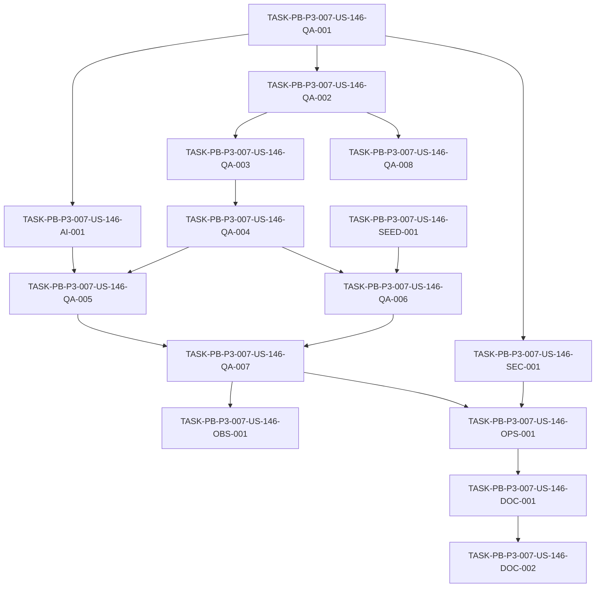

# Development Tasks — PB-P3-007 / US-146: Smoke automatizado sobre la URL de Demo

## 1. Metadata

| Field | Value |
|---|---|
| User Story ID | US-146 |
| Source User Story | `management/user-stories/US-146-demo-url-smoke.md` |
| Source Technical Specification | `management/technical-specs/P3/PB-P3-007/US-146-technical-spec.md` |
| Decision Resolution Artifact | N/A — no existe `management/user-stories/decision-resolutions/US-146-decision-resolution.md` |
| Priority | P3 (Must Have) |
| Backlog ID | PB-P3-007 |
| Backlog Title | Smoke test sobre Demo URL — Suite mínima (login, eventos, IA Mock, comparador) sobre la URL pública Demo |
| Backlog Execution Order | P3 #7 (séptimo ítem del bloque P3, por posición en el Product Backlog Prioritized) |
| User Story Position in Backlog Item | 1 de 1 |
| Related User Stories in Backlog Item | US-146 (única) |
| Epic | EPIC-DEMO-001 |
| Backlog Item Dependencies | PB-P2-016 (US-128), PB-P3-001 (US-140) |
| Feature | Smoke Demo (post-deploy) — subconjunto E2E mínimo contra URL pública |
| Module / Domain | Demo / QA |
| Backlog Alignment Status | Found |
| Task Breakdown Status | Ready for Sprint Planning |
| Created Date | 2026-07-08 |
| Last Updated | 2026-07-08 |

---

## 2. Source Validation

| Source | Found | Used | Notes |
|---|---|---|---|
| User Story | Yes | Yes | `US-146-demo-url-smoke.md` — Status: Approved with Minor Notes. AC-01..06, EC-01..03, VR-01..04, SEC-01..03, TS-01..05, NT-01..03, AUTH-TS-01. |
| Technical Specification | Yes | Yes | `US-146-technical-spec.md` — Status: Ready for Task Breakdown. Fuente primaria de implementación. |
| Decision Resolution Artifact | No | No | No existe artefacto de decisión para US-146. Confirmado. |
| Product Backlog Prioritized | Yes | Yes | `management/artifacts/4-Product-Backlog-Prioritized.md` — PB-P3-007 confirmado (línea 2283). |
| ADRs | Yes | Yes | ADR-TEST-001 (Vitest + Supertest; Playwright E2E), ADR-DEVOPS-001 (AWS/App Runner/Amplify/GitHub Actions) referenciados como contexto; no se reabren. |

---

## 3. Backlog Execution Context

### Parent Backlog Item

**PB-P3-007 — Smoke test sobre Demo URL** (EPIC-DEMO-001, P3, MoSCoW **Must Have**, Type Demo/QA, Primary Role System). Descripción de backlog: *"Suite mínima que valida login, listado de eventos, generación IA con Mock y comparador en la URL pública Demo. Ejecutable manual o por workflow."* Acceptance Summary: *Smoke pasa en <5 min · Documentado en runbook.* Trazabilidad: Doc 20 · Doc 21. Dependencias: PB-P2-016, PB-P3-001.

Entrega un **subconjunto de smoke E2E** sobre la app ya desplegada (frontend Amplify + backend App Runner). **No reimplementa** la suite E2E completa (US-128 / PB-P2-016): **reutiliza** su infraestructura Playwright y la ejecuta como flujo rápido y estable contra la **URL pública Demo**. Mitiga el riesgo "Demo URL inestable cerca de la presentación" (RISK-6; PB-P3-002, PB-P3-004, PB-P3-007).

### Execution Order Rationale

Por **posición en el backlog**, PB-P3-007 es el **séptimo ítem del bloque P3**; el orden se deriva de la secuencia `PB-P3-001, …, PB-P3-007, …` en `management/artifacts/4-Product-Backlog-Prioritized.md` y del "Orden de implementación sugerido" del bloque P3 (*… Toggle Mock/OpenAI → **Smoke Demo URL** → Reporte académico final*). Se ejecuta en este punto porque **depende** de la suite Playwright base (US-128 / PB-P2-016, entregada en P2), del reset del entorno Demo (US-140 / PB-P3-001) y del runbook del toggle Mock/OpenAI (US-144 / PB-P3-005). El número de User Story (146) **no** define el orden de ejecución.

### Related User Stories in Same Backlog Item

| User Story | Role in Backlog Item | Suggested Order |
|---|---|---|
| US-146 | Única historia del ítem (smoke mínimo post-deploy contra Demo URL) | 1 |

---

## 4. Task Breakdown Summary

| Area | Number of Tasks | Notes |
|---|---:|---|
| Product / Analysis (PO) | 0 | No aplica — historia técnica sin ambigüedad funcional (Tech Spec Ready). |
| Database / Prisma (DB) | 0 | No aplica — sin modelos/migraciones/seed. |
| Backend (BE) | 0 | No aplica — no implementa ni modifica endpoints. |
| API Contract (API) | 0 | No aplica — solo observa `GET /health` (propiedad de US-116). |
| Frontend (FE) | 0 | No aplica — sin UI nueva. |
| AI / PromptOps (AI) | 1 | Garantizar modo Mock determinista como precondición del paso de IA. |
| Security / Authorization (SEC) | 1 | Secretos por env/Secrets Manager; sin secretos/PII en logs ni evidencia. |
| Seed / Demo (SEED) | 1 | Verificar precondición de seed reproducible; reset US-140 como acción correctiva. |
| DevOps / Environment (OPS) | 1 | Workflow `smoke.yml` post-deploy (secrets, artefactos, notificación). |
| Observability / Audit (OBS) | 1 | Trazabilidad de la corrida (correlationId, resultado sin secretos). |
| QA / Testing (QA) | 8 | Scaffold `@smoke`; precheck health; login; eventos; IA Mock; comparador; evidencia+tiempo; negativos. |
| Documentation / Traceability (DOC) | 2 | Runbook (AC-05); notas de alineación docs/21 §16.1/§25.4. |
| **Total** | **15** | |

---

## 5. Traceability Matrix

| Acceptance Criterion | Technical Spec Section | Task IDs |
|---|---|---|
| AC-01 (ejecutable contra URL pública Demo) | §3, §5 Testing, §6 (AC-01), §13 API-SMOKE-01 | TASK-PB-P3-007-US-146-QA-001, TASK-PB-P3-007-US-146-QA-002, TASK-PB-P3-007-US-146-OPS-001 |
| AC-02 (cobertura mínima de flujos) | §3, §5 Testing, §6 (AC-02), §13 E2E | TASK-PB-P3-007-US-146-QA-003, TASK-PB-P3-007-US-146-QA-004, TASK-PB-P3-007-US-146-QA-005, TASK-PB-P3-007-US-146-QA-006 |
| AC-03 (determinismo con IA Mock) | §5 AI, §6 (AC-03), §11, §13 TS-03 | TASK-PB-P3-007-US-146-AI-001, TASK-PB-P3-007-US-146-QA-005 |
| AC-04 (<5 min) | §6 (AC-04), §13 TS-05, §17 | TASK-PB-P3-007-US-146-QA-007 |
| AC-05 (documentado en runbook) | §6 (AC-05), §18, §19 | TASK-PB-P3-007-US-146-DOC-001, TASK-PB-P3-007-US-146-OPS-001 |
| AC-06 (evidencia y señal de resultado) | §6 (AC-06), §13, §14 | TASK-PB-P3-007-US-146-QA-007, TASK-PB-P3-007-US-146-OBS-001 |
| EC-01 (Demo URL/health rojo → fail-fast) | §6 EC-01, §7 Error Handling, §13 API-SMOKE-01 | TASK-PB-P3-007-US-146-QA-002 |
| EC-02 (seed no reproducible) | §6 EC-02, §15, §13 NT-03 | TASK-PB-P3-007-US-146-SEED-001, TASK-PB-P3-007-US-146-QA-008 |
| EC-03 (IA no está en Mock) | §6 EC-03, §11, §13 NT-04 | TASK-PB-P3-007-US-146-AI-001, TASK-PB-P3-007-US-146-QA-008 |
| VR-01 (baseURL configurable; fail-fast) | §7 Validation, §5 Testing | TASK-PB-P3-007-US-146-QA-001, TASK-PB-P3-007-US-146-QA-008 |
| VR-02 (credenciales por secretos; no hardcode) | §7 Validation, §12 | TASK-PB-P3-007-US-146-SEC-001, TASK-PB-P3-007-US-146-QA-001 |
| VR-03 (IA en modo Mock/fallback) | §7 Validation, §11 | TASK-PB-P3-007-US-146-AI-001, TASK-PB-P3-007-US-146-QA-008 |
| VR-04 (precheck `GET /health = 200`) | §7 Validation, §13 API-SMOKE-01 | TASK-PB-P3-007-US-146-QA-002 |
| SEC-01 (autorización backend como fuente de verdad) | §12 Authentication/Authorization | TASK-PB-P3-007-US-146-QA-003 |
| SEC-02 / SEC-03 (secretos/PII fuera de repo/logs/evidencia) | §5 Security, §12, §14 | TASK-PB-P3-007-US-146-SEC-001, TASK-PB-P3-007-US-146-OBS-001 |
| Doc alignment (`smoke.yml` opcional→Must Have; manual §25.4 vs automatizado) | §16 | TASK-PB-P3-007-US-146-DOC-002 |

> Cobertura: cada AC (AC-01..06) y cada EC/VR relevante mapea a ≥1 tarea; cada tarea mapea a ≥1 sección de la Tech Spec y ≥1 AC/regla.

---

## 6. Development Tasks

### TASK-PB-P3-007-US-146-QA-001 — Scaffold del subconjunto `@smoke` reutilizando la infra Playwright de US-128

| Field | Value |
|---|---|
| Area | QA / Testing |
| Type | Setup |
| Priority | Must |
| Estimate | M |
| Depends On | — |
| Source AC(s) | AC-01 |
| Technical Spec Section(s) | §3, §5 Testing Architecture, §18 |
| Backlog ID | PB-P3-007 |
| User Story ID | US-146 |
| Owner Role | QA |
| Status | To Do |

#### Objective
Definir un subconjunto de smoke (proyecto o tag `@smoke`, o archivos `*.smoke.spec.ts`) que **reutilice** la configuración, page objects y helpers de la suite E2E de US-128 (PB-P2-016), con `baseURL` parametrizable por variable de entorno (p. ej. `PLAYWRIGHT_BASE_URL`/`DEMO_URL`) y credenciales inyectadas por env/secrets.

#### Scope
##### Include
- `playwright.config.ts` (o proyecto dedicado) con `use.baseURL` desde env, `screenshot: 'only-on-failure'`, `trace: 'retain-on-failure'`, reporter con salida clara y retries acotados.
- Estructura de archivos del smoke que reutilice helpers/page objects existentes de US-128.
- Lectura de `baseURL` y credenciales desde variables de entorno (sin hardcodear).
##### Exclude
- La suite E2E completa (US-128) — no se reimplementa.
- Cualquier cambio de backend/frontend/BD.

#### Implementation Notes
Fail-fast si `baseURL` no está configurada (VR-01). No apuntar a localhost ni a mocks de frontend. Preferir esperas basadas en estado (evitar `sleep`) para minimizar flakiness.

#### Acceptance Criteria Covered
AC-01; VR-01; VR-02 (parcial, cableado de credenciales por env).

#### Definition of Done
- [ ] Existe un subconjunto `@smoke` que reutiliza la infra de US-128.
- [ ] `baseURL` y credenciales provienen de variables de entorno.
- [ ] Config con screenshot/trace en fallo y reporter claro.
- [ ] Fail-fast si falta `baseURL`.

---

### TASK-PB-P3-007-US-146-AI-001 — Garantizar/verificar modo Mock determinista para el paso de IA

| Field | Value |
|---|---|
| Area | AI / PromptOps |
| Type | Setup |
| Priority | Must |
| Estimate | S |
| Depends On | TASK-PB-P3-007-US-146-QA-001 |
| Source AC(s) | AC-03 |
| Technical Spec Section(s) | §5 AI/PromptOps, §11, §6 (EC-03) |
| Backlog ID | PB-P3-007 |
| User Story ID | US-146 |
| Owner Role | AI / DevOps |
| Status | To Do |

#### Objective
Asegurar que, al ejecutar el smoke, el entorno Demo opera con IA en **modo Mock determinista** (`LLM_PROVIDER=mock` o `AI_USE_MOCK_FALLBACK=true`), y que el smoke **verifica** esa precondición antes del paso de generación IA (runbook US-144).

#### Scope
##### Include
- Verificación/aseguramiento del modo Mock/fallback como precondición del test de IA.
- Documentar la variable/estado esperado en el runbook (enlaza con DOC-001).
##### Exclude
- Uso de OpenAI real durante el smoke.
- Rediseño de la abstracción `LLMProvider` (ya existente).

#### Implementation Notes
El `MockAIProvider` retorna una respuesta determinista; el frontend nunca llama directo al LLM (docs/20 §6.5). Si el modo no es Mock y el proveedor externo falla/lento, el paso se marca inestable/fallo controlado (EC-03/NT-04).

#### Acceptance Criteria Covered
AC-03; VR-03; EC-03.

#### Definition of Done
- [ ] El smoke verifica el modo Mock/fallback antes del paso de IA.
- [ ] Documentada la precondición del modo IA.
- [ ] El paso de IA no depende de un proveedor externo.

---

### TASK-PB-P3-007-US-146-QA-002 — Precheck `GET /health = 200` con fail-fast

| Field | Value |
|---|---|
| Area | QA / Testing |
| Type | Test |
| Priority | Must |
| Estimate | S |
| Depends On | TASK-PB-P3-007-US-146-QA-001 |
| Source AC(s) | AC-01 |
| Technical Spec Section(s) | §6 (AC-01, EC-01), §7 Error Handling, §13 API-SMOKE-01 |
| Backlog ID | PB-P3-007 |
| User Story ID | US-146 |
| Owner Role | QA |
| Status | To Do |

#### Objective
Antes de ejecutar los flujos, verificar que `GET /health` (propiedad de US-116) responde `200` contra la Demo URL; si no, abortar con un mensaje claro de entorno no disponible (fail-fast), evitando un falso verde.

#### Scope
##### Include
- Precheck de disponibilidad (`GET /health = 200`) como primer paso/`globalSetup` del smoke.
- Mensaje de fallo que identifique la indisponibilidad del entorno.
##### Exclude
- Reimplementar o modificar el endpoint `/health` (US-116).

#### Implementation Notes
API-SMOKE-01 (happy) y NT-01 (health ≠ 200 → fail-fast). Cubre VR-04 y EC-01.

#### Acceptance Criteria Covered
AC-01; VR-04; EC-01.

#### Definition of Done
- [ ] El smoke aborta si `/health` no responde `200`.
- [ ] Mensaje de error identifica entorno no disponible.
- [ ] Verificado como happy (API-SMOKE-01) y negativo (NT-01).

---

### TASK-PB-P3-007-US-146-QA-003 — Test de login con usuario sembrado (TS-01)

| Field | Value |
|---|---|
| Area | QA / Testing |
| Type | Test |
| Priority | Must |
| Estimate | S |
| Depends On | TASK-PB-P3-007-US-146-QA-002 |
| Source AC(s) | AC-02 |
| Technical Spec Section(s) | §6 (AC-02), §12 Authentication, §13 TS-01 |
| Backlog ID | PB-P3-007 |
| User Story ID | US-146 |
| Owner Role | QA |
| Status | To Do |

#### Objective
Validar que un usuario sembrado puede iniciar sesión en la Demo URL usando el flujo de login real, con credenciales inyectadas por secretos.

#### Scope
##### Include
- Test de login con usuario sembrado (cookies HTTP-only gestionadas por el navegador).
##### Exclude
- Registro, reset de contraseña u otros flujos de auth (fuera del smoke mínimo).

#### Implementation Notes
Respeta la autorización del backend como fuente de verdad (SEC-01/AUTH-TS-01). No usa tokens en localStorage.

#### Acceptance Criteria Covered
AC-02; SEC-01.

#### Definition of Done
- [ ] Login con usuario sembrado pasa contra la Demo URL.
- [ ] Credenciales provienen de secretos, no hardcodeadas.

---

### TASK-PB-P3-007-US-146-QA-004 — Test de listado de eventos (TS-02)

| Field | Value |
|---|---|
| Area | QA / Testing |
| Type | Test |
| Priority | Must |
| Estimate | S |
| Depends On | TASK-PB-P3-007-US-146-QA-003 |
| Source AC(s) | AC-02 |
| Technical Spec Section(s) | §6 (AC-02), §13 TS-02 |
| Backlog ID | PB-P3-007 |
| User Story ID | US-146 |
| Owner Role | QA |
| Status | To Do |

#### Objective
Validar que, tras el login, el listado de eventos es visible para el usuario sembrado.

#### Scope
##### Include
- Navegación a la vista de eventos y aserción de que el listado renderiza datos seed.
##### Exclude
- Creación/edición de eventos (fuera del smoke mínimo).

#### Implementation Notes
Esperar el estado de carga real (TanStack Query) antes de aseverar para evitar flakiness.

#### Acceptance Criteria Covered
AC-02.

#### Definition of Done
- [ ] El listado de eventos es visible tras login.
- [ ] Aserción basada en estado cargado, no en `sleep`.

---

### TASK-PB-P3-007-US-146-QA-005 — Test de generación IA con Mock (TS-03)

| Field | Value |
|---|---|
| Area | QA / Testing |
| Type | Test |
| Priority | Must |
| Estimate | M |
| Depends On | TASK-PB-P3-007-US-146-QA-004, TASK-PB-P3-007-US-146-AI-001 |
| Source AC(s) | AC-02, AC-03 |
| Technical Spec Section(s) | §6 (AC-02, AC-03), §11, §13 TS-03 |
| Backlog ID | PB-P3-007 |
| User Story ID | US-146 |
| Owner Role | QA |
| Status | To Do |

#### Objective
Validar que el flujo de generación IA retorna una recomendación revisable de forma **determinista** usando el `MockAIProvider`.

#### Scope
##### Include
- Ejercer el paso de generación IA y aseverar sobre el resultado determinista de Mock.
##### Exclude
- Validación del proveedor OpenAI real.
- Validación de human-in-the-loop/persistencia como objetivo nuevo (se asume implementado).

#### Implementation Notes
Depende de AI-001 (modo Mock verificado). El frontend no llama directo al LLM (docs/20 §6.5).

#### Acceptance Criteria Covered
AC-02; AC-03.

#### Definition of Done
- [ ] El paso de IA retorna una recomendación determinista con Mock.
- [ ] El test no depende de un proveedor externo.

---

### TASK-PB-P3-007-US-146-QA-006 — Test del comparador de cotizaciones (TS-04)

| Field | Value |
|---|---|
| Area | QA / Testing |
| Type | Test |
| Priority | Must |
| Estimate | S |
| Depends On | TASK-PB-P3-007-US-146-QA-004 |
| Source AC(s) | AC-02 |
| Technical Spec Section(s) | §6 (AC-02), §13 TS-04, §15 |
| Backlog ID | PB-P3-007 |
| User Story ID | US-146 |
| Owner Role | QA |
| Status | To Do |

#### Objective
Validar que el comparador de cotizaciones renderiza cotizaciones sembradas para el usuario sembrado.

#### Scope
##### Include
- Navegación al comparador y aserción de que renderiza cotizaciones seed.
##### Exclude
- Creación de cotizaciones nuevas (fuera del smoke mínimo).

#### Implementation Notes
Depende de datos seed reproducibles (cotizaciones); si faltan, falla de forma controlada (ver SEED-001/NT-03).

#### Acceptance Criteria Covered
AC-02.

#### Definition of Done
- [ ] El comparador renderiza cotizaciones sembradas.
- [ ] Aserción basada en estado cargado.

---

### TASK-PB-P3-007-US-146-QA-007 — Evidencia en fallo y verificación de tiempo <5 min (TS-05, AC-06)

| Field | Value |
|---|---|
| Area | QA / Testing |
| Type | Test |
| Priority | Must |
| Estimate | S |
| Depends On | TASK-PB-P3-007-US-146-QA-005, TASK-PB-P3-007-US-146-QA-006 |
| Source AC(s) | AC-04, AC-06 |
| Technical Spec Section(s) | §6 (AC-04, AC-06), §13 TS-05, §14, §17 |
| Backlog ID | PB-P3-007 |
| User Story ID | US-146 |
| Owner Role | QA |
| Status | To Do |

#### Objective
Asegurar que la suite completa produce **resultado verde/rojo** con exit code apropiado, adjunta **evidencia** (screenshots/trazas) en fallo, y finaliza en **menos de 5 minutos**.

#### Scope
##### Include
- Confirmar `screenshot: 'only-on-failure'` y `trace: 'retain-on-failure'`.
- Reporter con salida clara y exit code correcto.
- Medición del tiempo total de ejecución (<5 min).
##### Exclude
- Métricas hacia CloudWatch (US-141).

#### Implementation Notes
Acotar tests y retries para respetar el presupuesto de tiempo; paralelizar solo donde sea seguro.

#### Acceptance Criteria Covered
AC-04; AC-06.

#### Definition of Done
- [ ] Evidencia (screenshots/trazas) presente en fallo.
- [ ] Resultado verde/rojo con exit code apropiado.
- [ ] Suite completa <5 min medida.

---

### TASK-PB-P3-007-US-146-QA-008 — Escenarios negativos: config, seed y modo IA (NT-02, NT-03, NT-04)

| Field | Value |
|---|---|
| Area | QA / Testing |
| Type | Test |
| Priority | Must |
| Estimate | S |
| Depends On | TASK-PB-P3-007-US-146-QA-002 |
| Source AC(s) | AC-01, AC-03 |
| Technical Spec Section(s) | §7 Validation, §13 Negative Tests, §6 (EC-02, EC-03) |
| Backlog ID | PB-P3-007 |
| User Story ID | US-146 |
| Owner Role | QA |
| Status | To Do |

#### Objective
Cubrir los negativos controlados: `baseURL`/credenciales no configuradas (NT-02), seed no reproducible (NT-03) y IA no en modo Mock con proveedor externo fallando (NT-04).

#### Scope
##### Include
- NT-02: fail-fast por configuración inválida (VR-01/VR-02).
- NT-03: fallo controlado que sugiere reset US-140 (EC-02).
- NT-04: paso de IA marcado inestable/fallo controlado si no está en Mock (EC-03).
##### Exclude
- Corrección automática del entorno (el smoke solo reporta).

#### Implementation Notes
Los mensajes deben orientar la acción correctiva (configurar env, ejecutar reset US-140, forzar modo Mock US-144).

#### Acceptance Criteria Covered
AC-01; AC-03; VR-01/VR-02/VR-03; EC-02/EC-03.

#### Definition of Done
- [ ] NT-02, NT-03 y NT-04 verificados con fallo controlado y mensaje accionable.

---

### TASK-PB-P3-007-US-146-SEC-001 — Manejo de secretos y redacción sin secretos/PII en evidencia

| Field | Value |
|---|---|
| Area | Security / Authorization |
| Type | Review |
| Priority | Must |
| Estimate | S |
| Depends On | TASK-PB-P3-007-US-146-QA-001 |
| Source AC(s) | AC-06 |
| Technical Spec Section(s) | §5 Security, §12, §14 |
| Backlog ID | PB-P3-007 |
| User Story ID | US-146 |
| Owner Role | DevOps / Tech Lead |
| Status | To Do |

#### Objective
Garantizar que la base URL y las credenciales demo se inyectan por **GitHub Actions secrets / Secrets Manager / env** (nunca en el repositorio), y que logs, consola y evidencia (screenshots/trazas) **no** exponen secretos ni PII.

#### Scope
##### Include
- Verificación de que no hay credenciales hardcodeadas (VR-02/SEC-02).
- Revisión de que las capturas/trazas no filtran datos sensibles (SEC-03).
##### Exclude
- Aprovisionamiento de Secrets Manager (ya existente, PB-P2-024).

#### Implementation Notes
Cuidar que las capturas del usuario sembrado no expongan PII; enmascarar donde sea necesario.

#### Acceptance Criteria Covered
AC-06 (parcial, evidencia segura); SEC-02; SEC-03; VR-02.

#### Definition of Done
- [ ] Sin credenciales en el repositorio ni en la suite.
- [ ] Sin secretos/PII en logs, consola ni evidencia.

---

### TASK-PB-P3-007-US-146-SEED-001 — Verificar precondición de seed reproducible y referenciar reset US-140

| Field | Value |
|---|---|
| Area | Seed / Demo Data |
| Type | Review |
| Priority | Should |
| Estimate | XS |
| Depends On | — |
| Source AC(s) | AC-02 |
| Technical Spec Section(s) | §15, §6 (EC-02) |
| Backlog ID | PB-P3-007 |
| User Story ID | US-146 |
| Owner Role | QA / DevOps |
| Status | To Do |

#### Objective
Documentar y verificar la precondición de **estado seed reproducible** (usuarios, eventos, cotizaciones) para el smoke, referenciando el **reset del entorno Demo** (US-140 / PB-P3-001) como acción correctiva ante datos alterados.

#### Scope
##### Include
- Confirmar que los datos seed requeridos existen antes de correr el smoke.
- Enlazar el reset (US-140) como acción correctiva en el runbook (DOC-001).
##### Exclude
- Crear o modificar el seed (PB-P0-014) o el endpoint/workflow de reset (US-140).

#### Implementation Notes
El smoke debe ser de solo lectura/no destructivo; si algún paso crea datos, deben ser idempotentes frente al reset y no ensuciar la demo.

#### Acceptance Criteria Covered
AC-02 (precondición de datos); EC-02.

#### Definition of Done
- [ ] Precondición de seed reproducible documentada.
- [ ] Reset US-140 referenciado como acción correctiva.

---

### TASK-PB-P3-007-US-146-OBS-001 — Trazabilidad de la corrida del smoke (correlationId, resultado sin secretos)

| Field | Value |
|---|---|
| Area | Observability / Audit |
| Type | Implementation |
| Priority | Should |
| Estimate | S |
| Depends On | TASK-PB-P3-007-US-146-QA-007 |
| Source AC(s) | AC-06 |
| Technical Spec Section(s) | §14 Logs/Correlation ID, §7 Observability |
| Backlog ID | PB-P3-007 |
| User Story ID | US-146 |
| Owner Role | QA / DevOps |
| Status | To Do |

#### Objective
Registrar inicio, fin y resultado (verde/rojo) de la corrida del smoke con `correlationId`, sin exponer secretos, permitiendo cruzar la corrida con los logs del backend cuando sea posible.

#### Scope
##### Include
- Log de inicio/fin/resultado del smoke con `correlationId`.
- (Opcional, decisión de Tech Lead) propagar un header de correlación desde Playwright.
##### Exclude
- Métricas/alarmas hacia CloudWatch (US-141).

#### Implementation Notes
Enlaza con docs/21 §19.2. No emitir contenido sensible.

#### Acceptance Criteria Covered
AC-06 (trazabilidad de la corrida).

#### Definition of Done
- [ ] La corrida registra inicio/fin/resultado con `correlationId`.
- [ ] Sin secretos en el registro.

---

### TASK-PB-P3-007-US-146-OPS-001 — Workflow `smoke.yml` post-deploy (secrets, artefactos, notificación)

| Field | Value |
|---|---|
| Area | DevOps / Environment |
| Type | Setup |
| Priority | Must |
| Estimate | M |
| Depends On | TASK-PB-P3-007-US-146-QA-007, TASK-PB-P3-007-US-146-SEC-001 |
| Source AC(s) | AC-01, AC-05, AC-06 |
| Technical Spec Section(s) | §5 Testing/Deploy, §13 CI Checks, §16, §18 |
| Backlog ID | PB-P3-007 |
| User Story ID | US-146 |
| Owner Role | DevOps |
| Status | To Do |

#### Objective
Crear/ajustar el workflow **`smoke.yml`** que ejecuta el subconjunto `@smoke` contra la Demo URL **después del deploy** (docs/21 §16.1), inyectando secrets (base URL, credenciales demo), publicando artefactos de evidencia y **notificando** en fallo para evaluar rollback manual (docs/21 §16.4).

#### Scope
##### Include
- Workflow con `workflow_dispatch` (manual) y trigger post-deploy tras `main.yml` (`DEPLOY_BE`/`DEPLOY_FE`).
- Secrets vía GitHub Actions (base URL, credenciales); OIDC donde aplique (docs/21 §16.3).
- Publicación de screenshots/trazas como artefactos; notificación en fallo.
##### Exclude
- Convertirlo en gate bloqueante de merge (es post-deploy, no bloqueante).
- Automatización de rollback (manual por diseño, docs/21 §24).

#### Implementation Notes
El fallo del smoke dispara notificación + evaluación de rollback manual, no bloqueo del pipeline.

#### Acceptance Criteria Covered
AC-01 (ejecución contra Demo URL); AC-05 (modo workflow); AC-06 (artefactos/resultado).

#### Definition of Done
- [ ] `smoke.yml` ejecuta el `@smoke` post-deploy y por `workflow_dispatch`.
- [ ] Secrets inyectados; sin credenciales en el repo.
- [ ] Artefactos de evidencia publicados y notificación en fallo.
- [ ] No es gate bloqueante de merge.

---

### TASK-PB-P3-007-US-146-DOC-001 — Runbook de ejecución del smoke (manual + workflow + precondiciones)

| Field | Value |
|---|---|
| Area | Documentation / Traceability |
| Type | Documentation |
| Priority | Must |
| Estimate | S |
| Depends On | TASK-PB-P3-007-US-146-OPS-001 |
| Source AC(s) | AC-05 |
| Technical Spec Section(s) | §6 (AC-05), §18, §19 |
| Backlog ID | PB-P3-007 |
| User Story ID | US-146 |
| Owner Role | QA / DevOps |
| Status | To Do |

#### Objective
Documentar en un runbook cómo ejecutar el smoke **manualmente** (comando) y cómo se dispara por **workflow `smoke.yml`**, incluyendo precondiciones (seed/reset US-140, modo Mock US-144, `GET /health = 200`) e interpretación de resultados.

#### Scope
##### Include
- Comando de ejecución manual y descripción del workflow.
- Precondiciones y acciones correctivas (reset, modo Mock).
- Interpretación de resultados verde/rojo y ubicación de la evidencia.
##### Exclude
- Reescritura de docs/21 (solo enlaces/notas puntuales).

#### Implementation Notes
El resultado verde del smoke es un ítem del checklist pre-demo (US-143 / PB-P3-004); referenciarlo.

#### Acceptance Criteria Covered
AC-05.

#### Definition of Done
- [ ] Runbook con ejecución manual + workflow + precondiciones + interpretación.
- [ ] Referencia al checklist pre-demo (US-143).

---

### TASK-PB-P3-007-US-146-DOC-002 — Notas de alineación de documentación (docs/21 §16.1 y §25.4)

| Field | Value |
|---|---|
| Area | Documentation / Traceability |
| Type | Documentation |
| Priority | Should |
| Estimate | XS |
| Depends On | TASK-PB-P3-007-US-146-DOC-001 |
| Source AC(s) | — (alineación de documentación, §16 Tech Spec) |
| Technical Spec Section(s) | §16 Documentation Alignment Required |
| Backlog ID | PB-P3-007 |
| User Story ID | US-146 |
| Owner Role | Tech Lead |
| Status | To Do |

#### Objective
Anotar en docs/21 que el `smoke.yml` es **requerido** por PB-P3-007 (Must Have) aunque §16.1 lo marca "opcional", y que el smoke **automatizado** de US-146 cubre un subconjunto mientras el smoke **manual** de §25.4 queda como respaldo.

#### Scope
##### Include
- Nota de alineación en docs/21 (§16.1 y §25.4) sin reabrir ADRs.
##### Exclude
- Cambios de arquitectura o de decisiones formalizadas.

#### Implementation Notes
No bloqueante; no contradice ningún ADR aceptado.

#### Acceptance Criteria Covered
N/A (alineación de documentación).

#### Definition of Done
- [ ] Nota de alineación agregada en docs/21 (§16.1 y §25.4).

---

## 7. Required QA Tasks

| Task ID | Test Type | Purpose |
|---|---|---|
| TASK-PB-P3-007-US-146-QA-001 | Setup (E2E) | Scaffold `@smoke` reutilizando US-128; baseURL/credenciales por env |
| TASK-PB-P3-007-US-146-QA-002 | API/E2E | Precheck `GET /health = 200` con fail-fast (API-SMOKE-01/NT-01) |
| TASK-PB-P3-007-US-146-QA-003 | E2E (smoke) | Login con usuario sembrado (TS-01) |
| TASK-PB-P3-007-US-146-QA-004 | E2E (smoke) | Listado de eventos (TS-02) |
| TASK-PB-P3-007-US-146-QA-005 | E2E (smoke) | Generación IA con Mock (TS-03) |
| TASK-PB-P3-007-US-146-QA-006 | E2E (smoke) | Comparador de cotizaciones (TS-04) |
| TASK-PB-P3-007-US-146-QA-007 | E2E (smoke/perf) | Evidencia en fallo + tiempo <5 min (TS-05) |
| TASK-PB-P3-007-US-146-QA-008 | Negative | NT-02/NT-03/NT-04 (config, seed, modo IA) |

---

## 8. Required Security Tasks

| Task ID | Security Concern | Purpose |
|---|---|---|
| TASK-PB-P3-007-US-146-SEC-001 | Secretos / PII | Credenciales por env/Secrets Manager; sin secretos/PII en logs ni evidencia (SEC-02/03; VR-02) |

---

## 9. Required Seed / Demo Tasks

| Task ID | Seed/Demo Concern | Purpose |
|---|---|---|
| TASK-PB-P3-007-US-146-SEED-001 | Estado reproducible | Verificar precondición de seed; reset US-140 como acción correctiva (EC-02) |

---

## 10. Observability / Audit Tasks

| Task ID | Concern | Purpose |
|---|---|---|
| TASK-PB-P3-007-US-146-OBS-001 | Trazabilidad de la corrida | `correlationId` + resultado sin secretos (AC-06) |

---

## 11. Documentation / Traceability Tasks

| Task ID | Document / Artifact | Purpose |
|---|---|---|
| TASK-PB-P3-007-US-146-DOC-001 | Runbook de smoke | Ejecución manual + workflow + precondiciones (AC-05) |
| TASK-PB-P3-007-US-146-DOC-002 | docs/21 §16.1/§25.4 | Notas de alineación (opcional→Must Have; manual vs automatizado) |

---

## 12. Dependency Graph

---

## 13. Suggested Implementation Order

### Phase 1 — Foundation
- TASK-PB-P3-007-US-146-QA-001 (scaffold `@smoke`, baseURL/credenciales).
- TASK-PB-P3-007-US-146-AI-001 (garantizar modo Mock).
- TASK-PB-P3-007-US-146-SEED-001 (precondición de seed reproducible).

### Phase 2 — Core Implementation
- TASK-PB-P3-007-US-146-QA-002 (precheck health).
- TASK-PB-P3-007-US-146-QA-003 (login), QA-004 (eventos), QA-005 (IA Mock), QA-006 (comparador).

### Phase 3 — Validation / Security / QA
- TASK-PB-P3-007-US-146-QA-007 (evidencia + tiempo <5 min).
- TASK-PB-P3-007-US-146-QA-008 (negativos).
- TASK-PB-P3-007-US-146-SEC-001 (secretos/PII).
- TASK-PB-P3-007-US-146-OBS-001 (trazabilidad de la corrida).

### Phase 4 — Documentation / Review
- TASK-PB-P3-007-US-146-OPS-001 (workflow `smoke.yml`).
- TASK-PB-P3-007-US-146-DOC-001 (runbook).
- TASK-PB-P3-007-US-146-DOC-002 (notas de alineación docs/21).

---

## 14. Risks & Mitigations

| Risk | Impact | Mitigation | Related Task |
|---|---|---|---|
| Flakiness del smoke (timing/red/entorno público) | Falsos rojos, pérdida de confianza | Esperas basadas en estado, reutilizar helpers estables de US-128, `trace` en fallo | QA-001, QA-004, QA-006, QA-007 |
| IA no determinista si corre con OpenAI real | Fallos intermitentes / costo | Forzar/verificar modo Mock antes del paso de IA | AI-001, QA-005, QA-008 |
| Seed alterado en Demo | Falso rojo del comparador | Precondición de reset (US-140); fallo controlado NT-03 | SEED-001, QA-008 |
| Secretos/PII en logs o capturas | Riesgo de seguridad | Redacción + revisión; secretos por env/Secrets Manager | SEC-001, OBS-001 |
| Exceso de tiempo (>5 min) | Incumple AC-04 | Acotar tests, limitar retries, medir tiempo total | QA-007 |
| Datos creados por el smoke ensucian la demo | Estado no reproducible | Preferir flujos de solo lectura; idempotencia frente al reset | SEED-001, QA-006 |
| `smoke.yml` bloquea el pipeline por error | Fricción de despliegue | Post-deploy no bloqueante; fallo = notificación + rollback manual | OPS-001 |

---

## 15. Out of Scope Confirmation

- La suite E2E completa sobre seed (US-128 / PB-P2-016) — solo se reutiliza su infraestructura.
- El seed y el endpoint/workflow de reset (PB-P0-014 / US-140) — se consumen, no se implementan.
- El healthcheck `GET /health` (US-116) — solo se observa como precheck.
- Monitoreo/alarmas CloudWatch (US-141 / PB-P3-002).
- Automatización de rollback (manual por diseño MVP).
- Uso de OpenAI real durante el smoke; cobertura i18n/multi-locale y accesibilidad.
- Convertir `smoke.yml` en gate bloqueante de merge.

---

## 16. Readiness for Sprint Planning

| Check | Status |
|---|---|
| Product Backlog mapping found | Pass |
| Every AC maps to tasks | Pass |
| Technical Spec used when available | Pass |
| QA tasks included | Pass |
| Security tasks included if applicable | Pass |
| Seed/demo tasks included if applicable | Pass |
| Observability tasks included if applicable | Pass |
| Documentation tasks included if applicable | Pass |
| Task dependencies clear | Pass |
| Tasks small enough | Pass (todas ≤ M) |
| Ready for Sprint Planning | Yes |

---

## 17. Final Recommendation

`Ready for Sprint Planning`

Las 15 tareas cubren de forma trazable el alcance de PB-P3-007 (P3, Must Have, EPIC-DEMO-001): scaffold del subconjunto `@smoke` reutilizando la infra Playwright de US-128, precheck de `GET /health`, los 4 flujos críticos (login, eventos, IA con Mock determinista, comparador), evidencia en fallo, verificación de <5 min, negativos controlados, manejo seguro de secretos, trazabilidad de la corrida, workflow `smoke.yml` post-deploy y el runbook documentado. Cada AC (AC-01..06) mapea a ≥1 tarea y cada tarea a ≥1 sección de la Tech Spec. No se reabren decisiones formalizadas (Playwright/ADR-TEST-001; AWS/ADR-DEVOPS-001; modo Mock; `/health` de US-116; reset de US-140). Las notas de alineación de docs/21 son no bloqueantes. Backend, frontend, base de datos e IA real = No aplica.

---

Development Tasks created: Yes
Path: management/development-tasks/P3/PB-P3-007/US-146-development-tasks.md
Status: Ready for Sprint Planning
Technical Specification used: Yes
Backlog ID: PB-P3-007
Execution Order: P3 #7 (séptimo ítem del bloque P3 por posición en el backlog)
Next step: Sprint Planning / Roadmap.
