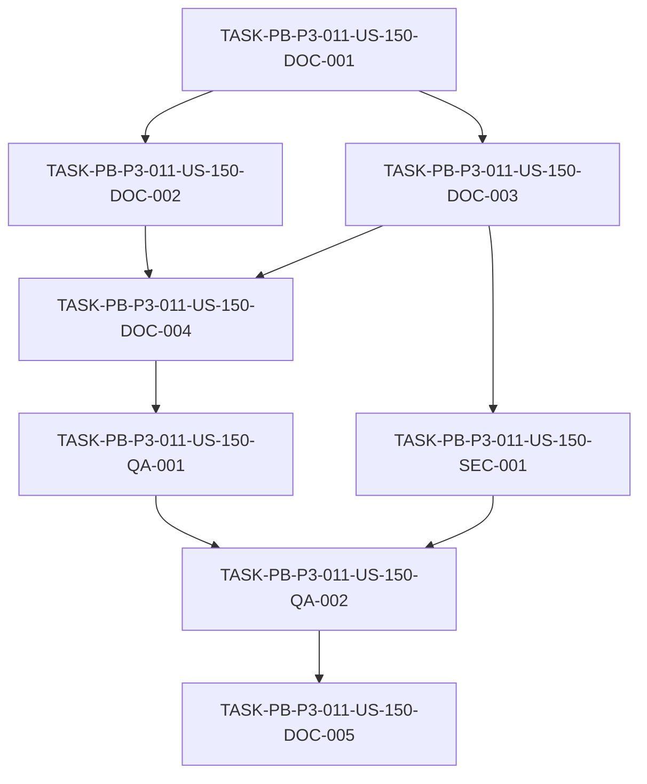

# Development Tasks — PB-P3-011 / US-150: Reporte final de evidencia académica AI4Devs

## 1. Metadata

| Field | Value |
|---|---|
| User Story ID | US-150 |
| Source User Story | `management/user-stories/US-150-academic-evidence-report.md` |
| Source Technical Specification | `management/technical-specs/P3/PB-P3-011/US-150-technical-spec.md` |
| Decision Resolution Artifact | N/A — no existe `management/user-stories/decision-resolutions/US-150-decision-resolution.md` |
| Priority | P3 (Should Have) |
| Backlog ID | PB-P3-011 |
| Backlog Title | Reporte académico final de evidencia — Documento ejecutivo que consolida ADRs, trazabilidad, prompts/outputs, HITL, Demo URL, screenshots y mapeo a la rúbrica AI4Devs |
| Backlog Execution Order | P3 #11 (undécimo y último ítem del bloque P3, por posición en el Product Backlog Prioritized) |
| User Story Position in Backlog Item | 1 de 1 |
| Related User Stories in Backlog Item | US-150 (única) |
| Epic | EPIC-ACAD-001 |
| Backlog Item Dependencies | PB-P3-008 (US-147), PB-P3-009 (US-148), PB-P3-010 (US-149) |
| Feature | Reporte académico final (consolidación de evidencia por enlace) |
| Module / Domain | Demo / Académica |
| Backlog Alignment Status | Found |
| Task Breakdown Status | Ready for Sprint Planning |
| Created Date | 2026-07-08 |
| Last Updated | 2026-07-08 |

---

## 2. Source Validation

| Source | Found | Used | Notes |
|---|---|---|---|
| User Story | Yes | Yes | `US-150-academic-evidence-report.md` — Status: Approved with Minor Notes. AC-01..05, EC-01/02, VR-01..03, SEC-01..03, TS-01..04, NT-01..03, AUTH-TS-01. |
| Technical Specification | Yes | Yes | `US-150-technical-spec.md` — Status: Ready for Task Breakdown. Fuente primaria; entregable documental. |
| Decision Resolution Artifact | No | No | No existe artefacto de decisión para US-150. Confirmado. |
| Product Backlog Prioritized | Yes | Yes | `management/artifacts/4-Product-Backlog-Prioritized.md` — PB-P3-011 confirmado (línea 2367). |
| ADRs | Yes | Yes | ADR index (US-147/`docs/22`) referenciado como evidencia; no se reabre ningún ADR. |

---

## 3. Backlog Execution Context

### Parent Backlog Item

**PB-P3-011 — Reporte académico final de evidencia** (EPIC-ACAD-001, P3, MoSCoW **Should Have**, Type Academic, Primary Role Product Owner). Acceptance Summary: *Reporte consolidado en repo · Mapeo a rúbrica · Listo para entrega.* Trazabilidad: Doc 3 §14.2/§15 · Doc 22. Dependencias: PB-P3-008..010. Es el **cierre del proyecto académico**: consolida por enlace la evidencia producida por US-147 (ADR index), US-148 (trazabilidad) y US-149 (catálogo de prompts), y la mapea a los criterios/métricas académicas y a la rúbrica AI4Devs.

### Execution Order Rationale

Por **posición en el backlog**, PB-P3-011 es el **undécimo y último ítem del bloque P3** (línea 2367); el "Orden de implementación sugerido" del bloque P3 lo ubica al final (*… → Reporte académico final*). Depende de que las historias hermanas (US-147/148/149) hayan producido su evidencia. El número de User Story (150) **no** define el orden de ejecución.

### Related User Stories in Same Backlog Item

| User Story | Role in Backlog Item | Suggested Order |
|---|---|---|
| US-150 | Redacción del reporte final de evidencia (único entregable del ítem) | 1 |

---

## 4. Task Breakdown Summary

| Area | Number of Tasks | Notes |
|---|---:|---|
| Product / Analysis (PO) | 0 | No aplica — alcance claro (Tech Spec Ready). |
| Database / Prisma (DB) | 0 | No aplica — sin modelos/migraciones/seed. |
| Backend (BE) | 0 | No aplica — sin backend. |
| API Contract (API) | 0 | No aplica — sin endpoints. |
| Frontend (FE) | 0 | No aplica — sin UI. |
| AI / PromptOps (AI) | 0 | No aplica — solo enlaza evidencia de IA (cubierto en DOC-003). |
| Security / Authorization (SEC) | 1 | Revisión de sanitización (sin secretos/PII). |
| Seed / Demo (SEED) | 0 | No aplica — solo referencia Demo URL/screenshots. |
| DevOps / Environment (OPS) | 0 | No aplica — documento versionado. |
| Observability / Audit (OBS) | 0 | No aplica — documento estático sin runtime. |
| QA / Testing (QA) | 2 | Revisión documental (DV-01..04); link check (LC-01) + NT-02. |
| Documentation / Traceability (DOC) | 5 | Esqueleto/ruta; mapeo criterios/métricas; enlaces; mapeo rúbrica+gaps; listo para entrega. |
| **Total** | **8** | |

---

## 5. Traceability Matrix

| Acceptance Criterion | Technical Spec Section | Task IDs |
|---|---|---|
| AC-01 (reporte consolidado versionado) | §3, §4, §6 (AC-01), §18 | TASK-PB-P3-011-US-150-DOC-001 |
| AC-02 (mapeo épicas → US → criterios/métricas) | §4, §6 (AC-02), §18 | TASK-PB-P3-011-US-150-DOC-002 |
| AC-03 (enlace a evidencia) | §4, §5 AI/Security, §6 (AC-03), §11 | TASK-PB-P3-011-US-150-DOC-003 |
| AC-04 (mapeo a rúbrica AI4Devs) | §4, §6 (AC-04), §18 | TASK-PB-P3-011-US-150-DOC-004 |
| AC-05 (listo para entrega) | §6 (AC-05), §13 LC-01, §18 | TASK-PB-P3-011-US-150-QA-002, TASK-PB-P3-011-US-150-DOC-005 |
| EC-01 (evidencia hermana faltante → gap) | §6 EC-01, §16, §13 NT-01 | TASK-PB-P3-011-US-150-DOC-004 |
| EC-02 / VR-02 (enlace roto → link check) | §6 EC-02, §13 LC-01/NT-02 | TASK-PB-P3-011-US-150-QA-002 |
| VR-01 (cada criterio con evidencia o gap) | §4, §13 DV-04 | TASK-PB-P3-011-US-150-DOC-004, TASK-PB-P3-011-US-150-QA-001 |
| VR-03 / SEC-02 / SEC-03 (sin secretos/PII) | §5 Security, §12, §13 NT-03 | TASK-PB-P3-011-US-150-SEC-001 |
| DV-01..04 (revisión documental) | §13 | TASK-PB-P3-011-US-150-QA-001 |

> Cobertura: cada AC (AC-01..05) y cada EC/VR relevante mapea a ≥1 tarea; cada tarea mapea a ≥1 sección de la Tech Spec y ≥1 AC/regla.

---

## 6. Development Tasks

### TASK-PB-P3-011-US-150-DOC-001 — Confirmar ruta canónica y crear el esqueleto del reporte

| Field | Value |
|---|---|
| Area | Documentation / Traceability |
| Type | Documentation |
| Priority | Must |
| Estimate | S |
| Depends On | — |
| Source AC(s) | AC-01 |
| Technical Spec Section(s) | §3, §4 In Scope, §16, §18 |
| Backlog ID | PB-P3-011 |
| User Story ID | US-150 |
| Owner Role | Product Owner / Tech Lead |
| Status | To Do |

#### Objective
Confirmar con PO/Tech Lead la ruta canónica del reporte (propuesta: `/management/artifacts/Academic-Evidence-Report.md`) y crear el esqueleto versionado del documento con las secciones requeridas (índice ejecutivo, mapeos, enlaces, rúbrica, gaps).

#### Scope
##### Include
- Confirmación de ruta canónica.
- Creación del archivo con encabezados de secciones y metadatos (título, fecha, propósito, estado).
##### Exclude
- Contenido de las secciones (tareas DOC-002..004).

#### Implementation Notes
Seguir la convención de `Pre-Demo-Checklist.md` / `Demo-Script.md` en `/management/artifacts/`.

#### Acceptance Criteria Covered
AC-01.

#### Definition of Done
- [ ] Ruta canónica confirmada.
- [ ] Esqueleto del reporte creado y versionado con secciones requeridas.

---

### TASK-PB-P3-011-US-150-DOC-002 — Mapeo épicas → User Stories → criterios y métricas académicas

| Field | Value |
|---|---|
| Area | Documentation / Traceability |
| Type | Documentation |
| Priority | Must |
| Estimate | M |
| Depends On | TASK-PB-P3-011-US-150-DOC-001 |
| Source AC(s) | AC-02 |
| Technical Spec Section(s) | §4, §6 (AC-02), §18 |
| Backlog ID | PB-P3-011 |
| User Story ID | US-150 |
| Owner Role | Business Analyst / PO |
| Status | To Do |

#### Objective
Construir el mapeo trazable **épicas → User Stories → criterios académicos** (Doc 3 §14.2) y **métricas recomendadas** (Doc 3 §15, priorizadas + complementarias), evidenciando la cobertura de cada criterio/métrica.

#### Scope
##### Include
- Tabla(s) de mapeo a §14.2 (criterios) y §15 (métricas).
##### Exclude
- Redefinir criterios/métricas (se referencian tal cual de Doc 3).

#### Implementation Notes
Referenciar Doc 3 §14.2/§15 sin duplicar su contenido; usar IDs de épica/US reales.

#### Acceptance Criteria Covered
AC-02; VR-01 (parcial, base para el mapeo de rúbrica).

#### Definition of Done
- [ ] Mapeo épicas → US → criterios (§14.2) presente y trazable.
- [ ] Mapeo a métricas recomendadas (§15) presente.

---

### TASK-PB-P3-011-US-150-DOC-003 — Sección de enlaces a la evidencia consolidada

| Field | Value |
|---|---|
| Area | Documentation / Traceability |
| Type | Documentation |
| Priority | Must |
| Estimate | M |
| Depends On | TASK-PB-P3-011-US-150-DOC-001 |
| Source AC(s) | AC-03 |
| Technical Spec Section(s) | §4, §5 (AI/Security), §6 (AC-03), §11 |
| Backlog ID | PB-P3-011 |
| User Story ID | US-150 |
| Owner Role | PO / BA |
| Status | To Do |

#### Objective
Construir la sección que **enlaza** (sin duplicar) la evidencia existente: índice de ADRs (US-147; `docs/22`), matriz de trazabilidad US → FRD/UC/BR (US-148), catálogo de prompts/outputs (US-149; `AI-Prompt-Evidence-Catalog.md`), evidencia HITL en `AIRecommendation`, Demo URL pública (docs/21 §25.1) y screenshots representativos.

#### Scope
##### Include
- Enlaces relativos a cada artefacto de evidencia + descripción breve.
##### Exclude
- Regenerar o copiar la evidencia hermana (Out of Scope).

#### Implementation Notes
Enlaces relativos válidos dentro del repo; para la Demo URL, enlace externo documentado en docs/21 §25.1.

#### Acceptance Criteria Covered
AC-03.

#### Definition of Done
- [ ] Enlaces a ADRs, trazabilidad, prompts, HITL, Demo y screenshots presentes.
- [ ] Sin duplicación de evidencia (solo enlaces).

---

### TASK-PB-P3-011-US-150-DOC-004 — Sección de mapeo a la rúbrica AI4Devs y manejo de gaps

| Field | Value |
|---|---|
| Area | Documentation / Traceability |
| Type | Documentation |
| Priority | Must |
| Estimate | M |
| Depends On | TASK-PB-P3-011-US-150-DOC-002, TASK-PB-P3-011-US-150-DOC-003 |
| Source AC(s) | AC-04 |
| Technical Spec Section(s) | §4, §6 (AC-04, EC-01), §16, §13 DV-04 |
| Backlog ID | PB-P3-011 |
| User Story ID | US-150 |
| Owner Role | PO / BA |
| Status | To Do |

#### Objective
Construir la sección que mapea la evidencia del proyecto a cada criterio de la **rúbrica AI4Devs**, indicando por criterio dónde está la evidencia o marcándolo como **gap** explícito (evidencia hermana pendiente), sin fabricar contenido.

#### Scope
##### Include
- Tabla criterio de rúbrica → evidencia enlazada / gap.
- Listado de gaps como pendientes accionables (EC-01).
##### Exclude
- Inventar o duplicar evidencia ausente.

#### Implementation Notes
Cada criterio debe tener evidencia enlazada o un gap explícito (VR-01/DV-04).

#### Acceptance Criteria Covered
AC-04; EC-01; VR-01.

#### Definition of Done
- [ ] Mapeo a la rúbrica AI4Devs completo.
- [ ] Cada criterio con evidencia o gap explícito.

---

### TASK-PB-P3-011-US-150-SEC-001 — Revisión de sanitización (sin secretos ni PII)

| Field | Value |
|---|---|
| Area | Security / Authorization |
| Type | Review |
| Priority | Must |
| Estimate | S |
| Depends On | TASK-PB-P3-011-US-150-DOC-003 |
| Source AC(s) | AC-03 |
| Technical Spec Section(s) | §5 Security, §12, §13 NT-03 |
| Backlog ID | PB-P3-011 |
| User Story ID | US-150 |
| Owner Role | Tech Lead / PO |
| Status | To Do |

#### Objective
Verificar que el reporte y la evidencia enlazada **no** exponen secretos ni PII, usando solo evidencia sanitizada/datos demo (VR-03; SEC-02/SEC-03).

#### Scope
##### Include
- Revisión de contenido y enlaces por secretos/PII.
##### Exclude
- Sanitizar el catálogo de prompts (ya sanitizado por US-149).

#### Implementation Notes
Cualquier valor sensible permanece en Secrets Manager, nunca en el reporte (docs/19; docs/21 §10.5).

#### Acceptance Criteria Covered
AC-03 (evidencia segura); VR-03; SEC-02; SEC-03.

#### Definition of Done
- [ ] Sin secretos ni PII en el reporte ni en la evidencia enlazada.

---

### TASK-PB-P3-011-US-150-QA-001 — Revisión documental del reporte (DV-01..04)

| Field | Value |
|---|---|
| Area | QA / Testing |
| Type | Review |
| Priority | Must |
| Estimate | S |
| Depends On | TASK-PB-P3-011-US-150-DOC-004 |
| Source AC(s) | AC-01, AC-02, AC-04 |
| Technical Spec Section(s) | §13 DV-01..04 |
| Backlog ID | PB-P3-011 |
| User Story ID | US-150 |
| Owner Role | QA / BA |
| Status | To Do |

#### Objective
Revisar que el reporte existe y es navegable (DV-01), el mapeo criterios/métricas es trazable (DV-02), la sección de enlaces está completa (DV-03) y el mapeo a la rúbrica cubre cada criterio con evidencia o gap (DV-04).

#### Scope
##### Include
- Checklist de revisión documental DV-01..04.
##### Exclude
- Verificación de enlaces (QA-002) y sanitización (SEC-001).

#### Implementation Notes
Revisión contra la Tech Spec §13; NT-01 (gap marcado) validado aquí.

#### Acceptance Criteria Covered
AC-01; AC-02; AC-04; VR-01.

#### Definition of Done
- [ ] DV-01..04 verificados.
- [ ] Gaps de evidencia marcados correctamente (NT-01).

---

### TASK-PB-P3-011-US-150-QA-002 — Verificación de enlaces (link check) y marcado de entrega

| Field | Value |
|---|---|
| Area | QA / Testing |
| Type | Test |
| Priority | Must |
| Estimate | S |
| Depends On | TASK-PB-P3-011-US-150-QA-001, TASK-PB-P3-011-US-150-SEC-001 |
| Source AC(s) | AC-05 |
| Technical Spec Section(s) | §6 (AC-05, EC-02), §13 LC-01/NT-02 |
| Backlog ID | PB-P3-011 |
| User Story ID | US-150 |
| Owner Role | QA |
| Status | To Do |

#### Objective
Ejecutar un link check de todos los enlaces relativos del reporte; detectar y reportar enlaces rotos (NT-02) para su corrección antes de marcar el reporte como listo para entrega.

#### Scope
##### Include
- Link check de enlaces relativos (LC-01) y verificación del enlace de Demo URL.
- Reporte de enlaces rotos críticos (fail-fast previo a entrega, VR-02).
##### Exclude
- Redacción de contenido (tareas DOC).

#### Implementation Notes
Puede automatizarse en CI (decisión de Tech Lead) o ejecutarse como revisión manual previa a la entrega.

#### Acceptance Criteria Covered
AC-05; EC-02; VR-02.

#### Definition of Done
- [ ] Todos los enlaces relativos resuelven.
- [ ] Enlaces rotos corregidos antes de la entrega.

---

### TASK-PB-P3-011-US-150-DOC-005 — Marcar el reporte como entregable final listo para evaluación

| Field | Value |
|---|---|
| Area | Documentation / Traceability |
| Type | Documentation |
| Priority | Must |
| Estimate | XS |
| Depends On | TASK-PB-P3-011-US-150-QA-002 |
| Source AC(s) | AC-05 |
| Technical Spec Section(s) | §6 (AC-05), §18 |
| Backlog ID | PB-P3-011 |
| User Story ID | US-150 |
| Owner Role | Product Owner |
| Status | To Do |

#### Objective
Una vez validados contenido, enlaces y sanitización, marcar el reporte como **entregable final listo para la evaluación académica** (estado/encabezado del documento) y registrar el hito de congelación de evidencia.

#### Scope
##### Include
- Marca de estado "listo para entrega" y fecha de congelación.
##### Exclude
- Cambios de contenido posteriores a la congelación (salvo corrección de gaps).

#### Implementation Notes
Coordinar el hito de congelación con el PO (nota no bloqueante de la aprobación).

#### Acceptance Criteria Covered
AC-05.

#### Definition of Done
- [ ] Reporte marcado como entregable final listo para evaluación.
- [ ] Hito de congelación de evidencia registrado.

---

## 7. Required QA Tasks

| Task ID | Test Type | Purpose |
|---|---|---|
| TASK-PB-P3-011-US-150-QA-001 | Doc review | Revisión documental DV-01..04 y marcado de gaps (NT-01) |
| TASK-PB-P3-011-US-150-QA-002 | Link check | Enlaces relativos válidos (LC-01) + enlaces rotos (NT-02) |

---

## 8. Required Security Tasks

| Task ID | Security Concern | Purpose |
|---|---|---|
| TASK-PB-P3-011-US-150-SEC-001 | Secretos / PII | Revisión de sanitización del reporte y evidencia enlazada (VR-03; SEC-02/03) |

---

## 9. Required Seed / Demo Tasks

`No aplica` — el reporte solo referencia (no modifica) la Demo URL y los screenshots.

---

## 10. Observability / Audit Tasks

`No aplica` — documento estático sin runtime; la trazabilidad de cambios proviene del control de versiones.

---

## 11. Documentation / Traceability Tasks

| Task ID | Document / Artifact | Purpose |
|---|---|---|
| TASK-PB-P3-011-US-150-DOC-001 | Academic-Evidence-Report.md | Ruta canónica + esqueleto (AC-01) |
| TASK-PB-P3-011-US-150-DOC-002 | Academic-Evidence-Report.md | Mapeo épicas → US → criterios/métricas (AC-02) |
| TASK-PB-P3-011-US-150-DOC-003 | Academic-Evidence-Report.md | Enlaces a evidencia (AC-03) |
| TASK-PB-P3-011-US-150-DOC-004 | Academic-Evidence-Report.md | Mapeo a rúbrica AI4Devs + gaps (AC-04, EC-01) |
| TASK-PB-P3-011-US-150-DOC-005 | Academic-Evidence-Report.md | Marcar como entregable final (AC-05) |

---

## 12. Dependency Graph

---

## 13. Suggested Implementation Order

### Phase 1 — Foundation
- TASK-PB-P3-011-US-150-DOC-001 (ruta canónica + esqueleto).

### Phase 2 — Core Implementation
- TASK-PB-P3-011-US-150-DOC-002 (mapeo criterios/métricas).
- TASK-PB-P3-011-US-150-DOC-003 (enlaces a evidencia).
- TASK-PB-P3-011-US-150-DOC-004 (mapeo a rúbrica + gaps).

### Phase 3 — Validation / Security / QA
- TASK-PB-P3-011-US-150-SEC-001 (sanitización).
- TASK-PB-P3-011-US-150-QA-001 (revisión documental).
- TASK-PB-P3-011-US-150-QA-002 (link check).

### Phase 4 — Documentation / Review
- TASK-PB-P3-011-US-150-DOC-005 (marcar como entregable final).

---

## 14. Risks & Mitigations

| Risk | Impact | Mitigation | Related Task |
|---|---|---|---|
| Evidencia hermana incompleta al consolidar | Rúbrica con gaps | Marcar gaps explícitos; coordinar hito de congelación con PO | DOC-004, DOC-005 |
| Enlaces rotos a evidencia | Reporte no entregable | Link check previo a entrega (fail-fast en críticos) | QA-002 |
| Secretos/PII en el reporte | Riesgo de seguridad/privacidad | Revisión de sanitización; solo evidencia sanitizada | SEC-001 |
| Duplicación de evidencia hermana | Inconsistencia y mantenimiento doble | Consolidar por enlace, no por copia | DOC-003 |
| Deriva reporte vs evidencia fuente | Reporte desactualizado | Enlaces relativos + hito de congelación | DOC-005 |

---

## 15. Out of Scope Confirmation

- Regenerar el índice de ADRs (US-147), la matriz de trazabilidad (US-148) o el catálogo de prompts/outputs (US-149) — solo se enlazan.
- Cualquier cambio de producto: endpoints, base de datos, UI, IA runtime.
- Generación de screenshots o de la Demo URL — se referencian.
- Métricas/dashboards en tiempo real; redefinición de criterios/métricas académicas.

---

## 16. Readiness for Sprint Planning

| Check | Status |
|---|---|
| Product Backlog mapping found | Pass |
| Every AC maps to tasks | Pass |
| Technical Spec used when available | Pass |
| QA tasks included | Pass |
| Security tasks included if applicable | Pass |
| Seed/demo tasks included if applicable | N/A |
| Observability tasks included if applicable | N/A |
| Documentation tasks included if applicable | Pass |
| Task dependencies clear | Pass |
| Tasks small enough | Pass (todas ≤ M) |
| Ready for Sprint Planning | Yes |

---

## 17. Final Recommendation

`Ready for Sprint Planning`

Las 8 tareas cubren de forma trazable el alcance de PB-P3-011 (P3, Should Have, EPIC-ACAD-001): crear el reporte consolidado (`/management/artifacts/Academic-Evidence-Report.md`), mapear épicas → US → criterios/métricas (Doc 3 §14.2/§15), enlazar la evidencia hermana (ADRs US-147, trazabilidad US-148, prompts US-149, HITL, Demo URL, screenshots), mapear a la rúbrica AI4Devs con manejo de gaps, revisar sanitización, revisar el documento y verificar enlaces, y marcarlo como entregable final. Cada AC (AC-01..05) mapea a ≥1 tarea y cada tarea a ≥1 sección de la Tech Spec. No se regenera la evidencia hermana ni se introduce producto. Las notas de alineación (ruta canónica; hito de congelación) son no bloqueantes. Backend, frontend, base de datos, API, IA runtime, seed y observabilidad = No aplica.

---

Development Tasks created: Yes
Path: management/development-tasks/P3/PB-P3-011/US-150-development-tasks.md
Status: Ready for Sprint Planning
Technical Specification used: Yes
Backlog ID: PB-P3-011
Execution Order: P3 #11 (undécimo y último ítem del bloque P3 por posición en el backlog)
Next step: Sprint Planning / Roadmap.
