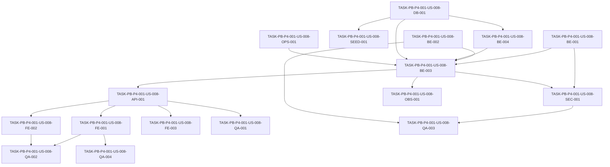

# Development Tasks — PB-P4-001 / US-008: Iniciar sesión con Google (OAuth)

## 1. Metadata

| Field | Value |
|---|---|
| User Story ID | US-008 |
| Source User Story | management/user-stories/US-008-login-with-google.md |
| Source Technical Specification | management/technical-specs/P4/PB-P4-001/US-008-technical-spec.md |
| Decision Resolution Artifact | No aplica (promoción formalizada en ADR-ARCH-005) |
| Priority | P4 (promovida a delivery actual vía ADR-ARCH-005) |
| Backlog ID | PB-P4-001 |
| Backlog Title | OAuth Google login |
| Backlog Execution Order | Backlog P4 (promovido); tras Auth base US-001…US-007 |
| User Story Position in Backlog Item | 1 de 1 |
| Related User Stories in Backlog Item | US-008 |
| Epic | EPIC-AUTH-001 — Authentication & User Access |
| Backlog Item Dependencies | US-001/US-002, US-003, EPIC-SEC-001 (cookies) |
| Feature | OAuth Google (promovida desde Could Have / v1.1) |
| Module / Domain | Auth |
| Backlog Alignment Status | Found |
| Task Breakdown Status | Ready for Sprint Planning |
| Created Date | 2026-08-13 |
| Last Updated | 2026-08-13 |

---

## 2. Source Validation

| Source | Found | Used | Notes |
|---|---|---|---|
| User Story | Yes | Yes | Approved with Minor Notes. |
| Technical Specification | Yes | Yes | Ready for Task Breakdown; fuente primaria. |
| Decision Resolution Artifact | No | No | Promoción vía ADR-ARCH-005 (no se requirió resolver). |
| Product Backlog Prioritized | Yes | Yes | PB-P4-001, promovido por ADR-ARCH-005. |
| ADRs | Yes | Yes | ADR-ARCH-005, ADR-SEC-002/003/006/007, ADR-DB-005, ADR-API-001..004, ADR-TEST-004. |

---

## 3. Backlog Execution Context

### Parent Backlog Item

**PB-P4-001 — OAuth Google login**. Promovido desde el Backlog P4 (target v1.1) a la fase de delivery actual por decisión PO 2026-08-13 (ADR-ARCH-005). Agrupa únicamente US-008.

### Execution Order Rationale

US-008 extiende el flujo de autenticación existente (US-001…US-007) y reutiliza la emisión de cookie de sesión (ADR-SEC-002) y el hardening de `/auth/*` (ADR-SEC-004/006). Se ejecuta después de esa base.

### Related User Stories in Same Backlog Item

| User Story | Role in Backlog Item | Suggested Order |
|---|---|---|
| US-008 | Único item de PB-P4-001 | 1 |

---

## 4. Task Breakdown Summary

| Area | Number of Tasks | Notes |
|---|---:|---|
| Database / Prisma | 1 | Migración `google_sub` + `password_hash` nullable |
| Backend | 4 | Port+provider, state/nonce, casos de uso, repositorio |
| API Contract | 1 | Endpoints OAuth + Zod |
| Security / Authorization | 1 | Verificación de claims, no exposición de `id_token`, redacción |
| Frontend | 3 | Botón, selección de rol, confirmación de vinculación |
| Seed / Demo | 1 | Usuario seed opcional con `google_sub` |
| DevOps / Environment | 1 | Credenciales + redirect URIs |
| Observability / Audit | 1 | Eventos `auth.oauth.google.*` |
| QA / Testing | 4 | Integration, E2E, seguridad, accesibilidad |
| Documentation / Traceability | 1 | Alinear D3/D19/ADR-SEC-007 |
| **Total** | **17** | |

---

## 5. Traceability Matrix

| Acceptance Criterion | Technical Spec Section | Task IDs |
|---|---|---|
| AC-01 Login OAuth existente | §6, §7, §9, §10, §12 | TASK-PB-P4-001-US-008-DB-001, -BE-001, -BE-003, -BE-004, -API-001, -SEC-001, -FE-001, -QA-001, -QA-002 |
| AC-02 Signup con selección de rol | §6, §7, §8, §10, §12 | TASK-PB-P4-001-US-008-DB-001, -BE-003, -BE-004, -API-001, -FE-002, -QA-001, -QA-002 |
| AC-03 Vinculación con confirmación | §6, §7, §8, §12 | TASK-PB-P4-001-US-008-BE-003, -BE-004, -API-001, -FE-003, -QA-001 |
| EC-01 `email_verified=false` | §6, §12 | TASK-PB-P4-001-US-008-SEC-001, -QA-001, -QA-003 |
| EC-02 Cancelación consentimiento | §6, §8 | TASK-PB-P4-001-US-008-BE-003, -FE-001, -QA-002 |
| VR-01/VR-02 id_token/email_verified | §12 | TASK-PB-P4-001-US-008-BE-001, -SEC-001, -QA-003 |
| VR-03 Rol requerido en signup | §6, §8, §9 | TASK-PB-P4-001-US-008-API-001, -FE-002, -QA-001 |
| SEC-01..05 (JWK, aud/iss/exp, state+nonce, cookie, no exposición) | §12 | TASK-PB-P4-001-US-008-BE-001, -BE-002, -SEC-001, -QA-003 |
| NT-01..04 negativos | §13 | TASK-PB-P4-001-US-008-QA-001, -QA-003 |
| AUTH-TS-01/02 | §9, §13 | TASK-PB-P4-001-US-008-QA-001 |

Todas las AC mapean a al menos una tarea.

---

## 6. Development Tasks

### TASK-PB-P4-001-US-008-DB-001 — Migración `google_sub` y `password_hash` nullable

| Field | Value |
|---|---|
| Area | Database / Prisma |
| Type | Implementation |
| Priority | Must |
| Estimate | S |
| Depends On | — |
| Source AC(s) | AC-01, AC-02 |
| Technical Spec Section(s) | §10 |
| Backlog ID | PB-P4-001 |
| User Story ID | US-008 |
| Owner Role | Backend |
| Status | To Do |

#### Objective
Agregar `google_sub` a `users` (nullable, UNIQUE, indexado) y relajar `password_hash` a nullable para cuentas creadas solo por OAuth.

#### Scope
##### Include
- Campo `googleSub String? @unique @map("google_sub")` en `model User`.
- `passwordHash` → `String?` (`password_hash` nullable).
- Migración Prisma aditiva y reproducible.
##### Exclude
- Backfill de datos; CHECK constraint (la invariante se valida en aplicación, ver BE-003).

#### Implementation Notes
Migración sin pérdida; cuentas existentes conservan `password_hash`. Respetar ADR-DB-005 (migraciones Prisma).

#### Acceptance Criteria Covered
AC-01, AC-02.

#### Definition of Done
- [ ] Migración aplicada y `prisma migrate validate` pasa en CI.
- [ ] `google_sub` UNIQUE + índice verificados.
- [ ] `password_hash` acepta null sin romper flujos existentes.

---

### TASK-PB-P4-001-US-008-BE-001 — Port `OAuthProvider` + `GoogleOAuthProvider` (verificación `id_token` con JWK)

| Field | Value |
|---|---|
| Area | Backend |
| Type | Implementation |
| Priority | Must |
| Estimate | M |
| Depends On | — |
| Source AC(s) | AC-01, VR-01, VR-02 |
| Technical Spec Section(s) | §5, §7, §12 |
| Backlog ID | PB-P4-001 |
| User Story ID | US-008 |
| Owner Role | Backend |
| Status | To Do |

#### Objective
Definir el puerto `OAuthProvider` en Application y su implementación `GoogleOAuthProvider` en Infrastructure, incluyendo verificación criptográfica del `id_token` con JWK del proveedor y validación de `aud`/`iss`/`exp`/`email_verified`.

#### Scope
##### Include
- Interfaz `OAuthProvider` (buildAuthUrl, exchangeCode, verifyIdToken).
- Cacheo de JWK por `kid` con refresh.
- Validación de claims (`aud`, `iss`, `exp`, `nonce`, `email_verified`).
##### Exclude
- Otros proveedores; acceso a APIs de Google.

#### Implementation Notes
Diseñar la interfaz para permitir un mock determinista en tests (paralelo a `LLMProvider`). No exponer el `id_token` fuera de la capa de infraestructura/aplicación.

#### Acceptance Criteria Covered
AC-01, VR-01, VR-02.

#### Definition of Done
- [ ] `verifyIdToken` rechaza firmas/claims inválidos.
- [ ] JWK cacheadas y refrescables por `kid`.
- [ ] Cobertura unitaria con JWK mockeadas.

---

### TASK-PB-P4-001-US-008-BE-002 — Servicio `state` + `nonce` anti-CSRF

| Field | Value |
|---|---|
| Area | Backend |
| Type | Implementation |
| Priority | Must |
| Estimate | S |
| Depends On | — |
| Source AC(s) | SEC-03 |
| Technical Spec Section(s) | §7, §12 |
| Backlog ID | PB-P4-001 |
| User Story ID | US-008 |
| Owner Role | Backend |
| Status | To Do |

#### Objective
Generar y validar `state` + `nonce` de un solo uso con TTL corto para el flujo OAuth.

#### Scope
##### Include
- Generación segura de `state`/`nonce`.
- Persistencia server-side (o cookie firmada de corta vida) con TTL y consumo único.
- Validación en el callback.
##### Exclude
- Almacenamiento persistente de larga vida.

#### Implementation Notes
`nonce` debe verificarse contra el `id_token`. Prevención de replay.

#### Acceptance Criteria Covered
SEC-03; soporta NT-02 (state inválido → 400).

#### Definition of Done
- [ ] `state` inválido/expirado rechazado con 400.
- [ ] `nonce` verificado y de un solo uso.

---

### TASK-PB-P4-001-US-008-BE-003 — Casos de uso Start/Handle callback (login/signup/link)

| Field | Value |
|---|---|
| Area | Backend |
| Type | Implementation |
| Priority | Must |
| Estimate | L |
| Depends On | TASK-PB-P4-001-US-008-DB-001, -BE-001, -BE-002, -BE-004 |
| Source AC(s) | AC-01, AC-02, AC-03, EC-01, EC-02, VR-03 |
| Technical Spec Section(s) | §6, §7, §12 |
| Backlog ID | PB-P4-001 |
| User Story ID | US-008 |
| Owner Role | Backend |
| Status | To Do |

#### Objective
Implementar `StartGoogleOAuthUseCase` y `HandleGoogleCallbackUseCase`, orquestando los tres caminos (login existente, signup con rol, vinculación con confirmación) y delegando la emisión de sesión.

#### Scope
##### Include
- Resolución de camino según `google_sub`/email verificado.
- Transacción en signup y en vinculación.
- Invariante de aplicación: `password_hash` o `google_sub` presente.
- Manejo de cancelación (EC-02) y `email_verified=false` (EC-01).
- Forzado de rol `organizer`/`vendor`; admin nunca por Google.
##### Exclude
- Multi-rol; creación de admin.

#### Implementation Notes
Idempotencia ante reintentos del callback. Emisión de cookie reutiliza el servicio de sesión existente (ADR-SEC-002). Paso interactivo (rol/confirmación) mediante token de continuación de corta vida.

#### Acceptance Criteria Covered
AC-01, AC-02, AC-03, EC-01, EC-02, VR-03.

#### Definition of Done
- [ ] Los tres caminos funcionan y emiten sesión solo en éxito.
- [ ] Vinculación requiere confirmación explícita.
- [ ] `role=admin` forzado a organizer/vendor.
- [ ] Transacciones verificadas.

---

### TASK-PB-P4-001-US-008-BE-004 — Extensiones de `UserRepository`

| Field | Value |
|---|---|
| Area | Backend |
| Type | Implementation |
| Priority | Must |
| Estimate | S |
| Depends On | TASK-PB-P4-001-US-008-DB-001 |
| Source AC(s) | AC-01, AC-02, AC-03 |
| Technical Spec Section(s) | §7 |
| Backlog ID | PB-P4-001 |
| User Story ID | US-008 |
| Owner Role | Backend |
| Status | To Do |

#### Objective
Agregar `findByGoogleSub`, `findByEmail`, `linkGoogleSub` y `createOAuthUser` al repositorio de usuarios (acceso solo vía Prisma).

#### Scope
##### Include
- Métodos de lectura/escritura para OAuth.
##### Exclude
- Lógica de negocio (vive en los casos de uso).

#### Implementation Notes
Respetar Clean/Hexagonal: repositorio en Infrastructure, interfaz en Application (ADR-BE-002).

#### Acceptance Criteria Covered
AC-01, AC-02, AC-03.

#### Definition of Done
- [ ] Métodos cubiertos por tests de integración con DB.
- [ ] Manejo de colisión de `google_sub` UNIQUE.

---

### TASK-PB-P4-001-US-008-API-001 — Endpoints OAuth + validación Zod

| Field | Value |
|---|---|
| Area | API Contract |
| Type | Implementation |
| Priority | Must |
| Estimate | M |
| Depends On | TASK-PB-P4-001-US-008-BE-003 |
| Source AC(s) | AC-01, AC-02, AC-03, VR-03, EC-02 |
| Technical Spec Section(s) | §9 |
| Backlog ID | PB-P4-001 |
| User Story ID | US-008 |
| Owner Role | Backend |
| Status | To Do |

#### Objective
Exponer `GET /api/v1/auth/google`, `GET /api/v1/auth/google/callback`, `POST /api/v1/auth/google/complete-signup` y `POST /api/v1/auth/google/confirm-link`, con validación Zod y correlation ID.

#### Scope
##### Include
- Redirects 302; envelope de error estándar en respuestas JSON de error.
- Zod para query del callback y bodies de continuación.
- 409/redirect si ya hay sesión activa (AUTH-TS-02).
##### Exclude
- Lógica de dominio (en casos de uso).

#### Implementation Notes
Controllers finos (ADR-API-001..004). Naming final de los endpoints de continuación se confirma aquí.

#### Acceptance Criteria Covered
AC-01, AC-02, AC-03, VR-03, EC-02.

#### Definition of Done
- [ ] Endpoints responden con códigos correctos (302/400/409).
- [ ] Validación Zod activa.
- [ ] Correlation ID propagado.

---

### TASK-PB-P4-001-US-008-SEC-001 — Hardening de verificación y no exposición de `id_token`

| Field | Value |
|---|---|
| Area | Security / Authorization |
| Type | Implementation |
| Priority | Must |
| Estimate | S |
| Depends On | TASK-PB-P4-001-US-008-BE-001, -BE-003 |
| Source AC(s) | SEC-01..05, EC-01, VR-01, VR-02 |
| Technical Spec Section(s) | §12 |
| Backlog ID | PB-P4-001 |
| User Story ID | US-008 |
| Owner Role | Backend |
| Status | To Do |

#### Objective
Garantizar validación de `aud`/`iss`/`exp`/`email_verified`, cookie HTTP-only firmada tras éxito, no exposición del `id_token` al frontend y redacción de tokens/PII en logs.

#### Scope
##### Include
- Verificación de claims y rechazo con mensaje neutro.
- Redacción en logger (ADR-SEC-001).
- Confirmar que no se persiste `id_token` (solo `google_sub`).
##### Exclude
- MFA.

#### Implementation Notes
Alinear con ADR-SEC-002/006. Mensajes neutros ("No fue posible iniciar sesión").

#### Acceptance Criteria Covered
SEC-01..05, EC-01, VR-01, VR-02.

#### Definition of Done
- [ ] `email_verified=false` → 400 neutro.
- [ ] `id_token` nunca llega al cliente ni a logs.
- [ ] Cookie HTTP-only firmada emitida solo en éxito.

---

### TASK-PB-P4-001-US-008-FE-001 — `GoogleSignInButton` e integración en login + i18n

| Field | Value |
|---|---|
| Area | Frontend |
| Type | Implementation |
| Priority | Must |
| Estimate | S |
| Depends On | TASK-PB-P4-001-US-008-API-001 |
| Source AC(s) | AC-01, EC-02 |
| Technical Spec Section(s) | §8 |
| Backlog ID | PB-P4-001 |
| User Story ID | US-008 |
| Owner Role | Frontend |
| Status | To Do |

#### Objective
Agregar el botón "Continuar con Google" en `/[locale]/auth/login` (navegación directa al endpoint backend), con estados loading/error y textos en 4 locales.

#### Scope
##### Include
- Botón accesible con ícono; spinner de redirección; mensaje neutro de error.
- next-intl para 4 locales.
##### Exclude
- Fetch del flujo OAuth (es server-driven).

#### Implementation Notes
Mobile-first. No manejar `id_token` en el cliente.

#### Acceptance Criteria Covered
AC-01, EC-02.

#### Definition of Done
- [ ] Botón inicia el flujo (302 a Google).
- [ ] Cancelación muestra mensaje neutro y sesión anónima.
- [ ] Textos traducidos en 4 locales.

---

### TASK-PB-P4-001-US-008-FE-002 — Pantalla `RoleSelectorOnSignup`

| Field | Value |
|---|---|
| Area | Frontend |
| Type | Implementation |
| Priority | Must |
| Estimate | S |
| Depends On | TASK-PB-P4-001-US-008-API-001 |
| Source AC(s) | AC-02, VR-03 |
| Technical Spec Section(s) | §8 |
| Backlog ID | PB-P4-001 |
| User Story ID | US-008 |
| Owner Role | Frontend |
| Status | To Do |

#### Objective
Pantalla de selección de rol (`organizer`/`vendor`) en primer signup OAuth, que envía la selección al endpoint de completar signup.

#### Scope
##### Include
- Selector accesible; validación de rol requerido; TanStack Query para el POST.
##### Exclude
- Multi-rol; rol admin.

#### Acceptance Criteria Covered
AC-02, VR-03.

#### Definition of Done
- [ ] Sin rol seleccionado no se puede continuar (VR-03).
- [ ] Tras selección se crea la sesión y redirige por rol.

---

### TASK-PB-P4-001-US-008-FE-003 — Pantalla `LinkAccountConfirmation`

| Field | Value |
|---|---|
| Area | Frontend |
| Type | Implementation |
| Priority | Must |
| Estimate | S |
| Depends On | TASK-PB-P4-001-US-008-API-001 |
| Source AC(s) | AC-03 |
| Technical Spec Section(s) | §8 |
| Backlog ID | PB-P4-001 |
| User Story ID | US-008 |
| Owner Role | Frontend |
| Status | To Do |

#### Objective
Pantalla de confirmación explícita para vincular `google_sub` a una cuenta email/password existente.

#### Scope
##### Include
- Confirmación explícita; si no confirma, no vincula y queda anónimo.
##### Exclude
- Vinculación automática sin confirmación.

#### Acceptance Criteria Covered
AC-03.

#### Definition of Done
- [ ] Vinculación solo tras confirmación.
- [ ] Cancelar no vincula y no crea sesión.

---

### TASK-PB-P4-001-US-008-SEED-001 — Usuario seed con `google_sub` (opcional demo)

| Field | Value |
|---|---|
| Area | Seed / Demo Data |
| Type | Implementation |
| Priority | Could |
| Estimate | XS |
| Depends On | TASK-PB-P4-001-US-008-DB-001 |
| Source AC(s) | AC-01 |
| Technical Spec Section(s) | §15 |
| Backlog ID | PB-P4-001 |
| User Story ID | US-008 |
| Owner Role | Backend |
| Status | To Do |

#### Objective
Agregar (opcional) un usuario seed con `google_sub` para demostrar el login OAuth de usuario existente.

#### Scope
##### Include
- Registro seed idempotente con `is_seed=true`.
##### Exclude
- Datos productivos.

#### Acceptance Criteria Covered
AC-01.

#### Definition of Done
- [ ] Seed idempotente; demo de AC-01 reproducible.

---

### TASK-PB-P4-001-US-008-OPS-001 — Credenciales Google y redirect URIs

| Field | Value |
|---|---|
| Area | DevOps / Environment |
| Type | Setup |
| Priority | Must |
| Estimate | S |
| Depends On | — |
| Source AC(s) | AC-01, AC-02 |
| Technical Spec Section(s) | §5, §18 |
| Backlog ID | PB-P4-001 |
| User Story ID | US-008 |
| Owner Role | DevOps |
| Status | To Do |

#### Objective
Configurar client_id/client_secret de Google Cloud y las redirect URIs por entorno, en variables de entorno / Secrets Manager (sin secretos en el repo).

#### Scope
##### Include
- Variables por entorno; redirect URIs de dev/prod.
##### Exclude
- Hardcodear secretos (ADR-SEC-005).

#### Acceptance Criteria Covered
AC-01, AC-02.

#### Definition of Done
- [ ] Credenciales fuera del repo (Secrets Manager/env).
- [ ] Redirect URIs válidas por entorno.

---

### TASK-PB-P4-001-US-008-OBS-001 — Eventos `auth.oauth.google.success/failure`

| Field | Value |
|---|---|
| Area | Observability / Audit |
| Type | Implementation |
| Priority | Should |
| Estimate | XS |
| Depends On | TASK-PB-P4-001-US-008-BE-003 |
| Source AC(s) | AC-01, EC-01 |
| Technical Spec Section(s) | §14 |
| Backlog ID | PB-P4-001 |
| User Story ID | US-008 |
| Owner Role | Backend |
| Status | To Do |

#### Objective
Emitir eventos estructurados de éxito/fallo del flujo OAuth con `correlationId`, sin filtrar `id_token` ni PII.

#### Scope
##### Include
- Logs `auth.oauth.google.success` / `failure`.
##### Exclude
- Métricas avanzadas (opcional).

#### Acceptance Criteria Covered
AC-01, EC-01.

#### Definition of Done
- [ ] Eventos emitidos con correlation ID.
- [ ] Tests de redacción verifican ausencia de tokens/PII.

---

### TASK-PB-P4-001-US-008-QA-001 — Tests de integración (login/signup/link + negativos)

| Field | Value |
|---|---|
| Area | QA / Testing |
| Type | Test |
| Priority | Must |
| Estimate | M |
| Depends On | TASK-PB-P4-001-US-008-BE-003, -API-001 |
| Source AC(s) | AC-01, AC-02, AC-03, VR-03, EC-01, NT-01..04, AUTH-TS-01/02 |
| Technical Spec Section(s) | §13 |
| Backlog ID | PB-P4-001 |
| User Story ID | US-008 |
| Owner Role | QA |
| Status | To Do |

#### Objective
Cubrir TS-01/02/03, NT-01..04 y AUTH-TS-01/02 con Vitest + Supertest y un mock del `OAuthProvider`.

#### Scope
##### Include
- Login existente, signup con rol, vinculación con confirmación.
- Negativos: id_token expirado, state inválido, email_verified=false, role=admin forzado.
- AUTH-TS: anónimo inicia (302), sesión activa (409/redirect).
##### Exclude
- E2E (ver QA-002).

#### Acceptance Criteria Covered
AC-01, AC-02, AC-03, VR-03, EC-01, NT-01..04, AUTH-TS-01/02.

#### Definition of Done
- [ ] Todos los escenarios pasan en CI.
- [ ] Mock provider determinista.

---

### TASK-PB-P4-001-US-008-QA-002 — E2E con mock OAuth provider (TS-04)

| Field | Value |
|---|---|
| Area | QA / Testing |
| Type | Test |
| Priority | Must |
| Estimate | M |
| Depends On | TASK-PB-P4-001-US-008-FE-001, -FE-002 |
| Source AC(s) | AC-01, AC-02, EC-02 |
| Technical Spec Section(s) | §13 |
| Backlog ID | PB-P4-001 |
| User Story ID | US-008 |
| Owner Role | QA |
| Status | To Do |

#### Objective
Flujo E2E (Playwright) con mock OAuth provider: login, signup con selección de rol y cancelación.

#### Scope
##### Include
- Escenario feliz y cancelación (EC-02).
##### Exclude
- Integración real con Google.

#### Acceptance Criteria Covered
AC-01, AC-02, EC-02.

#### Definition of Done
- [ ] E2E verde en CI (smoke).

---

### TASK-PB-P4-001-US-008-QA-003 — Tests negativos de seguridad

| Field | Value |
|---|---|
| Area | QA / Testing |
| Type | Test |
| Priority | Must |
| Estimate | S |
| Depends On | TASK-PB-P4-001-US-008-SEC-001, -BE-002 |
| Source AC(s) | SEC-01..05, EC-01, NT-01..03 |
| Technical Spec Section(s) | §12, §13 |
| Backlog ID | PB-P4-001 |
| User Story ID | US-008 |
| Owner Role | QA |
| Status | To Do |

#### Objective
Cubrir CSRF/`state` tampering, `aud`/`iss` incorrectos, replay de `nonce`, `id_token` expirado y no exposición del `id_token`. Parte del quality gate de seguridad (ADR-TEST-004).

#### Scope
##### Include
- Casos negativos de verificación y anti-CSRF.
##### Exclude
- Pentest manual.

#### Acceptance Criteria Covered
SEC-01..05, EC-01, NT-01..03.

#### Definition of Done
- [ ] Suite negativa activa como quality gate.

---

### TASK-PB-P4-001-US-008-QA-004 — Tests de accesibilidad

| Field | Value |
|---|---|
| Area | QA / Testing |
| Type | Test |
| Priority | Should |
| Estimate | XS |
| Depends On | TASK-PB-P4-001-US-008-FE-001 |
| Source AC(s) | Accessibility (botón Google) |
| Technical Spec Section(s) | §8, §13 |
| Backlog ID | PB-P4-001 |
| User Story ID | US-008 |
| Owner Role | QA |
| Status | To Do |

#### Objective
Verificar label accesible del botón Google y foco visible.

#### Scope
##### Include
- Checks de accesibilidad del botón y pantallas OAuth.
##### Exclude
- Auditoría completa WCAG del sitio.

#### Acceptance Criteria Covered
Accessibility Tests de la US.

#### Definition of Done
- [ ] Botón con label accesible y foco visible verificados.

---

### TASK-PB-P4-001-US-008-DOC-001 — Alineación documental (D3, D19, ADR-SEC-007)

| Field | Value |
|---|---|
| Area | Documentation / Traceability |
| Type | Documentation |
| Priority | Should |
| Estimate | XS |
| Depends On | — |
| Source AC(s) | — (trazabilidad) |
| Technical Spec Section(s) | §16 |
| Backlog ID | PB-P4-001 |
| User Story ID | US-008 |
| Owner Role | Tech Lead |
| Status | To Do |

#### Objective
Actualizar `docs/3-MVP-Scope-Definition.md` y `docs/19-Security-and-Authorization-Design.md` para reflejar OAuth Google habilitado, y agregar nota de reconciliación en ADR-SEC-007 (habilitado por ADR-ARCH-005).

#### Scope
##### Include
- Alineación de D3/D19; nota en ADR-SEC-007; mover ROAD-SEC-002 a implementado.
##### Exclude
- Cambios en otros ADRs no afectados.

#### Acceptance Criteria Covered
Documentation Alignment (§16 de la Tech Spec).

#### Definition of Done
- [ ] D3 y D19 reflejan OAuth habilitado.
- [ ] ADR-SEC-007 anotado.

---

## 7. Required QA Tasks

| Task ID | Test Type | Purpose |
|---|---|---|
| TASK-PB-P4-001-US-008-QA-001 | Integration | Login/signup/link + negativos + AUTH-TS |
| TASK-PB-P4-001-US-008-QA-002 | E2E | Flujo completo con mock provider (TS-04) |
| TASK-PB-P4-001-US-008-QA-003 | Security | CSRF/state/nonce/id_token negativos |
| TASK-PB-P4-001-US-008-QA-004 | Accessibility | Botón Google accesible |

---

## 8. Required Security Tasks

| Task ID | Security Concern | Purpose |
|---|---|---|
| TASK-PB-P4-001-US-008-BE-002 | Anti-CSRF | state+nonce de un solo uso |
| TASK-PB-P4-001-US-008-SEC-001 | Verificación de claims / no exposición de id_token | Hardening de autenticación |
| TASK-PB-P4-001-US-008-QA-003 | Tests negativos de seguridad | Quality gate (ADR-TEST-004) |

---

## 9. Required Seed / Demo Tasks

| Task ID | Seed/Demo Concern | Purpose |
|---|---|---|
| TASK-PB-P4-001-US-008-SEED-001 | Usuario con `google_sub` | Demostrar AC-01 (opcional) |

---

## 10. Observability / Audit Tasks

| Task ID | Concern | Purpose |
|---|---|---|
| TASK-PB-P4-001-US-008-OBS-001 | Eventos OAuth | `auth.oauth.google.success/failure` con correlation ID |

---

## 11. Documentation / Traceability Tasks

| Task ID | Document / Artifact | Purpose |
|---|---|---|
| TASK-PB-P4-001-US-008-DOC-001 | D3, D19, ADR-SEC-007 | Alinear documentación con OAuth habilitado |

---

## 12. Dependency Graph

---

## 13. Suggested Implementation Order

### Phase 1 — Foundation
- TASK-PB-P4-001-US-008-DB-001 (migración)
- TASK-PB-P4-001-US-008-OPS-001 (credenciales/redirect URIs)
- TASK-PB-P4-001-US-008-BE-004 (repositorio)

### Phase 2 — Core Implementation
- TASK-PB-P4-001-US-008-BE-001 (provider + verificación)
- TASK-PB-P4-001-US-008-BE-002 (state/nonce)
- TASK-PB-P4-001-US-008-BE-003 (casos de uso)
- TASK-PB-P4-001-US-008-API-001 (endpoints)
- TASK-PB-P4-001-US-008-FE-001/002/003 (frontend)

### Phase 3 — Validation / Security / QA
- TASK-PB-P4-001-US-008-SEC-001 (hardening)
- TASK-PB-P4-001-US-008-OBS-001 (observabilidad)
- TASK-PB-P4-001-US-008-SEED-001 (seed opcional)
- TASK-PB-P4-001-US-008-QA-001/002/003/004

### Phase 4 — Documentation / Review
- TASK-PB-P4-001-US-008-DOC-001

---

## 14. Risks & Mitigations

| Risk | Impact | Mitigation | Related Task |
|---|---|---|---|
| `password_hash` nullable debilita invariante | Cuenta sin método de login | Validación de aplicación (password o google_sub) | BE-003 |
| Account takeover por vinculación no consentida | Alto | Confirmación explícita + email_verified | BE-003, FE-003, SEC-001 |
| Replay/CSRF en callback | Alto | state+nonce de un solo uso | BE-002, QA-003 |
| Rotación de JWK de Google | Fallos intermitentes | Cache con refresh por kid | BE-001 |
| Fuga de id_token al frontend | Exposición PII | Flujo server-driven; redacción logs | SEC-001, OBS-001 |

---

## 15. Out of Scope Confirmation

- OAuth de otros proveedores (Facebook, Apple, GitHub).
- MFA combinado con OAuth.
- Multi-rol por usuario (PB-P4-015, item aparte).
- Cuenta admin vía Google.
- Almacenar `id_token`/tokens de acceso o acceder a APIs de Google.

---

## 16. Readiness for Sprint Planning

| Check | Status |
|---|---|
| Product Backlog mapping found | Pass |
| Every AC maps to tasks | Pass |
| Technical Spec used when available | Pass |
| QA tasks included | Pass |
| Security tasks included if applicable | Pass |
| Seed/demo tasks included if applicable | Pass |
| Observability tasks included if applicable | Pass |
| Documentation tasks included if applicable | Pass |
| Task dependencies clear | Pass |
| Tasks small enough | Pass |
| Ready for Sprint Planning | Yes |

---

## 17. Final Recommendation

**Ready for Sprint Planning.**

17 tareas cubren toda la especificación técnica y todos los AC de US-008, con dependencias claras y ninguna tarea mayor a `L`. La historia está aprobada y promovida formalmente (ADR-ARCH-005); no hay bloqueos. QA, seguridad, observabilidad, seed/demo y documentación están cubiertos.
