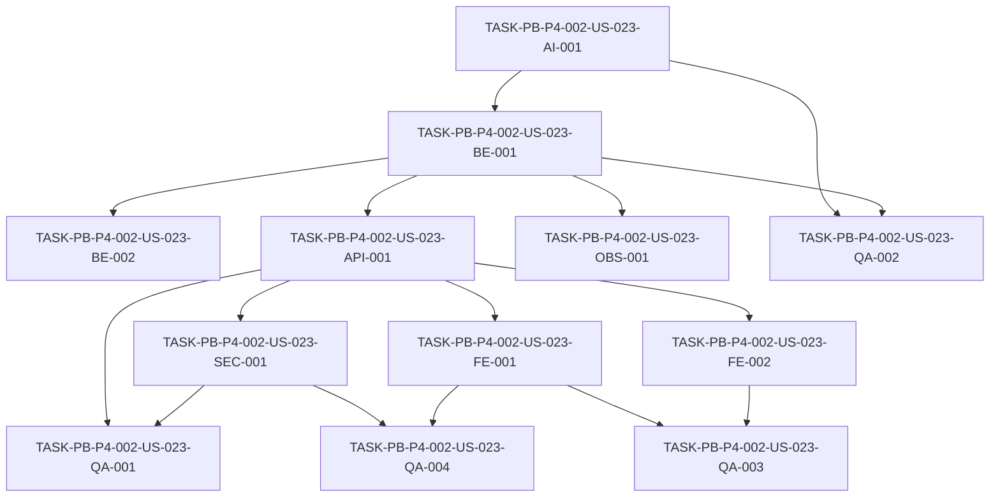

# Development Tasks — PB-P4-002 / US-023: (Vendor) Generar bio y paquetes con IA

## 1. Metadata

| Field | Value |
|---|---|
| User Story ID | US-023 |
| Source User Story | management/user-stories/US-023-ai-vendor-bio-packages.md |
| Source Technical Specification | management/technical-specs/P4/PB-P4-002/US-023-technical-spec.md |
| Decision Resolution Artifact | No aplica (promoción formalizada en ADR-ARCH-005) |
| Priority | P4 (promovida a delivery actual vía ADR-ARCH-005) |
| Backlog ID | PB-P4-002 |
| Backlog Title | Vendor genera bio/paquetes con IA (AI-007) |
| Backlog Execution Order | Backlog P4 (promovido); tras EPIC-VND-001 y EPIC-AI-001 |
| User Story Position in Backlog Item | 1 de 1 |
| Related User Stories in Backlog Item | US-023 |
| Epic | EPIC-AIP-001 — AI-Assisted Event Planning |
| Backlog Item Dependencies | EPIC-VND-001 (perfil vendor), EPIC-AI-001 (infra IA) |
| Feature | AI-007 Bio/paquetes IA del proveedor (promovida desde Could Have / v1.1) |
| Module / Domain | AI / Vendors |
| Backlog Alignment Status | Found |
| Task Breakdown Status | Ready for Sprint Planning |
| Created Date | 2026-08-13 |
| Last Updated | 2026-08-13 |

---

## 2. Source Validation

| Source | Found | Used | Notes |
|---|---|---|---|
| User Story | Yes | Yes | Approved with Minor Notes. |
| Technical Specification | Yes | Yes | Ready for Task Breakdown; fuente primaria. |
| Decision Resolution Artifact | No | No | Promoción vía ADR-ARCH-005. |
| Product Backlog Prioritized | Yes | Yes | PB-P4-002, promovido por ADR-ARCH-005. |
| ADRs | Yes | Yes | ADR-ARCH-005, ADR-AI-001/002/003/005/006/007, ADR-SEC-003, ADR-API-001..004, ADR-TEST-003/004. |

---

## 3. Backlog Execution Context

### Parent Backlog Item

**PB-P4-002 — Vendor genera bio/paquetes con IA (AI-007)**. Promovido desde el Backlog P4 (target v1.1) a la fase de delivery actual por decisión PO 2026-08-13 (ADR-ARCH-005). Agrupa únicamente US-023.

### Execution Order Rationale

Se apoya en el perfil de vendor (EPIC-VND-001) y en la infra de IA (EPIC-AI-001: LLMProvider, AIRecommendation, Prompt Registry, apply/discard). Se ejecuta tras esas bases.

### Related User Stories in Same Backlog Item

| User Story | Role in Backlog Item | Suggested Order |
|---|---|---|
| US-023 | Único item de PB-P4-002 | 1 |

---

## 4. Task Breakdown Summary

| Area | Number of Tasks | Notes |
|---|---:|---|
| AI / PromptOps | 1 | Prompts + I/O schemas + fallback |
| Backend | 2 | Use cases de generación; escritura al aplicar |
| API Contract | 1 | Endpoints + Zod + ownership |
| Security / Authorization | 1 | Ownership + rate limit + no exposición de llaves |
| Frontend | 2 | AIVendorBio y AIVendorPackages (editor, badge, banner EC-01, i18n) |
| Observability / Audit | 1 | Eventos IA |
| Seed / Demo | 1 | Vendor seed opcional |
| QA / Testing | 4 | Integration+auth, AI, E2E, seguridad+accesibilidad |
| Documentation / Traceability | 1 | Alinear D3/D7 |
| **Total** | **14** | |

---

## 5. Traceability Matrix

| Acceptance Criterion | Technical Spec Section | Task IDs |
|---|---|---|
| AC-01 Bio generada | §6, §7, §9, §11 | TASK-PB-P4-002-US-023-AI-001, -BE-001, -API-001, -FE-001, -QA-001, -QA-002 |
| AC-02 Paquetes generados | §6, §7, §9, §11 | TASK-PB-P4-002-US-023-AI-001, -BE-001, -BE-002, -API-001, -FE-002, -QA-001, -QA-002 |
| EC-01 Texto sensible | §8 | TASK-PB-P4-002-US-023-FE-001, -FE-002 |
| VR-01 Solo vendor sobre su perfil | §12 | TASK-PB-P4-002-US-023-SEC-001, -API-001, -QA-001, -QA-004 |
| VR-02 Bio ≤ 1000 | §7, §11 | TASK-PB-P4-002-US-023-AI-001, -BE-001 |
| AI-TS-01 Mock genera bio | §13 | TASK-PB-P4-002-US-023-QA-002 |
| AI-TS-02 Timeout → fallback | §11, §13 | TASK-PB-P4-002-US-023-AI-001, -QA-002 |
| NT-01/NT-02 Organizer/Admin → 403 | §12, §13 | TASK-PB-P4-002-US-023-SEC-001, -QA-001, -QA-004 |
| AUTH-TS-01/02 | §13 | TASK-PB-P4-002-US-023-QA-001 |
| TS-03 E2E | §13 | TASK-PB-P4-002-US-023-QA-003 |

Todas las AC mapean a al menos una tarea.

---

## 6. Development Tasks

### TASK-PB-P4-002-US-023-AI-001 — Prompts versionados + schemas de I/O + fallback

| Field | Value |
|---|---|
| Area | AI / PromptOps |
| Type | Implementation |
| Priority | Must |
| Estimate | M |
| Depends On | — |
| Source AC(s) | AC-01, AC-02, VR-02, AI-TS-02 |
| Technical Spec Section(s) | §11 |
| Backlog ID | PB-P4-002 |
| User Story ID | US-023 |
| Owner Role | AI |
| Status | To Do |

#### Objective
Registrar `PROMPT-VENDOR-BIO-V1` y `PROMPT-VENDOR-PACKAGES-V1` en el Prompt Registry (+ `AIPromptVersion`), con schemas estrictos de input/output y comportamiento de fallback por timeout/error.

#### Scope
##### Include
- Prompts versionados; JSON schema de output (`{ bio }` ≤1000 / `{ packages:[{id,description}] }`).
- Fallback a template estático con `fallbackUsed=true`.
##### Exclude
- Regeneración iterativa avanzada (US-026).

#### Implementation Notes
Alinear con ADR-AI-006/007. Sanitización de prompt.

#### Acceptance Criteria Covered
AC-01, AC-02, VR-02, AI-TS-02.

#### Definition of Done
- [ ] Prompts versionados y resolubles por el registry.
- [ ] Output fuera de schema → fallback.
- [ ] Bio truncada a 1000.

---

### TASK-PB-P4-002-US-023-BE-001 — Use cases `GenerateVendorBio` / `GenerateVendorPackages`

| Field | Value |
|---|---|
| Area | Backend |
| Type | Implementation |
| Priority | Must |
| Estimate | M |
| Depends On | TASK-PB-P4-002-US-023-AI-001 |
| Source AC(s) | AC-01, AC-02, VR-02 |
| Technical Spec Section(s) | §7, §11 |
| Backlog ID | PB-P4-002 |
| User Story ID | US-023 |
| Owner Role | Backend |
| Status | To Do |

#### Objective
Implementar los casos de uso que invocan el `LLMProvider`, validan el output y persisten `AIRecommendation(pending, kind='vendor_bio'/'vendor_packages')` con `vendorProfileId` y `eventId=null`.

#### Scope
##### Include
- Construcción de input; invocación LLMProvider; validación; persistencia AIRecommendation; `aiMeta`.
##### Exclude
- Escritura al perfil (va en apply, BE-002).

#### Implementation Notes
HITL: status `pending`; nada se materializa aquí (ADR-AI-005).

#### Acceptance Criteria Covered
AC-01, AC-02, VR-02.

#### Definition of Done
- [ ] Crea AIRecommendation pending con output válido.
- [ ] `aiMeta` con provider/promptVersion/latencyMs/fallbackUsed.

---

### TASK-PB-P4-002-US-023-BE-002 — Aplicar sugerencia a `VendorProfile.bio` / `VendorService.description`

| Field | Value |
|---|---|
| Area | Backend |
| Type | Implementation |
| Priority | Must |
| Estimate | S |
| Depends On | TASK-PB-P4-002-US-023-BE-001 |
| Source AC(s) | AC-02 |
| Technical Spec Section(s) | §7, §9 |
| Backlog ID | PB-P4-002 |
| User Story ID | US-023 |
| Owner Role | Backend |
| Status | To Do |

#### Objective
Extender/reutilizar `AcceptAIRecommendationUseCase` para escribir `bio` en `VendorProfile` y `description` en `VendorService` al aplicar una sugerencia `vendor_bio`/`vendor_packages`.

#### Scope
##### Include
- Mapeo apply → escritura de perfil/servicio; discard sin efecto.
##### Exclude
- Nuevos endpoints (se reutilizan `/ai-recommendations/:id/apply|discard`).

#### Implementation Notes
Ownership verificado en apply; idempotencia (409 si ya aplicada).

#### Acceptance Criteria Covered
AC-02 (y guardado de AC-01).

#### Definition of Done
- [ ] Apply escribe el campo correcto según `kind`.
- [ ] Discard no modifica el perfil.

---

### TASK-PB-P4-002-US-023-API-001 — Endpoints de generación + Zod + ownership

| Field | Value |
|---|---|
| Area | API Contract |
| Type | Implementation |
| Priority | Must |
| Estimate | S |
| Depends On | TASK-PB-P4-002-US-023-BE-001 |
| Source AC(s) | AC-01, AC-02, VR-01 |
| Technical Spec Section(s) | §9 |
| Backlog ID | PB-P4-002 |
| User Story ID | US-023 |
| Owner Role | Backend |
| Status | To Do |

#### Objective
Exponer `POST /api/v1/vendors/me/ai/bio` y `POST /api/v1/vendors/me/ai/packages` con validación Zod, ownership y correlation ID; envelope estándar.

#### Scope
##### Include
- Controllers finos; Zod de input; 403 no-owner; 200 con AIRecommendation.
##### Exclude
- Lógica de dominio (en use cases).

#### Acceptance Criteria Covered
AC-01, AC-02, VR-01.

#### Definition of Done
- [ ] Endpoints responden 200/403/422 según corresponda.
- [ ] Correlation ID propagado.

---

### TASK-PB-P4-002-US-023-SEC-001 — Ownership, rate limit y no exposición de llaves

| Field | Value |
|---|---|
| Area | Security / Authorization |
| Type | Implementation |
| Priority | Must |
| Estimate | S |
| Depends On | TASK-PB-P4-002-US-023-API-001 |
| Source AC(s) | VR-01, SEC-01..03, NT-01, NT-02 |
| Technical Spec Section(s) | §12 |
| Backlog ID | PB-P4-002 |
| User Story ID | US-023 |
| Owner Role | Backend |
| Status | To Do |

#### Objective
Aplicar ownership (vendor sobre su perfil), rate limit de IA y garantizar que las llaves del provider nunca salen del backend.

#### Scope
##### Include
- Middleware ownership; rate limit; redacción de logs.
##### Exclude
- MFA.

#### Acceptance Criteria Covered
VR-01, SEC-01..03, NT-01, NT-02.

#### Definition of Done
- [ ] Organizer/Admin → 403; perfil ajeno → 403.
- [ ] Rate limit activo; llaves solo en backend.

---

### TASK-PB-P4-002-US-023-FE-001 — `AIVendorBio` (editor, badge, banner EC-01, i18n)

| Field | Value |
|---|---|
| Area | Frontend |
| Type | Implementation |
| Priority | Must |
| Estimate | M |
| Depends On | TASK-PB-P4-002-US-023-API-001 |
| Source AC(s) | AC-01, EC-01 |
| Technical Spec Section(s) | §8 |
| Backlog ID | PB-P4-002 |
| User Story ID | US-023 |
| Owner Role | Frontend |
| Status | To Do |

#### Objective
Componente de bio con botones Generar/Regenerar/Descartar, editor editable, badge "sugerencia IA", banner de cumplimiento (EC-01) y estados loading/error; i18n locale del vendor.

#### Scope
##### Include
- Generación (TanStack Query), edición, apply/discard, banner EC-01.
##### Exclude
- Auto-publicación.

#### Acceptance Criteria Covered
AC-01, EC-01.

#### Definition of Done
- [ ] Bio generada es editable y solo se guarda al aplicar.
- [ ] Banner EC-01 visible antes de publicar.
- [ ] Textos en locale del vendor.

---

### TASK-PB-P4-002-US-023-FE-002 — `AIVendorPackages` (editor, badge, banner EC-01, i18n)

| Field | Value |
|---|---|
| Area | Frontend |
| Type | Implementation |
| Priority | Must |
| Estimate | M |
| Depends On | TASK-PB-P4-002-US-023-API-001 |
| Source AC(s) | AC-02, EC-01 |
| Technical Spec Section(s) | §8 |
| Backlog ID | PB-P4-002 |
| User Story ID | US-023 |
| Owner Role | Frontend |
| Status | To Do |

#### Objective
Componente de paquetes: generar descripciones por paquete, revisar/editar y guardar (apply); badge, banner EC-01, estados y i18n.

#### Scope
##### Include
- Generación y guardado por paquete; edición.
##### Exclude
- Generación de imágenes.

#### Acceptance Criteria Covered
AC-02, EC-01.

#### Definition of Done
- [ ] Descripciones por paquete editables y guardables.
- [ ] Respeta locale/moneda del vendor si menciona montos.

---

### TASK-PB-P4-002-US-023-OBS-001 — Eventos IA de vendor

| Field | Value |
|---|---|
| Area | Observability / Audit |
| Type | Implementation |
| Priority | Should |
| Estimate | XS |
| Depends On | TASK-PB-P4-002-US-023-BE-001 |
| Source AC(s) | AC-01, AI-TS-02 |
| Technical Spec Section(s) | §14 |
| Backlog ID | PB-P4-002 |
| User Story ID | US-023 |
| Owner Role | Backend |
| Status | To Do |

#### Objective
Emitir `ai.vendor_bio.success/failure` y `ai.vendor_packages.success/failure` con `correlationId` y `aiMeta`, sin filtrar llaves/PII.

#### Scope
##### Include
- Logs estructurados; `fallbackUsed`.
##### Exclude
- Métricas avanzadas.

#### Acceptance Criteria Covered
AC-01, AI-TS-02.

#### Definition of Done
- [ ] Eventos emitidos; tests de redacción pasan.

---

### TASK-PB-P4-002-US-023-SEED-001 — Vendor seed con inputs base (opcional demo)

| Field | Value |
|---|---|
| Area | Seed / Demo Data |
| Type | Implementation |
| Priority | Could |
| Estimate | XS |
| Depends On | — |
| Source AC(s) | AC-01, AC-02 |
| Technical Spec Section(s) | §15 |
| Backlog ID | PB-P4-002 |
| User Story ID | US-023 |
| Owner Role | Backend |
| Status | To Do |

#### Objective
Agregar (opcional) un vendor seed con categoría/ciudad/años/especialidades para demostrar la generación IA.

#### Scope
##### Include
- Seed idempotente `is_seed=true`.
##### Exclude
- Datos productivos.

#### Acceptance Criteria Covered
AC-01, AC-02.

#### Definition of Done
- [ ] Demo de generación reproducible con MockAIProvider.

---

### TASK-PB-P4-002-US-023-QA-001 — Integration + autorización

| Field | Value |
|---|---|
| Area | QA / Testing |
| Type | Test |
| Priority | Must |
| Estimate | M |
| Depends On | TASK-PB-P4-002-US-023-API-001, -SEC-001 |
| Source AC(s) | AC-01, AC-02, VR-01, NT-01, NT-02, AUTH-TS-01, AUTH-TS-02 |
| Technical Spec Section(s) | §13 |
| Backlog ID | PB-P4-002 |
| User Story ID | US-023 |
| Owner Role | QA |
| Status | To Do |

#### Objective
Cubrir TS-01/02, NT-01/02 y AUTH-TS-01/02 con Vitest + Supertest y `MockAIProvider`.

#### Scope
##### Include
- Bio/paquetes generados; 403 organizer/admin; vendor 200.
##### Exclude
- E2E (QA-003).

#### Acceptance Criteria Covered
AC-01, AC-02, VR-01, NT-01, NT-02, AUTH-TS-01, AUTH-TS-02.

#### Definition of Done
- [ ] Escenarios pasan en CI.

---

### TASK-PB-P4-002-US-023-QA-002 — Tests de IA (Mock + timeout)

| Field | Value |
|---|---|
| Area | QA / Testing |
| Type | Test |
| Priority | Must |
| Estimate | S |
| Depends On | TASK-PB-P4-002-US-023-AI-001, -BE-001 |
| Source AC(s) | AI-TS-01, AI-TS-02, VR-02 |
| Technical Spec Section(s) | §13 |
| Backlog ID | PB-P4-002 |
| User Story ID | US-023 |
| Owner Role | QA |
| Status | To Do |

#### Objective
Verificar AI-TS-01 (mock genera bio) y AI-TS-02 (timeout → fallback), y truncado de bio (VR-02).

#### Scope
##### Include
- Determinismo con MockAIProvider; fallback.
##### Exclude
- Llamadas reales al provider.

#### Acceptance Criteria Covered
AI-TS-01, AI-TS-02, VR-02.

#### Definition of Done
- [ ] Fallback verificado; output validado por schema.

---

### TASK-PB-P4-002-US-023-QA-003 — E2E perfil vendor (TS-03)

| Field | Value |
|---|---|
| Area | QA / Testing |
| Type | Test |
| Priority | Must |
| Estimate | M |
| Depends On | TASK-PB-P4-002-US-023-FE-001, -FE-002 |
| Source AC(s) | AC-01, AC-02 |
| Technical Spec Section(s) | §13 |
| Backlog ID | PB-P4-002 |
| User Story ID | US-023 |
| Owner Role | QA |
| Status | To Do |

#### Objective
Flujo E2E (Playwright + MSW/MockAIProvider): generar → editar → guardar bio y paquetes.

#### Scope
##### Include
- Escenario feliz con revisión humana.
##### Exclude
- Integración real con OpenAI.

#### Acceptance Criteria Covered
AC-01, AC-02.

#### Definition of Done
- [ ] E2E verde en CI (smoke).

---

### TASK-PB-P4-002-US-023-QA-004 — Seguridad + accesibilidad

| Field | Value |
|---|---|
| Area | QA / Testing |
| Type | Test |
| Priority | Should |
| Estimate | S |
| Depends On | TASK-PB-P4-002-US-023-SEC-001, -FE-001 |
| Source AC(s) | VR-01, NT-01, NT-02, Accessibility |
| Technical Spec Section(s) | §12, §13 |
| Backlog ID | PB-P4-002 |
| User Story ID | US-023 |
| Owner Role | QA |
| Status | To Do |

#### Objective
Tests negativos de ownership/rate limit (quality gate ADR-TEST-004) y accesibilidad del editor.

#### Scope
##### Include
- Ownership ajeno → 403; rate limit; editor accesible/foco visible.
##### Exclude
- Pentest manual.

#### Acceptance Criteria Covered
VR-01, NT-01, NT-02, Accessibility Tests.

#### Definition of Done
- [ ] Suite negativa activa; accesibilidad verificada.

---

### TASK-PB-P4-002-US-023-DOC-001 — Alineación documental (D3, D7)

| Field | Value |
|---|---|
| Area | Documentation / Traceability |
| Type | Documentation |
| Priority | Should |
| Estimate | XS |
| Depends On | — |
| Source AC(s) | — (trazabilidad) |
| Technical Spec Section(s) | §16 |
| Backlog ID | PB-P4-002 |
| User Story ID | US-023 |
| Owner Role | Tech Lead |
| Status | To Do |

#### Objective
Actualizar `docs/3-MVP-Scope-Definition.md` y `docs/7-AI-Features-Specification.md` para reflejar AI-007 habilitada en la fase actual (ADR-ARCH-005).

#### Scope
##### Include
- Marcar AI-007 como habilitada; referenciar ADR-ARCH-005.
##### Exclude
- Cambios en otros features IA.

#### Acceptance Criteria Covered
Documentation Alignment (§16 de la Tech Spec).

#### Definition of Done
- [ ] D3 y D7 reflejan AI-007 habilitada.

---

## 7. Required QA Tasks

| Task ID | Test Type | Purpose |
|---|---|---|
| TASK-PB-P4-002-US-023-QA-001 | Integration | Generación + autorización (TS/NT/AUTH-TS) |
| TASK-PB-P4-002-US-023-QA-002 | AI | Mock + timeout/fallback (AI-TS) |
| TASK-PB-P4-002-US-023-QA-003 | E2E | Flujo perfil vendor (TS-03) |
| TASK-PB-P4-002-US-023-QA-004 | Security / Accessibility | Ownership/rate limit + editor accesible |

---

## 8. Required Security Tasks

| Task ID | Security Concern | Purpose |
|---|---|---|
| TASK-PB-P4-002-US-023-SEC-001 | Ownership / rate limit / no exposición de llaves | Autorización backend-only |
| TASK-PB-P4-002-US-023-QA-004 | Tests negativos de autorización | Quality gate (ADR-TEST-004) |

---

## 9. Required Seed / Demo Tasks

| Task ID | Seed/Demo Concern | Purpose |
|---|---|---|
| TASK-PB-P4-002-US-023-SEED-001 | Vendor con inputs base | Demostrar generación IA (opcional) |

---

## 10. Observability / Audit Tasks

| Task ID | Concern | Purpose |
|---|---|---|
| TASK-PB-P4-002-US-023-OBS-001 | Eventos IA | `ai.vendor_bio/packages.success/failure` + correlation ID |

---

## 11. Documentation / Traceability Tasks

| Task ID | Document / Artifact | Purpose |
|---|---|---|
| TASK-PB-P4-002-US-023-DOC-001 | D3, D7 | Alinear AI-007 habilitada |

---

## 12. Dependency Graph

---

## 13. Suggested Implementation Order

### Phase 1 — Foundation
- TASK-PB-P4-002-US-023-AI-001 (prompts + schemas + fallback)

### Phase 2 — Core Implementation
- TASK-PB-P4-002-US-023-BE-001 (use cases)
- TASK-PB-P4-002-US-023-BE-002 (apply → perfil/servicio)
- TASK-PB-P4-002-US-023-API-001 (endpoints)
- TASK-PB-P4-002-US-023-FE-001 / -FE-002 (frontend)

### Phase 3 — Validation / Security / QA
- TASK-PB-P4-002-US-023-SEC-001 (ownership/rate limit)
- TASK-PB-P4-002-US-023-OBS-001 (observabilidad)
- TASK-PB-P4-002-US-023-SEED-001 (seed opcional)
- TASK-PB-P4-002-US-023-QA-001/002/003/004

### Phase 4 — Documentation / Review
- TASK-PB-P4-002-US-023-DOC-001

---

## 14. Risks & Mitigations

| Risk | Impact | Mitigation | Related Task |
|---|---|---|---|
| Output IA sensible/legal | Reputacional/legal | HITL + banner EC-01 | FE-001, FE-002 |
| Output fuera de schema | Datos inválidos | Validación estricta + fallback | AI-001, BE-001 |
| Abuso/costo de IA | Costo/latencia | Rate limit IA | SEC-001 |
| Escritura a perfil ajeno | Seguridad | Ownership estricto | SEC-001, BE-002 |
| Exposición de llaves | Alta | Backend-only, redacción logs | SEC-001, OBS-001 |

---

## 15. Out of Scope Confirmation

- Moderación automática IA de texto.
- Generación de imágenes.
- Auto-publicación sin revisión.
- Regeneración iterativa avanzada (US-026).
- Decisiones autónomas de IA.

---

## 16. Readiness for Sprint Planning

| Check | Status |
|---|---|
| Product Backlog mapping found | Pass |
| Every AC maps to tasks | Pass |
| Technical Spec used when available | Pass |
| QA tasks included | Pass |
| Security tasks included if applicable | Pass |
| Seed/demo tasks included if applicable | Pass |
| Observability tasks included if applicable | Pass |
| Documentation tasks included if applicable | Pass |
| Task dependencies clear | Pass |
| Tasks small enough | Pass |
| Ready for Sprint Planning | Yes |

---

## 17. Final Recommendation

**Ready for Sprint Planning.**

14 tareas cubren la especificación técnica y todos los AC de US-023, reutilizando la infraestructura de IA existente sin cambios de esquema. La historia está aprobada y promovida (ADR-ARCH-005); no hay bloqueos. HITL, seguridad por ownership, IA determinista, observabilidad, seed/demo y documentación están cubiertos.
