# EventFlow — Executive Summary of AI Prompts

## 1. Propósito del documento

`/prompts.md` centraliza un resumen ejecutivo de los prompts utilizados para guiar la generación asistida por IA de la documentación de EventFlow. Su objetivo es servir como índice navegable para revisores, docentes, desarrolladores y evaluadores, facilitando la comprensión del propósito de cada prompt, el artefacto que produce y su lugar dentro del flujo documental del proyecto.

Los prompts completos se encuentran en la carpeta [`/prompts`](./prompts/).

## 2. Contexto del proyecto

EventFlow es un MVP de planificación de eventos y gestión simplificada de proveedores, construido como proyecto final de una maestría en desarrollo de software asistido por IA. La propuesta se enfoca en un espacio de trabajo para organizar eventos con apoyo de IA, más un flujo acotado de solicitud y comparación de cotizaciones, evitando convertir el producto en un marketplace transaccional completo en la primera versión.

La documentación del proyecto cubre una cadena documental SDLC-oriented que va desde discovery y análisis hasta diseño técnico, diseño de seguridad, estrategia de pruebas, despliegue y registro de decisiones arquitectónicas. Las fases incluidas son:

- Planning
- Analysis
- Architecture
- Backend Technical Design
- Frontend Architecture Design
- API Design
- AI Architecture & PromptOps
- Database Physical Design
- Security & Authorization Design
- Testing Strategy
- Deployment & DevOps Design
- ADR Design

Esta cobertura corresponde a trabajo de documentación y diseño. La implementación de código, ejecución de pruebas, despliegues reales y evidencia de PRs se rastrean por separado fuera de este índice.

## 3. Estrategia general de prompting

La colección sigue una estrategia de prompting orientada a documentación trazable y control de alcance. En la mayor parte del set se observa la estructura `ACT → AIM → ACTION`, usada para fijar rol, objetivo y ejecución esperada. En los prompts que no siguen ese formato literal, igualmente se mantiene una intención clara de contexto, objetivo y salida estructurada.

De forma transversal, los prompts refuerzan:

- uso de documentos fuente como source of truth;
- restricción explícita del MVP para evitar sobreingeniería;
- separación entre MVP, futuro, fuera de alcance y decisiones pendientes;
- salida en español LATAM con tono profesional;
- trazabilidad entre artefactos;
- validación humana obligatoria en funciones asistidas por IA;
- control sobre supuestos, derivaciones y contenido no soportado.

Los prompts más recientes (12 a 22) extienden esta estrategia hacia diseño técnico y readiness de implementación. Para esa nueva capa, se incorporan técnicas adicionales que mantienen la misma disciplina de trazabilidad y control de alcance, ahora aplicadas a decisiones arquitectónicas y guías accionables:

- Architecture decision prompting
- C4 architecture prompting
- Implementation-ready technical design prompting
- Backend modular design prompting
- Frontend architecture prompting
- API contract prompting
- PromptOps design prompting
- Database physical design prompting
- Security threat modeling prompting
- Testing strategy prompting
- DevOps deployment prompting
- ADR prompting

## 4. Resumen ejecutivo de prompts

|  # | Prompt file | Propósito | Artefacto de salida | Link |
| -: | ----------- | --------- | ------------------- | ---- |
| 0 | `0-system-prompt.md` | Define el contexto maestro de discovery, hipótesis estratégica, alcance de investigación y formato esperado del reporte inicial. | `docs/1-Domain-Discovery-Report.md` | [View prompt](./prompts/0-system-prompt.md) |
| 1 | `1-Domain-Discovery-Report.md` | Solicita generar el Domain Discovery Report validando la hipótesis de producto y priorizando un MVP realista. | `docs/1-Domain-Discovery-Report.md` | [View prompt](./prompts/1-Domain-Discovery-Report.md) |
| 2 | `2-Generate-MVP-Scope-Definition.md` | Define el alcance exacto del MVP a partir del discovery y decisiones del Product Owner. | `docs/3-MVP-Scope-Definition.md` | [View prompt](./prompts/2-Generate-MVP-Scope-Definition.md) |
| 3 | `3-Generate-Business-Rules.md` | Extrae y formaliza reglas de negocio testables alineadas al MVP. | `docs/4-Business-Rules-Document.md` | [View prompt](./prompts/3-Generate-Business-Rules.md) |
| 4 | `4-User-Roles-Permissions-Matrix.md` | Construye la matriz de roles y permisos por módulo, entidad y flujo. | `docs/5-User-Roles-Permissions-Matrix.md` | [View prompt](./prompts/4-User-Roles-Permissions-Matrix.md) |
| 5 | `5-Generate-Domain-Data-Model.md` | Descubre entidades, relaciones, enums y constraints desde la documentación previa. | `docs/6-Domain-Data-Model.md` | [View prompt](./prompts/5-Generate-Domain-Data-Model.md) |
| 6 | `6-Generate-AI-features.md` | Especifica las funcionalidades de IA permitidas, sus inputs, outputs, validaciones y fallback. | `docs/7-AI-Features-Specification.md` | [View prompt](./prompts/6-Generate-AI-features.md) |
| 7 | `7-Generate-Use-Cases-Specification.md` | Deriva e inventaría casos de uso MVP, futuros y fuera de alcance, con detalle formal y diagramas. | `docs/8-Use-Cases-Specification.md` | [View prompt](./prompts/7-Generate-Use-Cases-Specification.md) |
| 7.1 | `7.1-Review-and-Update-Documentation-Before-FRD.md` | Revisa y alinea la documentación previa al FRD con un addendum de decisiones del Product Owner. | Actualización en `docs/4` a `docs/8` y creación de `docs/8.2-Documentation-Alignment-Review-Before-FRD.md` | [View prompt](./prompts/7.1-Review-and-Update-Documentation-Before-FRD.md) |
| 8 | `8-Generate-Functional-Requirements-FRD.md` | Consolida requerimientos funcionales trazables y listos para implementación. | `docs/9-Functional-Requirements-Document.md` | [View prompt](./prompts/8-Generate-Functional-Requirements-FRD.md) |
| 9 | `9-Generate-Non-Functional-Requirements.md` | Define NFRs medibles, realistas y alineados con el MVP. | `docs/10-Non-Functional-Requirements.md` | [View prompt](./prompts/9-Generate-Non-Functional-Requirements.md) |
| 11 | `11-Generate-Data-Seed-Strategy.md` | Diseña la estrategia de datos seed y demo a partir de los artefactos funcionales y no funcionales. | `docs/11-Data-Seed-Strategy.md` | [View prompt](./prompts/11-Generate-Data-Seed-Strategy.md) |
| 12 | `12-Generate-Architecture-Vision-and-Principles.md` | Define la visión arquitectónica inicial, principios técnicos y límites arquitectónicos del MVP. | `docs/12-Architecture-Vision-and-Principles.md` | [View prompt](./prompts/12-Generate-Architecture-Vision-and-Principles.md) |
| 13 | `13-Generate-System-Architecture.md` | Traduce la visión arquitectónica en arquitectura de sistema con vistas C4, módulos, responsabilidades e integraciones. | `docs/13-System-Architecture-Document.md` | [View prompt](./prompts/13-Generate-System-Architecture.md) |
| 14 | `14-Generate-Backend-Technical-Design.md` | Define el diseño técnico backend con Node.js, Express, TypeScript, Prisma, PostgreSQL y arquitectura modular. | `docs/14-Backend-Technical-Design.md` | [View prompt](./prompts/14-Generate-Backend-Technical-Design.md) |
| 15 | `15-Frontend-Architecture-Design.md` | Define la arquitectura frontend con Next.js, TypeScript, App Router, i18n, estado, UX IA y testing frontend. | `docs/15-Frontend-Architecture-Design.md` | [View prompt](./prompts/15-Frontend-Architecture-Design.md) |
| 16 | `16-Generate-API-Design-Specification.md` | Define el contrato REST del MVP, convenciones de API, autorización, DTOs, errores y OpenAPI readiness. | `docs/16-API-Design-Specification.md` | [View prompt](./prompts/16-Generate-API-Design-Specification.md) |
| 17 | `17-Generate-AI-Architecture-Prompts-Design.md` | Define la arquitectura IA y PromptOps: providers, prompts, fallback, trazabilidad, seguridad y testing IA. | `docs/17-AI-Architecture-and-PromptOps-Design.md` | [View prompt](./prompts/17-Generate-AI-Architecture-Prompts-Design.md) |
| 18 | `18-Generate-Database-Physical-Design.md` | Traduce el modelo de dominio a diseño físico PostgreSQL/Prisma con tablas, índices, constraints y migraciones. | `docs/18-Database-Physical-Design.md` | [View prompt](./prompts/18-Generate-Database-Physical-Design.md) |
| 19 | `19-Generate-Security-Authorization-Design.md` | Define seguridad y autorización implementable: amenazas, sesiones, RBAC, ownership, rate limiting, IA y auditoría. | `docs/19-Security-and-Authorization-Design.md` | [View prompt](./prompts/19-Generate-Security-Authorization-Design.md) |
| 20 | `20-Generate-Testing-Strategy.md` | Define la estrategia de pruebas del MVP para backend, frontend, API, IA, seguridad, accesibilidad, seed y E2E. | `docs/20-Testing-Strategy.md` | [View prompt](./prompts/20-Generate-Testing-Strategy.md) |
| 21 | `21-Generate-Deployment-and-DevOps-Design.md` | Define la estrategia de despliegue y DevOps en AWS, CI/CD, entornos, secretos, observabilidad y demo readiness. | `docs/21-Deployment-and-DevOps-Design.md` | [View prompt](./prompts/21-Generate-Deployment-and-DevOps-Design.md) |
| 22 | `22-Generate-ADR-Design.md` | Define el ADR Log del proyecto y formaliza decisiones arquitectónicas, técnicas, de seguridad, IA, testing y DevOps. | `docs/22-Architecture-Decision-Records.md` | [View prompt](./prompts/22-Generate-ADR-Design.md) |
| - | `wacl-prompts.md` | Registra un mapa informal de artefactos y líneas futuras de trabajo para skills/agentes del proyecto. | Nota de referencia, sin artefacto formal definido | [View prompt](./prompts/wacl-prompts.md) |

## 5. Matriz de prompts y artefactos generados

| Prompt | Documento generado | Fase | Nivel de dependencia | Notas |
| ------ | ------------------ | ----- | -------------------- | ----- |
| `0-system-prompt.md` | Base de trabajo para discovery | Planning | Base | Actúa como contexto rector del análisis inicial. |
| `1-Domain-Discovery-Report.md` | `docs/1-Domain-Discovery-Report.md` | Planning | Base | Inicia la cadena documental formal. |
| `2-Generate-MVP-Scope-Definition.md` | `docs/3-MVP-Scope-Definition.md` | Planning | Depends on previous docs | Usa discovery y decisiones del Product Owner. |
| `3-Generate-Business-Rules.md` | `docs/4-Business-Rules-Document.md` | Analysis | Depends on previous docs | Convierte el alcance en reglas verificables. |
| `4-User-Roles-Permissions-Matrix.md` | `docs/5-User-Roles-Permissions-Matrix.md` | Analysis | Depends on previous docs | Formaliza autorización y ownership. |
| `5-Generate-Domain-Data-Model.md` | `docs/6-Domain-Data-Model.md` | Analysis | Depends on previous docs | Modela entidades y relaciones del MVP. |
| `6-Generate-AI-features.md` | `docs/7-AI-Features-Specification.md` | Analysis | Depends on previous docs | Acota el uso de IA con validación humana. |
| `7-Generate-Use-Cases-Specification.md` | `docs/8-Use-Cases-Specification.md` | Analysis | Depends on previous docs | Baja reglas y capacidades a interacción actor-sistema. |
| `7.1-Review-and-Update-Documentation-Before-FRD.md` | `docs/8.2-Documentation-Alignment-Review-Before-FRD.md` y actualización de docs previos | Documentation alignment | Review / alignment | Ajusta inconsistencias antes del FRD. |
| `8-Generate-Functional-Requirements-FRD.md` | `docs/9-Functional-Requirements-Document.md` | Analysis | Consolidation | Formaliza lo que el sistema debe hacer. |
| `9-Generate-Non-Functional-Requirements.md` | `docs/10-Non-Functional-Requirements.md` | Analysis | Consolidation | Define calidad, seguridad, resiliencia y demo readiness. |
| `11-Generate-Data-Seed-Strategy.md` | `docs/11-Data-Seed-Strategy.md` | Delivery preparation | Final delivery support | Conecta demo, QA, seed y trazabilidad. |
| `12-Generate-Architecture-Vision-and-Principles.md` | `docs/12-Architecture-Vision-and-Principles.md` | Architecture | Depends on Planning + Analysis docs | Define principios técnicos y decisiones base para diseño posterior. |
| `13-Generate-System-Architecture.md` | `docs/13-System-Architecture-Document.md` | Architecture | Depends on docs 1–12 | Traduce la visión en vistas C4, módulos, integraciones y flujos. |
| `14-Generate-Backend-Technical-Design.md` | `docs/14-Backend-Technical-Design.md` | Technical Design | Depends on docs 1–13 | Baja la arquitectura a capas, módulos, casos de uso, DTOs y repositorios backend. |
| `15-Frontend-Architecture-Design.md` | `docs/15-Frontend-Architecture-Design.md` | Technical Design | Depends on docs 1–14 | Define arquitectura frontend, routing, estado, i18n, UX IA y testing frontend. |
| `16-Generate-API-Design-Specification.md` | `docs/16-API-Design-Specification.md` | API Design | Depends on docs 1–15 | Formaliza contratos REST, endpoints, DTOs, errores, seguridad y OpenAPI readiness. |
| `17-Generate-AI-Architecture-Prompts-Design.md` | `docs/17-AI-Architecture-and-PromptOps-Design.md` | AI Technical Design / PromptOps | Depends on docs 1–16 | Define providers, prompts, fallback, trazabilidad, seguridad y testing IA. |
| `18-Generate-Database-Physical-Design.md` | `docs/18-Database-Physical-Design.md` | Database Technical Design | Depends on docs 1–17 | Materializa el modelo en PostgreSQL/Prisma, índices, constraints y migraciones. |
| `19-Generate-Security-Authorization-Design.md` | `docs/19-Security-and-Authorization-Design.md` | Security Design | Depends on docs 1–18 | Define threat model, autenticación, autorización, seguridad API, IA, DB y auditoría. |
| `20-Generate-Testing-Strategy.md` | `docs/20-Testing-Strategy.md` | Testing Strategy | Depends on docs 1–19 | Define estrategia de pruebas por capa, IA determinística, autorización, seed y E2E. |
| `21-Generate-Deployment-and-DevOps-Design.md` | `docs/21-Deployment-and-DevOps-Design.md` | Deployment & DevOps | Depends on docs 1–20 | Define AWS, CI/CD, entornos, secretos, observabilidad, migraciones y demo readiness. |
| `22-Generate-ADR-Design.md` | `docs/22-Architecture-Decision-Records.md` | Architecture Decision Records | Depends on docs 1–21 | Consolida decisiones técnicas y arquitectónicas como ADRs trazables. |
| `wacl-prompts.md` | Referencia no formal | Delivery preparation | Review / alignment | Sirve como nota de orientación, no como prompt completo de generación. |

## 6. Técnicas de prompting utilizadas

| Técnica | Descripción | Used in |
| --------- | ----------- | ------- |
| AAA Prompting | Estructura explícita de rol, objetivo e instrucciones para conducir la salida. | `3`, `4`, `5`, `6`, `7`, `7.1`, `8`, `9`, `11`, `12`, `13`, `14`, `15`, `16`, `17`, `18`, `19`, `20`, `21`, `22` |
| Source-of-truth grounding | Obliga a trabajar sobre documentos previos y evita inventar alcance. | `2`, `3`, `4`, `5`, `6`, `7`, `7.1`, `8`, `9`, `11`, `12`, `13`, `14`, `15`, `16`, `17`, `18`, `19`, `20`, `21`, `22` |
| Extraction-first prompting | Pide extraer primero entidades, features, casos, requisitos o datasets antes de especificar. | `5`, `6`, `7`, `8`, `9`, `11` |
| Classification-based prompting | Clasifica contenido por tipo de fuente, prioridad, alcance o estatus MVP/Future/Out of Scope. | `3`, `4`, `5`, `6`, `7`, `8`, `9`, `11`, `19`, `20`, `22` |
| Scope guardrails | Refuerza límites del MVP y bloquea features típicas pero no soportadas. | `0`, `1`, `2`, `3`, `4`, `5`, `6`, `7`, `7.1`, `8`, `9`, `11`, `12`, `13`, `14`, `15`, `16`, `17`, `18`, `19`, `20`, `21`, `22` |
| MVP restriction validation | Exige validar que cada artefacto respete la estrategia de MVP acotado. | `2`, `6`, `7`, `8`, `9`, `11`, `12`, `13`, `14`, `15`, `16`, `17`, `18`, `19`, `20`, `21` |
| Traceability mapping | Solicita matrices o referencias cruzadas entre reglas, casos, FRD, NFR y seed data. | `3`, `4`, `7`, `8`, `9`, `11`, `13`, `14`, `15`, `16`, `17`, `18`, `19`, `20`, `21`, `22` |
| Structured output templates | Define secciones obligatorias, tablas, IDs y formatos de salida. | `0`, `2`, `3`, `4`, `5`, `6`, `7`, `7.1`, `8`, `9`, `11`, `12`, `13`, `14`, `15`, `16`, `17`, `18`, `19`, `20`, `21`, `22` |
| Document generation by sections | Descompone documentos extensos en secciones normalizadas para revisión académica. | `0`, `2`, `3`, `4`, `5`, `6`, `7`, `7.1`, `8`, `9`, `11`, `12`, `13`, `14`, `15`, `16`, `17`, `18`, `19`, `20`, `21`, `22` |
| Mermaid diagram generation | Exige diagramas Mermaid para representar relaciones, casos, vistas C4 o flujos. | `5`, `7`, `13`, `14`, `15`, `17`, `18`, `21` |
| Human-in-the-loop validation | Exige validación humana en salidas de IA o decisiones sensibles. | `2`, `6`, `7`, `8`, `9`, `11`, `17`, `19` |
| Future vs MVP separation | Separa explícitamente lo que entra en MVP de lo que queda diferido. | `0`, `2`, `3`, `4`, `5`, `6`, `7`, `8`, `9`, `11`, `12`, `13`, `14`, `15`, `16`, `17`, `18`, `19`, `20`, `21`, `22` |
| Out-of-scope control | Pide listar exclusiones explícitas para reducir ambigüedad. | `2`, `3`, `4`, `5`, `6`, `7`, `8`, `9`, `11`, `12`, `13`, `14`, `15`, `16`, `17`, `18`, `19`, `20`, `21` |
| Readiness checklist generation | Incorpora checklists de validación o preparación antes de continuar. | `2`, `7.1`, `9`, `11`, `14`, `15`, `16`, `17`, `18`, `19`, `20`, `21`, `22` |
| QA scenario derivation | Conecta los artefactos con escenarios de validación o aceptación. | `4`, `6`, `7`, `8`, `9`, `11`, `19`, `20` |
| Seed/demo scenario derivation | Diseña datasets o recorridos pensados para demo académica y pruebas. | `2`, `7`, `8`, `9`, `11`, `18`, `20`, `21` |
| Alignment review prompting | Revisa, actualiza y alinea documentos existentes antes del siguiente entregable. | `7.1` |
| Architecture decision prompting | Orienta la selección y justificación de decisiones técnicas con alternativas, trade-offs y consecuencias. | `12`, `13`, `22` |
| C4 architecture prompting | Solicita representar arquitectura usando vistas de contexto, contenedores y componentes. | `13` |
| Implementation-ready technical design prompting | Convierte decisiones arquitectónicas en guías accionables para desarrollo. | `14`, `15`, `16`, `17`, `18`, `19`, `20`, `21` |
| Backend modular design prompting | Define módulos, capas, casos de uso, repositorios, DTOs, validaciones y estructura backend. | `14` |
| Frontend architecture prompting | Define App Router, layouts, estado, data fetching, i18n, accesibilidad y UX asistida por IA. | `15` |
| API contract prompting | Especifica endpoints REST, DTOs, errores, auth, autorización, paginación y OpenAPI readiness. | `16` |
| PromptOps design prompting | Define versionado de prompts, registry, providers, fallback, trazabilidad y operación IA. | `17` |
| Database physical design prompting | Traduce entidades de dominio a tablas, enums, índices, constraints, migraciones y Prisma schema. | `18` |
| Security threat modeling prompting | Identifica amenazas y define controles de autenticación, autorización, API, archivos, IA, secretos y auditoría. | `19` |
| Testing strategy prompting | Define niveles de prueba, herramientas, quality gates, mocks, E2E, seguridad, accesibilidad y seed testing. | `20` |
| Deployment design prompting | Define cloud provider, servicios, CI/CD, entornos, secretos, observabilidad, rollback y demo readiness. | `21` |
| ADR prompting | Formaliza decisiones arquitectónicas con contexto, alternativas, decisión, consecuencias y trazabilidad. | `22` |

## 7. Flujo documental generado por los prompts

```mermaid
flowchart TD
    A[0-system-prompt.md<br/>Contexto maestro de discovery] --> B[1-Domain-Discovery-Report.md<br/>Domain Discovery Report]
    B --> C[2-Generate-MVP-Scope-Definition.md<br/>MVP Scope Definition]
    C --> D[3-Generate-Business-Rules.md<br/>Business Rules Document]
    D --> E[4-User-Roles-Permissions-Matrix.md<br/>Roles and Permissions]
    E --> F[5-Generate-Domain-Data-Model.md<br/>Domain Data Model]
    F --> G[6-Generate-AI-features.md<br/>AI Features Specification]
    G --> H[7-Generate-Use-Cases-Specification.md<br/>Use Cases Specification]
    H --> I[7.1-Review-and-Update-Documentation-Before-FRD.md<br/>Alignment Review]
    I --> J[8-Generate-Functional-Requirements-FRD.md<br/>FRD]
    J --> K[9-Generate-Non-Functional-Requirements.md<br/>NFR]
    K --> L[11-Generate-Data-Seed-Strategy.md<br/>Data Seed Strategy]

    L --> M[12-Generate-Architecture-Vision-and-Principles.md<br/>Architecture Vision & Principles]
    M --> N[13-Generate-System-Architecture.md<br/>System Architecture]
    N --> O[14-Generate-Backend-Technical-Design.md<br/>Backend Technical Design]
    N --> P[15-Frontend-Architecture-Design.md<br/>Frontend Architecture Design]
    O --> Q[16-Generate-API-Design-Specification.md<br/>API Design Specification]
    P --> Q
    Q --> R[17-Generate-AI-Architecture-Prompts-Design.md<br/>AI Architecture & PromptOps]
    R --> S[18-Generate-Database-Physical-Design.md<br/>Database Physical Design]
    S --> T[19-Generate-Security-Authorization-Design.md<br/>Security & Authorization Design]
    T --> U[20-Generate-Testing-Strategy.md<br/>Testing Strategy]
    U --> V[21-Generate-Deployment-and-DevOps-Design.md<br/>Deployment & DevOps Design]
    V --> W[22-Generate-ADR-Design.md<br/>ADR Design]

    X[wacl-prompts.md<br/>Mapa informal y notas futuras] -. referencia .-> A
    X -. referencia .-> W
```

## 8. Detalle ejecutivo por prompt

### 0-system-prompt.md

**Ubicación:** [`0-system-prompt.md`](./prompts/0-system-prompt.md)

**Objetivo:**  
Definir el marco de discovery del proyecto, la hipótesis estratégica inicial de EventFlow, el alcance de investigación y el formato del reporte esperado.

**Artefacto que genera:**  
Base para `docs/1-Domain-Discovery-Report.md`.

**Técnica utilizada:**  
Role prompting, guardrails de alcance, validación de hipótesis estratégica, estructura de salida por secciones.

**Entradas principales:**  
Contexto del producto y objetivos académicos del proyecto.

**Valor dentro del proyecto:**  
Establece la línea editorial y analítica que alimenta el resto de la documentación.

**Notas relevantes:**  
Incluye restricciones claras para no sobreexpandir el MVP y pide recomendación estratégica explícita, no neutral.

### 1-Domain-Discovery-Report.md

**Ubicación:** [`1-Domain-Discovery-Report.md`](./prompts/1-Domain-Discovery-Report.md)

**Objetivo:**  
Solicitar el Domain Discovery Report completo para EventFlow con foco en dominio, usuarios, procesos, riesgos y recomendación estratégica.

**Artefacto que genera:**  
`docs/1-Domain-Discovery-Report.md`.

**Técnica utilizada:**  
Prompt directo orientado a skill, validación de hipótesis de producto, separación entre hechos, supuestos e hipótesis.

**Entradas principales:**  
Contexto general de EventFlow y skill de discovery referenciado por el prompt.

**Valor dentro del proyecto:**  
Produce el primer artefacto formal del que dependen alcance, reglas y requerimientos posteriores.

**Notas relevantes:**  
Pide fuentes recientes cuando se requiera investigación externa y prioriza un MVP realista.

### 2-Generate-MVP-Scope-Definition.md

**Ubicación:** [`2-Generate-MVP-Scope-Definition.md`](./prompts/2-Generate-MVP-Scope-Definition.md)

**Objetivo:**  
Definir exactamente qué entra, qué no entra y qué se simula dentro del MVP.

**Artefacto que genera:**  
`docs/3-MVP-Scope-Definition.md`.

**Técnica utilizada:**  
Source-of-truth grounding, validación de restricciones MVP, plantilla estructurada por módulos, separación MVP/Futuro/Fuera de alcance.

**Entradas principales:**  
`docs/1-Domain-Discovery-Report.md` y `docs/2-Product-Owner-Decisions.md`.

**Valor dentro del proyecto:**  
Convierte el discovery en una frontera de producto operativa para análisis, diseño y demo.

**Notas relevantes:**  
Incluye decisiones obligatorias del Product Owner sobre mercados, idiomas, IA, roles, seed data y simplificaciones del MVP.

### 3-Generate-Business-Rules.md

**Ubicación:** [`3-Generate-Business-Rules.md`](./prompts/3-Generate-Business-Rules.md)

**Objetivo:**  
Formalizar reglas de negocio precisas, testeables y clasificadas por prioridad y fuente.

**Artefacto que genera:**  
`docs/4-Business-Rules-Document.md`.

**Técnica utilizada:**  
AAA prompting, classification-based prompting, tablas con IDs, control de supuestos y reglas derivadas.

**Entradas principales:**  
`docs/1-Domain-Discovery-Report.md`, `docs/2-Product-Owner-Decisions.md`, `docs/3-MVP-Scope-Definition.md`.

**Valor dentro del proyecto:**  
Sirve como puente entre alcance de producto y especificación funcional verificable.

**Notas relevantes:**  
Exige clasificar cada regla como explícita, derivada, suposición o recomendación.

### 4-User-Roles-Permissions-Matrix.md

**Ubicación:** [`4-User-Roles-Permissions-Matrix.md`](./prompts/4-User-Roles-Permissions-Matrix.md)

**Objetivo:**  
Definir permisos por rol, módulo, entidad, ruta y API para el MVP.

**Artefacto que genera:**  
`docs/5-User-Roles-Permissions-Matrix.md`.

**Técnica utilizada:**  
AAA prompting, matrices estructuradas, clasificación de permisos, QA-oriented prompting.

**Entradas principales:**  
`docs/1-Domain-Discovery-Report.md`, `docs/2-Product-Owner-Decisions.md`, `docs/3-MVP-Scope-Definition.md`, `docs/4-Business-Rules-Document.md`.

**Valor dentro del proyecto:**  
Fija ownership, accesos y restricciones que luego impactan modelo, casos de uso, backend y QA.

**Notas relevantes:**  
Incluye roles futuros y fuera de alcance para evitar confundir necesidades de MVP con evolución posterior.

### 5-Generate-Domain-Data-Model.md

**Ubicación:** [`5-Generate-Domain-Data-Model.md`](./prompts/5-Generate-Domain-Data-Model.md)

**Objetivo:**  
Extraer y documentar el modelo de datos del dominio desde los artefactos ya aprobados.

**Artefacto que genera:**  
`docs/6-Domain-Data-Model.md`.

**Técnica utilizada:**  
AAA prompting, extracción primero, descubrimiento de entidades, clasificación por alcance, Mermaid ER diagram.

**Entradas principales:**  
`docs/1-Domain-Discovery-Report.md`, `docs/2-Product-Owner-Decisions.md`, `docs/3-MVP-Scope-Definition.md`, `docs/4-Business-Rules-Document.md`, `docs/5-User-Roles-Permissions-Matrix.md`.

**Valor dentro del proyecto:**  
Da base al diseño físico, la API, el seed, la autorización y los casos de uso.

**Notas relevantes:**  
Prohíbe agregar entidades o atributos por costumbre si no están soportados por la documentación.

### 6-Generate-AI-features.md

**Ubicación:** [`6-Generate-AI-features.md`](./prompts/6-Generate-AI-features.md)

**Objetivo:**  
Especificar qué funcionalidades de IA sí forman parte del MVP, cómo operan y qué validaciones requieren.

**Artefacto que genera:**  
`docs/7-AI-Features-Specification.md`.

**Técnica utilizada:**  
AAA prompting, extracción de features IA, clasificación por fuente y alcance, human-in-the-loop, fallback design.

**Entradas principales:**  
`docs/1-Domain-Discovery-Report.md`, `docs/2-Product-Owner-Decisions.md`, `docs/3-MVP-Scope-Definition.md`, `docs/4-Business-Rules-Document.md`, `docs/5-User-Roles-Permissions-Matrix.md`, `docs/6-Domain-Data-Model.md`.

**Valor dentro del proyecto:**  
Traduce el posicionamiento “AI-assisted” en capacidades concretas, controladas y evaluables.

**Notas relevantes:**  
Bloquea IA autónoma de alta confianza y exige estrategia de provider, fallback y MockAIProvider.

### 7-Generate-Use-Cases-Specification.md

**Ubicación:** [`7-Generate-Use-Cases-Specification.md`](./prompts/7-Generate-Use-Cases-Specification.md)

**Objetivo:**  
Derivar, clasificar y detallar los casos de uso del MVP a partir de la documentación previa.

**Artefacto que genera:**  
`docs/8-Use-Cases-Specification.md`.

**Técnica utilizada:**  
AAA prompting, extracción de casos de uso, clasificación MVP/Future/Out of Scope, Mermaid use case diagrams, trazabilidad.

**Entradas principales:**  
`docs/1-Domain-Discovery-Report.md`, `docs/2-Product-Owner-Decisions.md`, `docs/3-MVP-Scope-Definition.md`, `docs/4-Business-Rules-Document.md`, `docs/5-User-Roles-Permissions-Matrix.md`, `docs/6-Domain-Data-Model.md`, `docs/7-AI-Features-Specification.md`.

**Valor dentro del proyecto:**  
Conecta reglas, actores, entidades e IA con los flujos que después alimentan FRD, historias y pruebas.

**Notas relevantes:**  
Excluye explícitamente casos genéricos de marketplace, pagos reales, WhatsApp, chat en tiempo real y otras capacidades no soportadas.

### 7.1-Review-and-Update-Documentation-Before-FRD.md

**Ubicación:** [`7.1-Review-and-Update-Documentation-Before-FRD.md`](./prompts/7.1-Review-and-Update-Documentation-Before-FRD.md)

**Objetivo:**  
Revisar y actualizar la documentación desde Business Rules hasta Use Cases antes de generar el FRD.

**Artefacto que genera:**  
Actualizaciones en `docs/4-Business-Rules-Document.md`, `docs/5-User-Roles-Permissions-Matrix.md`, `docs/6-Domain-Data-Model.md`, `docs/7-AI-Features-Specification.md`, `docs/8-Use-Cases-Specification.md` y creación de `docs/8.2-Documentation-Alignment-Review-Before-FRD.md`.

**Técnica utilizada:**  
AAA prompting, alignment review prompting, actualización incremental, matriz de impacto de decisiones.

**Entradas principales:**  
`docs/1` a `docs/8`, más `docs/8.1-Product-Owner-Decisions-Use-Cases-Addendum.md`.

**Valor dentro del proyecto:**  
Reduce inconsistencias antes del FRD y deja constancia de cambios, conflictos y readiness.

**Notas relevantes:**  
Indica explícitamente revisar y ajustar, no reescribir desde cero salvo necesidad justificada.

### 8-Generate-Functional-Requirements-FRD.md

**Ubicación:** [`8-Generate-Functional-Requirements-FRD.md`](./prompts/8-Generate-Functional-Requirements-FRD.md)

**Objetivo:**  
Consolidar los requerimientos funcionales del MVP en un FRD trazable y listo para implementación.

**Artefacto que genera:**  
`docs/9-Functional-Requirements-Document.md`.

**Técnica utilizada:**  
AAA prompting, functional extraction pass, trazabilidad, validación de restricciones MVP, aceptación por módulo.

**Entradas principales:**  
`docs/1` a `docs/8.2`, con énfasis en `docs/8.1` y `docs/8.2`.

**Valor dentro del proyecto:**  
Transforma la documentación analítica en especificación funcional central para desarrollo y QA.

**Notas relevantes:**  
Pide separar requisitos MVP, futuros y fuera de alcance sin convertir el documento en diseño técnico o NFR.

### 9-Generate-Non-Functional-Requirements.md

**Ubicación:** [`9-Generate-Non-Functional-Requirements.md`](./prompts/9-Generate-Non-Functional-Requirements.md)

**Objetivo:**  
Definir los requerimientos no funcionales del MVP con criterios medibles y realistas para un proyecto académico.

**Artefacto que genera:**  
`docs/10-Non-Functional-Requirements.md`.

**Técnica utilizada:**  
AAA prompting, extracción de NFRs, clasificación por categoría, validación de realismo MVP, checklist de readiness.

**Entradas principales:**  
`docs/1` a `docs/9-Functional-Requirements-Document.md`.

**Valor dentro del proyecto:**  
Incorpora performance, seguridad, privacidad, accesibilidad, IA, despliegue y demo readiness sin sobredimensionar la solución.

**Notas relevantes:**  
Bloquea requisitos enterprise típicos que no correspondan al alcance real del MVP.

### 11-Generate-Data-Seed-Strategy.md

**Ubicación:** [`11-Generate-Data-Seed-Strategy.md`](./prompts/11-Generate-Data-Seed-Strategy.md)

**Objetivo:**  
Definir una estrategia de seed data y demo basada en necesidades reales del MVP y la documentación previa.

**Artefacto que genera:**  
`docs/11-Data-Seed-Strategy.md`.

**Técnica utilizada:**  
AAA prompting, seed extraction pass, trazabilidad cruzada, escenarios demo/QA, control de alcance.

**Entradas principales:**  
`docs/1` a `docs/10`.

**Valor dentro del proyecto:**  
Aterriza el proyecto a datos demo utilizables para desarrollo, QA, presentación académica y scripts seed.

**Notas relevantes:**  
Prohíbe inventar datasets genéricos de marketplace y exige alinear seed data con FRD, NFR, casos de uso y modelo.

### 12-Generate-Architecture-Vision-and-Principles.md

**Ubicación:** [`12-Generate-Architecture-Vision-and-Principles.md`](./prompts/12-Generate-Architecture-Vision-and-Principles.md)

**Objetivo:**  
Crear la visión arquitectónica inicial y los principios técnicos que gobiernan el MVP de EventFlow.

**Artefacto que genera:**  
`docs/12-Architecture-Vision-and-Principles.md`.

**Técnica utilizada:**  
AAA prompting, architecture decision prompting, source-of-truth grounding, scope guardrails.

**Entradas principales:**  
Documentos de Planning y Analysis: Discovery, PO Decisions, MVP Scope, Business Rules, Roles, Data Model, AI Features, Use Cases, FRD, NFR y Seed Strategy.

**Valor dentro del proyecto:**  
Funciona como puente entre análisis funcional y diseño técnico, definiendo estilo arquitectónico, límites y principios.

**Notas relevantes:**  
Debe evitar microservicios o complejidad innecesaria si no está justificada por el MVP.

### 13-Generate-System-Architecture.md

**Ubicación:** [`13-Generate-System-Architecture.md`](./prompts/13-Generate-System-Architecture.md)

**Objetivo:**  
Traducir la visión arquitectónica en una arquitectura de sistema concreta con componentes, módulos, diagramas C4, integraciones y runtime flows.

**Artefacto que genera:**  
`docs/13-System-Architecture-Document.md`.

**Técnica utilizada:**  
AAA prompting, C4 architecture prompting, modular architecture prompting, traceability mapping.

**Entradas principales:**  
Documentos 1–12.

**Valor dentro del proyecto:**  
Define la vista de sistema que guía backend, frontend, API, IA, seguridad, testing y DevOps.

**Notas relevantes:**  
Debe mantener EventFlow como monolito modular y no convertirlo en arquitectura distribuida innecesaria.

### 14-Generate-Backend-Technical-Design.md

**Ubicación:** [`14-Generate-Backend-Technical-Design.md`](./prompts/14-Generate-Backend-Technical-Design.md)

**Objetivo:**  
Definir el diseño técnico backend con Node.js, Express, TypeScript, Prisma, PostgreSQL, Clean/Hexagonal Architecture y Modular Monolith.

**Artefacto que genera:**  
`docs/14-Backend-Technical-Design.md`.

**Técnica utilizada:**  
AAA prompting, backend modular design prompting, implementation-ready technical design, source-grounded design.

**Entradas principales:**  
Documentos 1–13, con énfasis en System Architecture, FRD, NFR, Data Model, API needs, AI Features y Security.

**Valor dentro del proyecto:**  
Convierte la arquitectura en una guía accionable para módulos, capas, use cases, repositorios, DTOs, middlewares y testing backend.

**Notas relevantes:**  
Debe respetar la decisión técnica de Node.js + Express + TypeScript + Prisma + PostgreSQL.

### 15-Frontend-Architecture-Design.md

**Ubicación:** [`15-Frontend-Architecture-Design.md`](./prompts/15-Frontend-Architecture-Design.md)

**Objetivo:**  
Definir la arquitectura frontend de EventFlow con Next.js, TypeScript, App Router, i18n, estado, formularios, UX IA, accesibilidad y testing.

**Artefacto que genera:**  
`docs/15-Frontend-Architecture-Design.md`.

**Técnica utilizada:**  
AAA prompting, frontend architecture prompting, implementation-ready technical design, UX architecture prompting.

**Entradas principales:**  
Documentos 1–14, especialmente System Architecture, Backend Technical Design, FRD, Use Cases, NFR y AI Features.

**Valor dentro del proyecto:**  
Define cómo se organiza el frontend, cómo consume el API y cómo representa los flujos por rol y las sugerencias IA human-in-the-loop.

**Notas relevantes:**  
Debe mantener la decisión aprobada de Next.js como base del frontend.

### 16-Generate-API-Design-Specification.md

**Ubicación:** [`16-Generate-API-Design-Specification.md`](./prompts/16-Generate-API-Design-Specification.md)

**Objetivo:**  
Crear la especificación de diseño del API REST del MVP, incluyendo convenciones, endpoints, DTOs, errores, autorización y OpenAPI readiness.

**Artefacto que genera:**  
`docs/16-API-Design-Specification.md`.

**Técnica utilizada:**  
AAA prompting, API contract prompting, traceability-first prompting, implementation-ready design.

**Entradas principales:**  
Documentos 1–15, especialmente Backend Technical Design, Frontend Architecture, FRD, Data Model, Security y AI Features.

**Valor dentro del proyecto:**  
Establece el contrato entre frontend y backend, reduciendo ambigüedad para implementación y pruebas.

**Notas relevantes:**  
Debe mantener REST JSON versionado y evitar GraphQL, tRPC o WebSockets si no están aprobados.

### 17-Generate-AI-Architecture-Prompts-Design.md

**Ubicación:** [`17-Generate-AI-Architecture-Prompts-Design.md`](./prompts/17-Generate-AI-Architecture-Prompts-Design.md)

**Objetivo:**  
Definir la arquitectura IA y PromptOps: providers, prompts, versionado, fallback, trazabilidad, seguridad, testing y modo demo.

**Artefacto que genera:**  
`docs/17-AI-Architecture-and-PromptOps-Design.md`.

**Técnica utilizada:**  
AAA prompting, PromptOps design prompting, AI safety prompting, human-in-the-loop prompting, security-aware prompting.

**Entradas principales:**  
Documentos 1–16, especialmente AI Features, Backend Technical Design, API Design, NFR y Security.

**Valor dentro del proyecto:**  
Convierte las features IA en una arquitectura operable y testeable sin permitir decisiones autónomas de IA.

**Notas relevantes:**  
Debe contemplar OpenAIProvider, MockAIProvider y AnthropicProvider stub, además de trazabilidad de AIRecommendation.

### 18-Generate-Database-Physical-Design.md

**Ubicación:** [`18-Generate-Database-Physical-Design.md`](./prompts/18-Generate-Database-Physical-Design.md)

**Objetivo:**  
Traducir el modelo de dominio y las decisiones técnicas en un diseño físico PostgreSQL/Prisma con tablas, enums, índices, constraints y migraciones.

**Artefacto que genera:**  
`docs/18-Database-Physical-Design.md`.

**Técnica utilizada:**  
AAA prompting, database physical design prompting, implementation-ready technical design, constraint-driven modeling.

**Entradas principales:**  
Documentos 1–17, especialmente Domain Data Model, Backend Technical Design, API Design y AI Architecture.

**Valor dentro del proyecto:**  
Prepara la base para generar `schema.prisma`, migraciones, seed, repositorios y pruebas de integración.

**Notas relevantes:**  
Debe respetar PostgreSQL, Prisma, soft delete, `is_seed`, constraints de negocio y JSONB solo cuando esté justificado.

### 19-Generate-Security-Authorization-Design.md

**Ubicación:** [`19-Generate-Security-Authorization-Design.md`](./prompts/19-Generate-Security-Authorization-Design.md)

**Objetivo:**  
Definir el diseño de seguridad y autorización implementable para EventFlow, incluyendo threat model, autenticación, sesiones, RBAC, ownership, API, archivos, IA, secretos y auditoría.

**Artefacto que genera:**  
`docs/19-Security-and-Authorization-Design.md`.

**Técnica utilizada:**  
AAA prompting, security threat modeling prompting, authorization design prompting, defense-in-depth prompting.

**Entradas principales:**  
Documentos 1–18, especialmente Business Rules, Roles & Permissions, API Design, AI Architecture, Database Physical Design y NFR.

**Valor dentro del proyecto:**  
Convierte reglas de permisos y seguridad en políticas, middlewares, validaciones y escenarios negativos de prueba.

**Notas relevantes:**  
Debe contemplar riesgos de inyección, manipulación de tokens, prompt injection y abuso de endpoints sensibles.

### 20-Generate-Testing-Strategy.md

**Ubicación:** [`20-Generate-Testing-Strategy.md`](./prompts/20-Generate-Testing-Strategy.md)

**Objetivo:**  
Definir cómo se prueba EventFlow a nivel backend, frontend, API, IA, seguridad, accesibilidad, i18n, seed, E2E y quality gates.

**Artefacto que genera:**  
`docs/20-Testing-Strategy.md`.

**Técnica utilizada:**  
AAA prompting, testing strategy prompting, QA scenario derivation, risk-based testing prompting.

**Entradas principales:**  
Documentos 1–19.

**Valor dentro del proyecto:**  
Define la estrategia de calidad que conecta requerimientos, arquitectura, seguridad, seed y demo readiness.

**Notas relevantes:**  
Debe priorizar pruebas críticas y determinísticas con MockAIProvider, sin prometer cobertura o resultados no ejecutados.

### 21-Generate-Deployment-and-DevOps-Design.md

**Ubicación:** [`21-Generate-Deployment-and-DevOps-Design.md`](./prompts/21-Generate-Deployment-and-DevOps-Design.md)

**Objetivo:**  
Definir la estrategia de despliegue y DevOps del MVP, incluyendo AWS, CI/CD, entornos, secretos, migraciones, seed, observabilidad y rollback.

**Artefacto que genera:**  
`docs/21-Deployment-and-DevOps-Design.md`.

**Técnica utilizada:**  
AAA prompting, deployment design prompting, DevOps strategy prompting, demo readiness prompting.

**Entradas principales:**  
Documentos 1–20.

**Valor dentro del proyecto:**  
Define cómo llevar el MVP a un entorno demostrable con servicios gestionados y controles de calidad.

**Notas relevantes:**  
Debe marcar la estrategia como diseño/plan si aún no existe evidencia real de despliegue.

### 22-Generate-ADR-Design.md

**Ubicación:** [`22-Generate-ADR-Design.md`](./prompts/22-Generate-ADR-Design.md)

**Objetivo:**  
Crear el ADR Log del proyecto, formalizando decisiones arquitectónicas, técnicas, de seguridad, IA, testing y DevOps.

**Artefacto que genera:**  
`docs/22-Architecture-Decision-Records.md`.

**Técnica utilizada:**  
AAA prompting, ADR prompting, architecture decision prompting, traceability-first prompting.

**Entradas principales:**  
Documentos 1–21.

**Valor dentro del proyecto:**  
Consolida decisiones clave, alternativas consideradas, consecuencias y trazabilidad para evaluación académica y mantenimiento futuro.

**Notas relevantes:**  
Debe registrar decisiones reales derivadas de la documentación, no inventar decisiones no tomadas.

### wacl-prompts.md

**Ubicación:** [`wacl-prompts.md`](./prompts/wacl-prompts.md)

**Objetivo:**  
Registrar una vista rápida del flujo documental y anotar líneas de trabajo futuras relacionadas con skills o agentes.

**Artefacto que genera:**  
No define un artefacto formal; funciona como nota de referencia.

**Técnica utilizada:**  
Mapa informal de artefactos, listado secuencial de documentos, lluvia de ideas técnica.

**Entradas principales:**  
Conocimiento general del proyecto y necesidades futuras de automatización.

**Valor dentro del proyecto:**  
Ayuda a visualizar el pipeline documental y anticipa posibles extensiones del trabajo con agentes/skills.

**Notas relevantes:**  
No sigue el patrón AAA ni especifica una salida estructurada comparable con el resto de prompts.

## 9. Cómo usar estos prompts

La colección debe utilizarse en secuencia, respetando las dependencias documentales entre un prompt y el siguiente. El flujo completo recomendado, ahora que el set cubre el ciclo SDLC-oriented de documentación y diseño, es el siguiente:

1. Planning — discovery y decisiones del Product Owner.
2. Analysis — alcance MVP, reglas, roles, modelo, IA, casos de uso.
3. Documentation alignment — revisión previa al FRD.
4. FRD y NFR — consolidación funcional y no funcional.
5. Seed strategy — preparación de datos demo y QA.
6. Architecture — visión, principios y arquitectura de sistema (prompts 12, 13).
7. Technical design — backend, frontend y API (prompts 14, 15, 16).
8. AI Architecture & PromptOps — providers, prompts, fallback y trazabilidad (prompt 17).
9. Database physical design — schema, índices, constraints y migraciones (prompt 18).
10. Security & Authorization — threat model, RBAC, ownership y auditoría (prompt 19).
11. Testing strategy — niveles de prueba, IA determinística, accesibilidad y seed testing (prompt 20).
12. Deployment & DevOps — cloud, CI/CD, entornos, observabilidad y demo readiness (prompt 21).
13. ADRs — formalización de decisiones técnicas y arquitectónicas (prompt 22).
14. Final deliverables / implementation backlog — historias, backlog, QA, demo y entregables académicos.

Cada prompt debe ejecutarse cuando ya existe el artefacto previo que declara como fuente. La carpeta `/docs` debe mantenerse como source of truth del proyecto y no conviene saltarse el prompt de alineación previo al FRD, porque allí se consolidan decisiones tardías del Product Owner. Si cambian decisiones de negocio o alcance, el orden correcto es:

- Actualizar primero el documento fuente afectado (por ejemplo, MVP Scope, Business Rules, FRD o NFR).
- Regenerar o ajustar los documentos dependientes en cascada.
- Registrar las decisiones técnicas relevantes en el ADR Log (`docs/22-Architecture-Decision-Records.md`).
- Actualizar este índice (`/prompts.md`) cada vez que se agreguen nuevos prompts a `/prompts`.

Los documentos resultantes pueden luego alimentar historias de usuario, backlog, tareas, QA, demo y entregables finales.

## 10. Observaciones finales

Este set de prompts muestra un uso disciplinado de IA a lo largo del ciclo de vida del software, ahora extendido a una cadena documental SDLC-oriented que cubre:

- Discovery
- Scope
- Functional analysis
- Architecture
- Backend
- Frontend
- API
- AI PromptOps
- Database
- Security
- Testing
- DevOps
- ADRs

La colección destaca por combinar automatización documental con revisión humana, trazabilidad cruzada entre artefactos y control estricto del alcance, manteniendo el enfoque académico y de portafolio.

Se mantiene un criterio honesto sobre el alcance de este índice:

- Los prompts y documentos cubren trabajo de diseño y planificación.
- La implementación de código, ejecución de pruebas, despliegues reales, capturas de pantalla y Pull Requests deben rastrearse de forma separada en sus propios entregables y registros.
- Las estrategias de testing y despliegue se presentan como diseño/plan; no se asume cobertura ejecutada ni infraestructura desplegada salvo que exista evidencia explícita en los documentos correspondientes.
