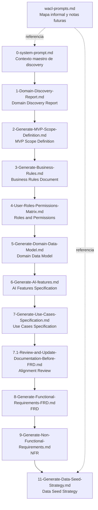

# EventFlow — Executive Summary of AI Prompts

## 1. Propósito del documento

`/prompts.md` centraliza un resumen ejecutivo de los prompts utilizados para guiar la generación asistida por IA de la documentación de EventFlow. Su objetivo es servir como índice navegable para revisores, docentes, desarrolladores y evaluadores, facilitando la comprensión del propósito de cada prompt, el artefacto que produce y su lugar dentro del flujo documental del proyecto.

Los prompts completos se encuentran en la carpeta [`/prompts`](./prompts/).

## 2. Contexto del proyecto

EventFlow es un MVP de planificación de eventos y gestión simplificada de proveedores, construido como proyecto final de una maestría en desarrollo de software asistido por IA. La propuesta se enfoca en un espacio de trabajo para organizar eventos con apoyo de IA, más un flujo acotado de solicitud y comparación de cotizaciones, evitando convertir el producto en un marketplace transaccional completo en la primera versión.

La documentación del proyecto fue construida principalmente durante las fases de Planning y Analysis, con una cadena de prompts que ayudan a definir dominio, alcance, reglas, modelo, funcionalidades de IA, casos de uso, requerimientos y estrategia de datos demo.

## 3. Estrategia general de prompting

La colección sigue una estrategia de prompting orientada a documentación trazable y control de alcance. En la mayor parte del set se observa la estructura `ACT → AIM → ACTION`, usada para fijar rol, objetivo y ejecución esperada. En los prompts que no siguen ese formato literal, igualmente se mantiene una intención clara de contexto, objetivo y salida estructurada.

De forma transversal, los prompts refuerzan:

- uso de documentos fuente como source of truth;
- restricción explícita del MVP para evitar sobreingeniería;
- separación entre MVP, futuro, fuera de alcance y decisiones pendientes;
- salida en español LATAM con tono profesional;
- trazabilidad entre artefactos;
- validación humana obligatoria en funciones asistidas por IA;
- control sobre supuestos, derivaciones y contenido no soportado.

## 4. Resumen ejecutivo de prompts

|  # | Prompt file | Propósito | Artefacto de salida | Link |
| -: | ----------- | --------- | ------------------- | ---- |
| 0 | `0-system-prompt.md` | Define el contexto maestro de discovery, hipótesis estratégica, alcance de investigación y formato esperado del reporte inicial. | `docs/1-Domain-Discovery-Report.md` | [View prompt](./prompts/0-system-prompt.md) |
| 1 | `1-Domain-Discovery-Report.md` | Solicita generar el Domain Discovery Report validando la hipótesis de producto y priorizando un MVP realista. | `docs/1-Domain-Discovery-Report.md` | [View prompt](./prompts/1-Domain-Discovery-Report.md) |
| 2 | `2-Generate-MVP-Scope-Definition.md` | Define el alcance exacto del MVP a partir del discovery y decisiones del Product Owner. | `docs/3-MVP-Scope-Definition.md` | [View prompt](./prompts/2-Generate-MVP-Scope-Definition.md) |
| 3 | `3-Generate-Business-Rules.md` | Extrae y formaliza reglas de negocio testables alineadas al MVP. | `docs/4-Business-Rules-Document.md` | [View prompt](./prompts/3-Generate-Business-Rules.md) |
| 4 | `4-User-Roles-Permissions-Matrix.md` | Construye la matriz de roles y permisos por módulo, entidad y flujo. | `docs/5-User-Roles-Permissions-Matrix.md` | [View prompt](./prompts/4-User-Roles-Permissions-Matrix.md) |
| 5 | `5-Generate-Domain-Data-Model.md` | Descubre entidades, relaciones, enums y constraints desde la documentación previa. | `docs/6-Domain-Data-Model.md` | [View prompt](./prompts/5-Generate-Domain-Data-Model.md) |
| 6 | `6-Generate-AI-features.md` | Especifica las funcionalidades de IA permitidas, sus inputs, outputs, validaciones y fallback. | `docs/7-AI-Features-Specification.md` | [View prompt](./prompts/6-Generate-AI-features.md) |
| 7 | `7-Generate-Use-Cases-Specification.md` | Deriva e inventaría casos de uso MVP, futuros y fuera de alcance, con detalle formal y diagramas. | `docs/8-Use-Cases-Specification.md` | [View prompt](./prompts/7-Generate-Use-Cases-Specification.md) |
| 7.1 | `7.1-Review-and-Update-Documentation-Before-FRD.md` | Revisa y alinea la documentación previa al FRD con un addendum de decisiones del Product Owner. | Actualización en `docs/4` a `docs/8` y creación de `docs/8.2-Documentation-Alignment-Review-Before-FRD.md` | [View prompt](./prompts/7.1-Review-and-Update-Documentation-Before-FRD.md) |
| 8 | `8-Generate-Functional-Requirements-FRD.md` | Consolida requerimientos funcionales trazables y listos para implementación. | `docs/9-Functional-Requirements-Document.md` | [View prompt](./prompts/8-Generate-Functional-Requirements-FRD.md) |
| 9 | `9-Generate-Non-Functional-Requirements.md` | Define NFRs medibles, realistas y alineados con el MVP. | `docs/10-Non-Functional-Requirements.md` | [View prompt](./prompts/9-Generate-Non-Functional-Requirements.md) |
| 11 | `11-Generate-Data-Seed-Strategy.md` | Diseña la estrategia de datos seed y demo a partir de los artefactos funcionales y no funcionales. | `docs/11-Data-Seed-Strategy.md` | [View prompt](./prompts/11-Generate-Data-Seed-Strategy.md) |
| - | `wacl-prompts.md` | Registra un mapa informal de artefactos y líneas futuras de trabajo para skills/agentes del proyecto. | Nota de referencia, sin artefacto formal definido | [View prompt](./prompts/wacl-prompts.md) |

## 5. Matriz de prompts y artefactos generados

| Prompt | Documento generado | Fase | Nivel de dependencia | Notas |
| ------ | ------------------ | ----- | -------------------- | ----- |
| `0-system-prompt.md` | Base de trabajo para discovery | Planning | Base | Actúa como contexto rector del análisis inicial. |
| `1-Domain-Discovery-Report.md` | `docs/1-Domain-Discovery-Report.md` | Planning | Base | Inicia la cadena documental formal. |
| `2-Generate-MVP-Scope-Definition.md` | `docs/3-MVP-Scope-Definition.md` | Planning | Depends on previous docs | Usa discovery y decisiones del Product Owner. |
| `3-Generate-Business-Rules.md` | `docs/4-Business-Rules-Document.md` | Analysis | Depends on previous docs | Convierte el alcance en reglas verificables. |
| `4-User-Roles-Permissions-Matrix.md` | `docs/5-User-Roles-Permissions-Matrix.md` | Analysis | Depends on previous docs | Formaliza autorización y ownership. |
| `5-Generate-Domain-Data-Model.md` | `docs/6-Domain-Data-Model.md` | Analysis | Depends on previous docs | Modela entidades y relaciones del MVP. |
| `6-Generate-AI-features.md` | `docs/7-AI-Features-Specification.md` | Analysis | Depends on previous docs | Acota el uso de IA con validación humana. |
| `7-Generate-Use-Cases-Specification.md` | `docs/8-Use-Cases-Specification.md` | Analysis | Depends on previous docs | Baja reglas y capacidades a interacción actor-sistema. |
| `7.1-Review-and-Update-Documentation-Before-FRD.md` | `docs/8.2-Documentation-Alignment-Review-Before-FRD.md` y actualización de docs previos | Documentation alignment | Review / alignment | Ajusta inconsistencias antes del FRD. |
| `8-Generate-Functional-Requirements-FRD.md` | `docs/9-Functional-Requirements-Document.md` | Analysis | Consolidation | Formaliza lo que el sistema debe hacer. |
| `9-Generate-Non-Functional-Requirements.md` | `docs/10-Non-Functional-Requirements.md` | Analysis | Consolidation | Define calidad, seguridad, resiliencia y demo readiness. |
| `11-Generate-Data-Seed-Strategy.md` | `docs/11-Data-Seed-Strategy.md` | Delivery preparation | Final delivery support | Conecta demo, QA, seed y trazabilidad. |
| `wacl-prompts.md` | Referencia no formal | Delivery preparation | Review / alignment | Sirve como nota de orientación, no como prompt completo de generación. |

## 6. Técnicas de prompting utilizadas

| Técnica | Descripción | Used in |
| --------- | ----------- | ------- |
| AAA Prompting | Estructura explícita de rol, objetivo e instrucciones para conducir la salida. | `3`, `4`, `5`, `6`, `7`, `7.1`, `8`, `9`, `11` |
| Source-of-truth grounding | Obliga a trabajar sobre documentos previos y evita inventar alcance. | `2`, `3`, `4`, `5`, `6`, `7`, `7.1`, `8`, `9`, `11` |
| Extraction-first prompting | Pide extraer primero entidades, features, casos, requisitos o datasets antes de especificar. | `5`, `6`, `7`, `8`, `9`, `11` |
| Classification-based prompting | Clasifica contenido por tipo de fuente, prioridad, alcance o estatus MVP/Future/Out of Scope. | `3`, `4`, `5`, `6`, `7`, `8`, `9`, `11` |
| Scope guardrails | Refuerza límites del MVP y bloquea features típicas pero no soportadas. | `0`, `1`, `2`, `3`, `4`, `5`, `6`, `7`, `7.1`, `8`, `9`, `11` |
| MVP restriction validation | Exige validar que cada artefacto respete la estrategia de MVP acotado. | `2`, `6`, `7`, `8`, `9`, `11` |
| Traceability mapping | Solicita matrices o referencias cruzadas entre reglas, casos, FRD, NFR y seed data. | `3`, `4`, `7`, `8`, `9`, `11` |
| Structured output templates | Define secciones obligatorias, tablas, IDs y formatos de salida. | `0`, `2`, `3`, `4`, `5`, `6`, `7`, `7.1`, `8`, `9`, `11` |
| Document generation by sections | Descompone documentos extensos en secciones normalizadas para revisión académica. | `0`, `2`, `3`, `4`, `5`, `6`, `7`, `7.1`, `8`, `9`, `11` |
| Mermaid diagram generation | Exige diagramas Mermaid para representar relaciones o casos de uso. | `5`, `7` |
| Human-in-the-loop validation | Exige validación humana en salidas de IA o decisiones sensibles. | `2`, `6`, `7`, `8`, `9`, `11` |
| Future vs MVP separation | Separa explícitamente lo que entra en MVP de lo que queda diferido. | `0`, `2`, `3`, `4`, `5`, `6`, `7`, `8`, `9`, `11` |
| Out-of-scope control | Pide listar exclusiones explícitas para reducir ambigüedad. | `2`, `3`, `4`, `5`, `6`, `7`, `8`, `9`, `11` |
| Readiness checklist generation | Incorpora checklists de validación o preparación antes de continuar. | `2`, `7.1`, `9`, `11` |
| QA scenario derivation | Conecta los artefactos con escenarios de validación o aceptación. | `4`, `6`, `7`, `8`, `9`, `11` |
| Seed/demo scenario derivation | Diseña datasets o recorridos pensados para demo académica y pruebas. | `2`, `7`, `8`, `9`, `11` |
| Alignment review prompting | Revisa, actualiza y alinea documentos existentes antes del siguiente entregable. | `7.1` |

## 7. Flujo documental generado por los prompts

## 8. Detalle ejecutivo por prompt

### 0-system-prompt.md

**Ubicación:** [`0-system-prompt.md`](./prompts/0-system-prompt.md)

**Objetivo:**  
Definir el marco de discovery del proyecto, la hipótesis estratégica inicial de EventFlow, el alcance de investigación y el formato del reporte esperado.

**Artefacto que genera:**  
Base para `docs/1-Domain-Discovery-Report.md`.

**Técnica utilizada:**  
Role prompting, guardrails de alcance, validación de hipótesis estratégica, estructura de salida por secciones.

**Entradas principales:**  
Contexto del producto y objetivos académicos del proyecto.

**Valor dentro del proyecto:**  
Establece la línea editorial y analítica que alimenta el resto de la documentación.

**Notas relevantes:**  
Incluye restricciones claras para no sobreexpandir el MVP y pide recomendación estratégica explícita, no neutral.

### 1-Domain-Discovery-Report.md

**Ubicación:** [`1-Domain-Discovery-Report.md`](./prompts/1-Domain-Discovery-Report.md)

**Objetivo:**  
Solicitar el Domain Discovery Report completo para EventFlow con foco en dominio, usuarios, procesos, riesgos y recomendación estratégica.

**Artefacto que genera:**  
`docs/1-Domain-Discovery-Report.md`.

**Técnica utilizada:**  
Prompt directo orientado a skill, validación de hipótesis de producto, separación entre hechos, supuestos e hipótesis.

**Entradas principales:**  
Contexto general de EventFlow y skill de discovery referenciado por el prompt.

**Valor dentro del proyecto:**  
Produce el primer artefacto formal del que dependen alcance, reglas y requerimientos posteriores.

**Notas relevantes:**  
Pide fuentes recientes cuando se requiera investigación externa y prioriza un MVP realista.

### 2-Generate-MVP-Scope-Definition.md

**Ubicación:** [`2-Generate-MVP-Scope-Definition.md`](./prompts/2-Generate-MVP-Scope-Definition.md)

**Objetivo:**  
Definir exactamente qué entra, qué no entra y qué se simula dentro del MVP.

**Artefacto que genera:**  
`docs/3-MVP-Scope-Definition.md`.

**Técnica utilizada:**  
Source-of-truth grounding, validación de restricciones MVP, plantilla estructurada por módulos, separación MVP/Futuro/Fuera de alcance.

**Entradas principales:**  
`docs/1-Domain-Discovery-Report.md` y `docs/2-Product-Owner-Decisions.md`.

**Valor dentro del proyecto:**  
Convierte el discovery en una frontera de producto operativa para análisis, diseño y demo.

**Notas relevantes:**  
Incluye decisiones obligatorias del Product Owner sobre mercados, idiomas, IA, roles, seed data y simplificaciones del MVP.

### 3-Generate-Business-Rules.md

**Ubicación:** [`3-Generate-Business-Rules.md`](./prompts/3-Generate-Business-Rules.md)

**Objetivo:**  
Formalizar reglas de negocio precisas, testeables y clasificadas por prioridad y fuente.

**Artefacto que genera:**  
`docs/4-Business-Rules-Document.md`.

**Técnica utilizada:**  
AAA prompting, classification-based prompting, tablas con IDs, control de supuestos y reglas derivadas.

**Entradas principales:**  
`docs/1-Domain-Discovery-Report.md`, `docs/2-Product-Owner-Decisions.md`, `docs/3-MVP-Scope-Definition.md`.

**Valor dentro del proyecto:**  
Sirve como puente entre alcance de producto y especificación funcional verificable.

**Notas relevantes:**  
Exige clasificar cada regla como explícita, derivada, suposición o recomendación.

### 4-User-Roles-Permissions-Matrix.md

**Ubicación:** [`4-User-Roles-Permissions-Matrix.md`](./prompts/4-User-Roles-Permissions-Matrix.md)

**Objetivo:**  
Definir permisos por rol, módulo, entidad, ruta y API para el MVP.

**Artefacto que genera:**  
`docs/5-User-Roles-Permissions-Matrix.md`.

**Técnica utilizada:**  
AAA prompting, matrices estructuradas, clasificación de permisos, QA-oriented prompting.

**Entradas principales:**  
`docs/1-Domain-Discovery-Report.md`, `docs/2-Product-Owner-Decisions.md`, `docs/3-MVP-Scope-Definition.md`, `docs/4-Business-Rules-Document.md`.

**Valor dentro del proyecto:**  
Fija ownership, accesos y restricciones que luego impactan modelo, casos de uso, backend y QA.

**Notas relevantes:**  
Incluye roles futuros y fuera de alcance para evitar confundir necesidades de MVP con evolución posterior.

### 5-Generate-Domain-Data-Model.md

**Ubicación:** [`5-Generate-Domain-Data-Model.md`](./prompts/5-Generate-Domain-Data-Model.md)

**Objetivo:**  
Extraer y documentar el modelo de datos del dominio desde los artefactos ya aprobados.

**Artefacto que genera:**  
`docs/6-Domain-Data-Model.md`.

**Técnica utilizada:**  
AAA prompting, extracción primero, descubrimiento de entidades, clasificación por alcance, Mermaid ER diagram.

**Entradas principales:**  
`docs/1-Domain-Discovery-Report.md`, `docs/2-Product-Owner-Decisions.md`, `docs/3-MVP-Scope-Definition.md`, `docs/4-Business-Rules-Document.md`, `docs/5-User-Roles-Permissions-Matrix.md`.

**Valor dentro del proyecto:**  
Da base al diseño físico, la API, el seed, la autorización y los casos de uso.

**Notas relevantes:**  
Prohíbe agregar entidades o atributos por costumbre si no están soportados por la documentación.

### 6-Generate-AI-features.md

**Ubicación:** [`6-Generate-AI-features.md`](./prompts/6-Generate-AI-features.md)

**Objetivo:**  
Especificar qué funcionalidades de IA sí forman parte del MVP, cómo operan y qué validaciones requieren.

**Artefacto que genera:**  
`docs/7-AI-Features-Specification.md`.

**Técnica utilizada:**  
AAA prompting, extracción de features IA, clasificación por fuente y alcance, human-in-the-loop, fallback design.

**Entradas principales:**  
`docs/1-Domain-Discovery-Report.md`, `docs/2-Product-Owner-Decisions.md`, `docs/3-MVP-Scope-Definition.md`, `docs/4-Business-Rules-Document.md`, `docs/5-User-Roles-Permissions-Matrix.md`, `docs/6-Domain-Data-Model.md`.

**Valor dentro del proyecto:**  
Traduce el posicionamiento “AI-assisted” en capacidades concretas, controladas y evaluables.

**Notas relevantes:**  
Bloquea IA autónoma de alta confianza y exige estrategia de provider, fallback y MockAIProvider.

### 7-Generate-Use-Cases-Specification.md

**Ubicación:** [`7-Generate-Use-Cases-Specification.md`](./prompts/7-Generate-Use-Cases-Specification.md)

**Objetivo:**  
Derivar, clasificar y detallar los casos de uso del MVP a partir de la documentación previa.

**Artefacto que genera:**  
`docs/8-Use-Cases-Specification.md`.

**Técnica utilizada:**  
AAA prompting, extracción de casos de uso, clasificación MVP/Future/Out of Scope, Mermaid use case diagrams, trazabilidad.

**Entradas principales:**  
`docs/1-Domain-Discovery-Report.md`, `docs/2-Product-Owner-Decisions.md`, `docs/3-MVP-Scope-Definition.md`, `docs/4-Business-Rules-Document.md`, `docs/5-User-Roles-Permissions-Matrix.md`, `docs/6-Domain-Data-Model.md`, `docs/7-AI-Features-Specification.md`.

**Valor dentro del proyecto:**  
Conecta reglas, actores, entidades e IA con los flujos que después alimentan FRD, historias y pruebas.

**Notas relevantes:**  
Excluye explícitamente casos genéricos de marketplace, pagos reales, WhatsApp, chat en tiempo real y otras capacidades no soportadas.

### 7.1-Review-and-Update-Documentation-Before-FRD.md

**Ubicación:** [`7.1-Review-and-Update-Documentation-Before-FRD.md`](./prompts/7.1-Review-and-Update-Documentation-Before-FRD.md)

**Objetivo:**  
Revisar y actualizar la documentación desde Business Rules hasta Use Cases antes de generar el FRD.

**Artefacto que genera:**  
Actualizaciones en `docs/4-Business-Rules-Document.md`, `docs/5-User-Roles-Permissions-Matrix.md`, `docs/6-Domain-Data-Model.md`, `docs/7-AI-Features-Specification.md`, `docs/8-Use-Cases-Specification.md` y creación de `docs/8.2-Documentation-Alignment-Review-Before-FRD.md`.

**Técnica utilizada:**  
AAA prompting, alignment review prompting, actualización incremental, matriz de impacto de decisiones.

**Entradas principales:**  
`docs/1` a `docs/8`, más `docs/8.1-Product-Owner-Decisions-Use-Cases-Addendum.md`.

**Valor dentro del proyecto:**  
Reduce inconsistencias antes del FRD y deja constancia de cambios, conflictos y readiness.

**Notas relevantes:**  
Indica explícitamente revisar y ajustar, no reescribir desde cero salvo necesidad justificada.

### 8-Generate-Functional-Requirements-FRD.md

**Ubicación:** [`8-Generate-Functional-Requirements-FRD.md`](./prompts/8-Generate-Functional-Requirements-FRD.md)

**Objetivo:**  
Consolidar los requerimientos funcionales del MVP en un FRD trazable y listo para implementación.

**Artefacto que genera:**  
`docs/9-Functional-Requirements-Document.md`.

**Técnica utilizada:**  
AAA prompting, functional extraction pass, trazabilidad, validación de restricciones MVP, aceptación por módulo.

**Entradas principales:**  
`docs/1` a `docs/8.2`, con énfasis en `docs/8.1` y `docs/8.2`.

**Valor dentro del proyecto:**  
Transforma la documentación analítica en especificación funcional central para desarrollo y QA.

**Notas relevantes:**  
Pide separar requisitos MVP, futuros y fuera de alcance sin convertir el documento en diseño técnico o NFR.

### 9-Generate-Non-Functional-Requirements.md

**Ubicación:** [`9-Generate-Non-Functional-Requirements.md`](./prompts/9-Generate-Non-Functional-Requirements.md)

**Objetivo:**  
Definir los requerimientos no funcionales del MVP con criterios medibles y realistas para un proyecto académico.

**Artefacto que genera:**  
`docs/10-Non-Functional-Requirements.md`.

**Técnica utilizada:**  
AAA prompting, extracción de NFRs, clasificación por categoría, validación de realismo MVP, checklist de readiness.

**Entradas principales:**  
`docs/1` a `docs/9-Functional-Requirements-Document.md`.

**Valor dentro del proyecto:**  
Incorpora performance, seguridad, privacidad, accesibilidad, IA, despliegue y demo readiness sin sobredimensionar la solución.

**Notas relevantes:**  
Bloquea requisitos enterprise típicos que no correspondan al alcance real del MVP.

### 11-Generate-Data-Seed-Strategy.md

**Ubicación:** [`11-Generate-Data-Seed-Strategy.md`](./prompts/11-Generate-Data-Seed-Strategy.md)

**Objetivo:**  
Definir una estrategia de seed data y demo basada en necesidades reales del MVP y la documentación previa.

**Artefacto que genera:**  
`docs/11-Data-Seed-Strategy.md`.

**Técnica utilizada:**  
AAA prompting, seed extraction pass, trazabilidad cruzada, escenarios demo/QA, control de alcance.

**Entradas principales:**  
`docs/1` a `docs/10`.

**Valor dentro del proyecto:**  
Aterriza el proyecto a datos demo utilizables para desarrollo, QA, presentación académica y scripts seed.

**Notas relevantes:**  
Prohíbe inventar datasets genéricos de marketplace y exige alinear seed data con FRD, NFR, casos de uso y modelo.

### wacl-prompts.md

**Ubicación:** [`wacl-prompts.md`](./prompts/wacl-prompts.md)

**Objetivo:**  
Registrar una vista rápida del flujo documental y anotar líneas de trabajo futuras relacionadas con skills o agentes.

**Artefacto que genera:**  
No define un artefacto formal; funciona como nota de referencia.

**Técnica utilizada:**  
Mapa informal de artefactos, listado secuencial de documentos, lluvia de ideas técnica.

**Entradas principales:**  
Conocimiento general del proyecto y necesidades futuras de automatización.

**Valor dentro del proyecto:**  
Ayuda a visualizar el pipeline documental y anticipa posibles extensiones del trabajo con agentes/skills.

**Notas relevantes:**  
No sigue el patrón AAA ni especifica una salida estructurada comparable con el resto de prompts.

## 9. Cómo usar estos prompts

La colección debe utilizarse en secuencia, respetando las dependencias documentales entre un prompt y el siguiente. El flujo recomendado es generar primero el discovery, luego el alcance del MVP, después reglas, permisos, modelo, IA, casos de uso, revisión de alineación, FRD, NFR y finalmente la estrategia seed.

Cada prompt debe ejecutarse cuando ya existe el artefacto previo que declara como fuente. La carpeta `/docs` debe mantenerse como source of truth del proyecto y no conviene saltarse el prompt de alineación previo al FRD, porque allí se consolidan decisiones tardías del Product Owner. Si cambian decisiones de negocio o alcance, el orden correcto es actualizar los documentos base y volver a generar los artefactos dependientes. Los documentos resultantes pueden luego alimentar historias de usuario, backlog, tareas, QA, demo y entregables finales.

## 10. Observaciones finales

Este set de prompts muestra un uso disciplinado de IA a lo largo del ciclo de vida del software: discovery, definición de alcance, análisis funcional, modelado, control de IA, validación previa a requerimientos y preparación de datos demo. La colección destaca por combinar automatización documental con revisión humana, trazabilidad y control estricto del alcance para fines académicos y de portafolio.
