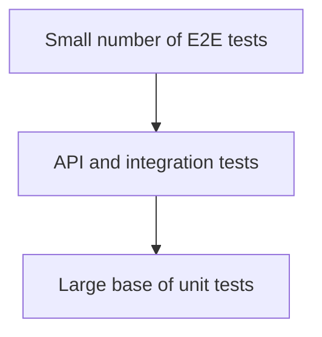

# AAA Prompt — Testing Strategy Document for EventFlow

## ACT — Role, Context and Inputs

You are a **Senior QA Architect, Test Strategy Lead, Software Architect and AI-assisted SDLC Reviewer** working on the EventFlow final project for the AI4Devs Master.

Your task is to create the formal document:

```text
/docs/20-Testing-Strategy.md
```

The document must be written in **Spanish LATAM neutral**, with a professional academic/technical tone, and must be consistent with all previous EventFlow documentation.

EventFlow is an **AI-assisted event planning workspace + simplified vendor quote flow**. It is a responsive web MVP with three main roles:

* Organizer
* Vendor
* Admin

The system architecture has already been defined as:

```text
Responsive Web Frontend
→ REST API Backend
→ Modular Monolith with Clean / Hexagonal Architecture
→ PostgreSQL Database
→ LLMProvider abstraction
→ OpenAIProvider / MockAIProvider / AnthropicProvider stub
```

The approved technical stack is:

### Frontend

* Next.js
* TypeScript
* App Router
* TanStack Query
* React Hook Form
* Zod
* next-intl
* Tailwind CSS
* MSW
* Vitest
* Testing Library
* Playwright

### Backend

* Node.js LTS
* TypeScript
* Express.js
* Prisma ORM
* PostgreSQL
* REST JSON
* Zod
* Vitest
* Supertest

### AI

* `LLMProvider` abstraction
* `OpenAIProvider` as primary provider
* `MockAIProvider` as mandatory deterministic provider for testing, demo and fallback
* `AnthropicProvider` as stub/future provider
* `AIRecommendation` persistence
* Prompt versioning / PromptOps
* Human-in-the-loop validation for every AI output
* Timeout of 60 seconds before controlled error or fallback
* No autonomous AI decisions

### Security

* Cookie-based session with HTTP-only cookies
* RBAC + ownership + assignment-based access
* Captcha / anti-bot for register and login
* Rate limiting for sensitive flows
* Zod validation at API boundaries
* Admin audit trail through `AdminAction`
* No secrets in frontend
* No payments, contracts, WhatsApp, SMS, push notifications or real-time chat in MVP

### Database

* PostgreSQL 15+
* Prisma ORM
* UUID identifiers
* Strong relational model
* Soft delete where required
* `is_seed` flag for demo/seed data
* `AIRecommendation` and optional `AIPromptVersion`
* Query-driven indexes
* No vector stores, payments, contracts, chat, RSVP or external calendar sync in MVP

Use the following documents as source material and preserve traceability to them:

```text
/docs/1-Domain-Discovery-Report.md
/docs/2-Product-Owner-Decisions.md
/docs/3-MVP-Scope-Definition.md
/docs/4-Business-Rules-Document.md
/docs/5-User-Roles-Permissions-Matrix.md
/docs/6-Domain-Data-Model.md
/docs/7-AI-Features-Specification.md
/docs/8-Use-Cases-Specification.md
/docs/8.1-Product-Owner-Decisions-Use-Cases-Addendum.md
/docs/8.2-Documentation-Alignment-Review-Before-FRD.md
/docs/9-Functional-Requirements-Document.md
/docs/10-Non-Functional-Requirements.md
/docs/11-Data-Seed-Strategy.md
/docs/12-Architecture-Vision-and-Principles.md
/docs/13-System-Architecture-Document.md
/docs/14-Backend-Technical-Design.md
/docs/15-Frontend-Architecture-Design.md
/docs/16-API-Design-Specification.md
/docs/17-AI-Architecture-and-PromptOps-Design.md
/docs/18-Database-Physical-Design.md
/docs/19-Security-and-Authorization-Design.md
```

Do not invent new product scope. Do not add testing requirements for features that are explicitly out of scope, such as:

* Real payments
* Contracts
* WhatsApp integration
* Real-time chat
* Native mobile app
* SMS
* Push notifications
* Calendar integrations
* AI autonomous moderation
* AI autonomous vendor approval
* Currency conversion
* Vector database / RAG
* Marketplace transactional flows

---

## AIM — Objective and Document Purpose

Create a complete **Testing Strategy Document** for EventFlow MVP.

The document must define **how EventFlow will be tested** across frontend, backend, API, database, AI, security, accessibility, i18n, seed data, demo readiness and CI/CD readiness.

The goal is not to create every individual test case, but to define a clear, actionable and traceable strategy that can guide:

* QA engineers
* Backend engineers
* Frontend engineers
* AI engineers
* DevOps
* Product Owner
* Academic reviewers
* AI coding agents generating tests
* Future backlog and development tasks

The Testing Strategy must answer:

1. What testing levels apply to EventFlow?
2. What test types are required for the MVP?
3. Which tools should be used for frontend, backend, API, AI and E2E testing?
4. What must be tested manually vs automatically?
5. How will AI features be tested deterministically?
6. How will RBAC + ownership authorization be tested?
7. How will seed data support repeatable QA and demo flows?
8. How will functional, non-functional and security requirements be validated?
9. What is the minimum acceptable test coverage?
10. What quality gates must pass before demo or delivery?
11. What risks remain and how should they be mitigated?

The document must be **implementation-ready**, but must not include production code.

---

## ASK — Required Output Structure

Generate the document using the following structure.

# EventFlow — Testing Strategy

## 1. Propósito del documento

Explain the purpose of the Testing Strategy.

Clarify that this document defines the test approach for the EventFlow MVP and acts as input for development tasks, QA scenarios, automated tests, CI/CD quality gates and academic evaluation.

## 2. Alcance del documento

Include:

### 2.1 Incluye

Cover at minimum:

* Unit testing
* Integration testing
* API testing
* Contract testing
* Frontend component testing
* Frontend integration testing
* End-to-end testing
* AI testing
* Security testing
* Authorization testing
* Accessibility testing
* i18n testing
* Database and migration testing
* Seed data testing
* Regression testing
* Smoke testing
* Demo readiness testing
* CI quality gates

### 2.2 No incluye

Explicitly exclude:

* Testing of payments
* Testing of contracts
* Testing of WhatsApp
* Testing of native mobile apps
* Testing of real-time chat
* Testing of push/SMS
* Testing of production-grade compliance certifications
* Testing of RAG/vector search
* Testing of autonomous AI moderation or decisions

## 3. Fuentes utilizadas

Create a table listing all source documents and how each one informs the testing strategy.

At minimum include:

* FRD
* NFR
* Use Cases
* Business Rules
* Roles & Permissions Matrix
* Data Model
* AI Features
* API Design
* Backend Technical Design
* Frontend Architecture
* AI Architecture & PromptOps
* Database Physical Design
* Security & Authorization Design
* Data Seed Strategy

## 4. Resumen ejecutivo de la estrategia de testing

Provide a concise executive summary.

It must state that EventFlow uses a pragmatic MVP testing strategy based on:

* Test pyramid adapted to a modular monolith
* Strong backend use case testing
* API contract validation
* Frontend component and flow testing
* Deterministic AI tests through `MockAIProvider`
* E2E coverage of critical demo flows
* Security and authorization negative tests
* Seed-based repeatability
* CI quality gates before merge/demo

## 5. Principios de testing del MVP

Define principles such as:

| ID | Principle | Meaning | Implication |
| -- | --------- | ------- | ----------- |

Include at least:

* Test critical user journeys first
* Backend business rules are source of truth
* Frontend guards are UX only, not security
* AI must be deterministic in tests
* Human-in-the-loop must be tested explicitly
* Seed data must be reproducible
* Authorization must include positive and negative scenarios
* No overengineering
* Demo readiness is a quality requirement
* Tests must be traceable to FR, BR, UC, NFR or security policy

## 6. Testing levels

Define the testing levels for EventFlow:

### 6.1 Unit tests

Explain scope, examples and recommended tools.

Must include:

* Domain policies
* Application use cases
* Utility functions
* DTO validation schemas
* AI prompt mappers
* Frontend pure components
* Frontend hooks where applicable

### 6.2 Integration tests

Must include:

* Use case + repository adapter
* Prisma integration
* Database constraints
* Auth middleware + policy middleware
* AI module with `MockAIProvider`
* Notifications simulation
* File upload simulation

### 6.3 API tests

Must include:

* Supertest for Express endpoints
* Zod validation failures
* HTTP status codes
* Error envelope
* Pagination/filtering
* Authenticated vs unauthenticated requests
* RBAC and ownership checks

### 6.4 Contract tests

Must include:

* DTO consistency between backend and frontend
* API response shape validation
* MSW handlers aligned with API contracts
* OpenAPI-readiness validation if OpenAPI is generated later

### 6.5 Frontend tests

Must include:

* Vitest
* Testing Library
* MSW
* Form validation
* Loading/error/empty states
* i18n rendering
* Role-based UI visibility
* AI suggestion review UI
* No direct LLM provider calls from frontend

### 6.6 End-to-end tests

Must include:

* Playwright
* Seeded environment
* Auth flows
* Organizer critical flow
* Vendor critical flow
* Admin critical flow
* AI-assisted planning with `MockAIProvider`
* Quote flow
* Booking intent flow
* Review and moderation flow
* Demo smoke flow

### 6.7 Manual exploratory testing

Define what remains manual:

* UX polish
* Responsive behavior
* Visual inspection
* Copy review
* Edge-case exploration
* Demo rehearsal
* AI output quality review using real provider in controlled environments

## 7. Test pyramid for EventFlow

Create an EventFlow-specific test pyramid.

Include a Mermaid diagram similar to:



Explain why the MVP should not rely only on E2E tests.

## 8. Test types by quality attribute

Create a table:

| Quality attribute | Test type | Tool | Evidence |
| ----------------- | --------- | ---- | -------- |

Include at minimum:

* Functional correctness
* Authorization
* Security
* AI determinism
* Human-in-the-loop
* Data integrity
* Database constraints
* Performance smoke
* Accessibility
* i18n
* Responsive behavior
* Observability
* Demo readiness
* Regression safety

## 9. Functional testing strategy by module

For each module, define what must be tested, recommended level and examples.

Modules:

1. Auth
2. Users
3. Events
4. AI Assistance
5. Tasks
6. Budget
7. Vendors
8. Service Categories
9. Quotes
10. Booking Intent
11. Reviews
12. Notifications
13. Admin
14. Attachments
15. Seed/Demo
16. i18n

For each module include a table:

| Area | What to test | Level | Priority | Traceability |
| ---- | ------------ | ----- | -------- | ------------ |

## 10. Backend testing strategy

Define backend testing in detail.

Must include:

* Unit tests for application use cases
* Unit tests for domain policies
* Integration tests with Prisma
* Repository adapter tests
* Controller tests with Supertest
* Middleware tests
* Auth and authorization tests
* Transaction boundary tests
* Error handler tests
* Job tests
* Seed reset tests
* AI provider adapter tests

Include recommended backend folder structure for tests, for example:

```text
backend/
  src/
  tests/
    unit/
    integration/
    api/
    fixtures/
    helpers/
```

## 11. Frontend testing strategy

Define frontend testing in detail.

Must include:

* Component tests
* Page flow tests
* Form validation tests
* Role-based navigation tests
* TanStack Query states
* MSW API mocking
* i18n tests
* Accessibility checks
* AI human-in-the-loop UI
* Public vendor SEO page smoke tests
* Error/loading/empty/skeleton states

Include recommended frontend folder structure for tests, for example:

```text
frontend/
  src/
  tests/
    unit/
    integration/
    e2e/
    mocks/
    fixtures/
```

## 12. API testing strategy

Define how REST API endpoints will be validated.

Must include:

* Status codes
* Request DTO validation
* Response envelope
* Error envelope
* Pagination
* Sorting/filtering
* Correlation ID
* Auth required
* Role denied
* Ownership denied
* Business rule violations
* Soft delete behavior
* File upload validation

## 13. AI testing strategy

This section is critical.

Define how to test AI features safely and deterministically.

Must include:

### 13.1 AI testing principles

* Never depend on real OpenAI output for automated tests
* Use `MockAIProvider` for unit, integration and E2E tests
* Validate strict JSON schemas
* Test fallback behavior
* Test timeout behavior
* Test invalid output handling
* Test persistence in `AIRecommendation`
* Test human acceptance/edit/reject flows
* Test language parameter handling
* Test that frontend never calls LLM directly

### 13.2 AI feature test matrix

Include:

| AI feature | Test approach | Mock expected | Human validation required | Priority |
| ---------- | ------------- | ------------- | ------------------------- | -------- |

Features:

* Event plan generation
* Checklist generation
* Budget distribution
* Vendor category recommendation
* Quote brief generation
* Quote comparison summary
* Vendor bio/package generation
* Urgent task prioritization

### 13.3 Real provider testing

Explain that real OpenAI integration tests are optional/manual or gated by environment variables, not required in CI by default.

Define conditions:

* Only in controlled environment
* Never with real sensitive data
* Skip when `OPENAI_API_KEY` is missing
* Assertions focus on schema, not exact wording
* Cost and rate limits must be controlled

## 14. Security and authorization testing strategy

Define negative and positive testing for security.

Must include:

* Anonymous access denied
* Wrong role denied
* Wrong owner denied
* Assigned vendor only sees assigned quote requests
* Admin-only operations denied for organizer/vendor
* Captcha required for register/login
* Rate limiting
* Password reset token behavior
* Cookie flags
* CSRF considerations if applicable
* CORS restrictions
* Payload size limits
* MIME allowlist for uploads
* No secrets in frontend
* Error messages do not leak stack traces
* Admin actions audited

Include a matrix:

| Scenario | Expected result | Test level | Priority |
| -------- | --------------- | ---------- | -------- |

## 15. Database and migration testing strategy

Must include:

* Prisma migration validation
* Constraints
* Foreign keys
* Enum values
* Soft delete uniqueness behavior
* `is_seed` reset behavior
* Transaction rollback tests
* Quote validity default of 15 days
* Rating 1–5 constraint
* Service category hierarchy max 2 levels
* Currency immutable after event creation
* Event auto-completion after 2 days
* AIRecommendation persistence integrity

## 16. Seed data testing strategy

Define how seed supports tests.

Must include:

* Seed idempotency
* Deterministic seed values
* `is_seed = true`
* Reset strategy
* Demo users
* Demo events
* Demo vendors
* Demo quote requests
* Demo AI recommendations
* Avoid real PII
* Support for E2E flows

Include a table:

| Seed dataset | Tests supported | Priority |
| ------------ | --------------- | -------- |

## 17. Accessibility testing strategy

Define MVP accessibility checks.

Must include:

* Keyboard navigation
* Focus management
* Form labels and errors
* Color contrast checks
* Semantic headings
* ARIA only where needed
* Dialog/modal accessibility
* AI suggestion review accessibility
* Responsive mobile browser checks

Tools may include:

* Testing Library accessibility queries
* Playwright accessibility checks
* axe-core as recommended if adopted

## 18. i18n and currency testing strategy

Must include:

* Supported locales: `es-LATAM`, `es-ES`, `pt`, `en`
* Language selection
* Event language handling
* AI output language parameter
* Currency display
* Currency immutability after event creation
* No automatic conversion
* Formatting consistency

## 19. Performance and reliability testing strategy

Keep it realistic for MVP.

Must include:

* Smoke performance only
* API response sanity checks
* Frontend loading state checks
* AI timeout behavior
* Retry/fallback behavior
* No load testing enterprise scope
* Database query/index smoke checks for critical lists

## 20. Observability and audit testing strategy

Must include:

* Correlation ID presence
* Structured logs for critical flows
* AIRecommendation traceability
* AdminAction audit logs
* Error logging without sensitive data
* Fallback flag tracking
* Seed reset audit if applicable

## 21. Regression testing strategy

Define:

* What must run on every PR
* What must run before demo
* What can run nightly or manually
* How smoke tests differ from full regression

## 22. CI/CD quality gates

Define quality gates without implementing a full DevOps pipeline.

Include at minimum:

* Type check
* Lint
* Unit tests
* Integration tests
* API tests
* Frontend tests
* E2E smoke tests
* Build verification
* Migration validation
* Seed validation
* Minimum coverage threshold
* No skipped critical tests
* No failing security/authorization tests

Recommend a pragmatic coverage threshold aligned with MVP reality:

```text
Minimum global automated coverage target: 60%
Critical backend use cases and authorization policies: 80%+
```

Clarify that coverage is a support metric, not the only quality metric.

## 23. Definition of test readiness

Define when a user story or feature is ready to be tested.

Include:

* Acceptance criteria exist
* Test data identified
* Role and permissions known
* API contract defined
* Error cases identified
* Seed impact known
* AI mock response defined if applicable
* Observability/audit expectations known

## 24. Definition of done from testing perspective

Define testing DoD:

* Unit tests added/updated
* Integration/API tests added where needed
* Frontend tests added where needed
* Authorization negative cases covered
* AI mock tests added where needed
* E2E smoke updated for critical flow changes
* Seed updated if flow requires it
* No regression failures
* Documentation updated when behavior changes

## 25. Critical MVP test scenarios

Create a prioritized list of critical scenarios.

At minimum include:

### Organizer flow

* Register/login
* Create event
* Generate AI plan
* Accept/edit AI output
* Generate checklist
* Manage budget
* Search vendors
* Send quote request
* Compare quotes
* Create booking intent
* Leave review after confirmed booking

### Vendor flow

* Register/login
* Create vendor profile
* Submit for approval
* Manage services
* Manage portfolio
* Receive quote request
* Respond quote
* Confirm booking intent

### Admin flow

* Login as admin
* Approve vendor
* Manage categories
* View metrics
* Moderate review
* Audit admin action
* Reset seed/demo if enabled

### AI flow

* Generate AI output through `MockAIProvider`
* Persist `AIRecommendation`
* Accept/edit/reject output
* Handle timeout/fallback
* Handle invalid JSON

### Security flow

* Deny unauthorized access
* Deny wrong owner
* Deny wrong role
* Validate captcha/rate limit
* Validate upload restrictions

## 26. Test data management

Define:

* Fixture strategy
* Seed strategy
* Test database strategy
* Isolation between tests
* Cleanup
* Avoiding real PII
* Deterministic IDs where useful
* Environment variables for test mode

## 27. Environment strategy

Define testing environments:

| Environment | Purpose | AI provider | Database | Notes |
| ----------- | ------- | ----------- | -------- | ----- |

Include:

* Local dev
* Test
* CI
* Demo
* Optional staging

Specify that CI should use `MockAIProvider`.

## 28. Tooling summary

Create a table:

| Area | Tool | Purpose | Required / Recommended |
| ---- | ---- | ------- | ---------------------- |

Include:

* Vitest
* Testing Library
* Playwright
* MSW
* Supertest
* Prisma
* Zod
* MockAIProvider
* Optional axe-core
* Optional OpenAPI validation tooling

## 29. Risks and mitigations

Create a table:

| Risk | Impact | Mitigation | Owner |
| ---- | ------ | ---------- | ----- |

Include risks such as:

* Too many E2E tests causing flakiness
* AI output nondeterminism
* Authorization gaps
* Seed data drift
* Frontend mocks diverging from API
* Database constraints not covered
* Manual-only QA
* Low coverage of negative scenarios
* Demo environment inconsistency

## 30. Out of scope testing

Explicitly list tests not required for MVP:

* PCI/payment testing
* Contract signing testing
* WhatsApp/SMS/push testing
* Native mobile testing
* Real-time chat testing
* Load/stress testing at enterprise scale
* Formal compliance certification tests
* Malware scanning pipeline
* RAG/vector testing
* Multi-tenant isolation testing
* Marketplace commission testing

## 31. Traceability matrix

Create a matrix connecting:

| Test area | Source documents | Related FR/NFR/BR/UC/SEC references | Evidence expected |
| --------- | ---------------- | ----------------------------------- | ----------------- |

Do not invent exact IDs unless they already exist in the source documents. If exact IDs are unknown, reference the document/module level.

## 32. Testing roadmap

Separate into:

### MVP Must Have

Tests required before delivery/demo.

### MVP Should Have

Useful but not blocking.

### Future

Testing capabilities needed after MVP.

## 33. Checklist de readiness del Testing Strategy

Create a final checklist:

* Functional modules covered
* Backend testing covered
* Frontend testing covered
* API testing covered
* AI testing covered
* Security testing covered
* Authorization testing covered
* Seed testing covered
* Database testing covered
* Demo smoke testing covered
* CI gates defined
* Out of scope testing declared
* Traceability included

## 34. Conclusión

Close with a concise conclusion explaining that this Testing Strategy enables EventFlow to be validated as a secure, traceable, AI-assisted MVP without overengineering.

---

## Additional Requirements

Follow these rules:

1. Write the final document in **Spanish LATAM neutral**.
2. Use markdown headings, tables and Mermaid diagrams where useful.
3. Keep the document formal, structured and implementation-ready.
4. Preserve strict MVP boundaries.
5. Do not introduce new product features.
6. Do not invent unsupported technologies.
7. Do not convert EventFlow into an enterprise QA program.
8. Ensure every testing area is traceable to previous documentation.
9. Highlight that the backend is the source of truth for authorization.
10. Highlight that AI automated tests must use `MockAIProvider`.
11. Highlight that real provider AI tests are optional, gated and not required in CI.
12. Highlight that E2E tests must be few, valuable and seed-based.
13. Highlight that negative authorization tests are mandatory.
14. Include realistic coverage targets:

    * Global automated coverage target: 60%
    * Critical backend use cases and authorization policies: 80%+
15. Include clear quality gates for PR/demo readiness.
16. Include explicit testing out-of-scope section.
17. Use the same document style and rigor as the previous EventFlow documents.

---

## Expected Final Output

Return the full content for:

```text
/docs/20-Testing-Strategy.md
```

The result must be ready to copy into the repository.

Do not include commentary outside the document unless necessary.
