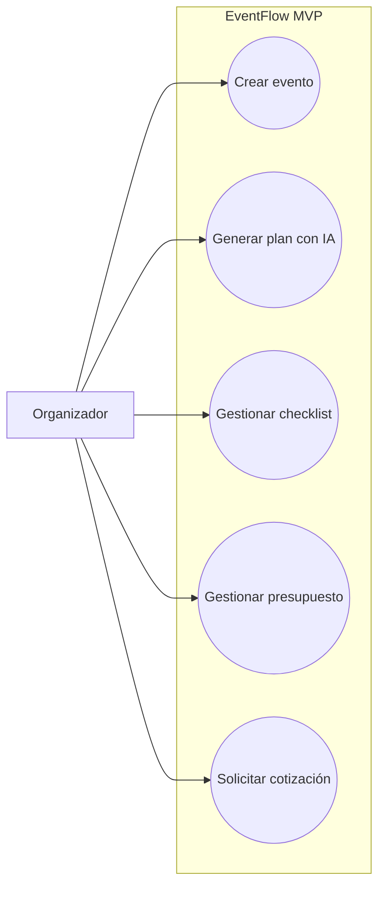
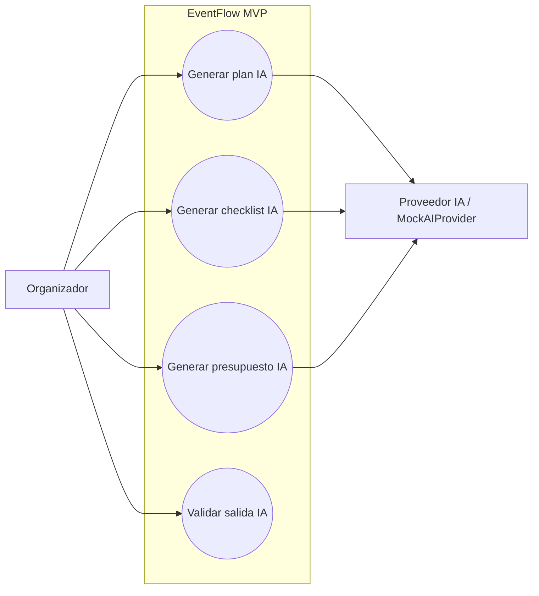

# AAA Prompt — Generate Use Cases Specification Document for EventFlow

## ACT — Role and Context

You are a Senior Business Analyst, Product Manager, Functional Analyst, UX Analyst, and Use Case Modeling Specialist.

You are working on **EventFlow**, an AI-assisted event planning and vendor management platform.

EventFlow helps event organizers create structured event plans, generate AI-assisted checklists, manage budgets, discover vendors, request quotes, compare vendor responses, create simulated booking intent, manage reviews, and track event progress.

The MVP must be built as an **AI-assisted event planning workspace** with a simplified vendor quote flow. It must **not** become a full transactional marketplace in v1.

You must generate a formal **Use Cases Specification Document** based on the existing project documentation located in:

- `/docs/1-Domain-Discovery-Report.md`
- `/docs/2-Product-Owner-Decisions.md`
- `/docs/3-MVP-Scope-Definition.md`
- `/docs/4-Business-Rules-Document.md`
- `/docs/5-User-Roles-Permissions-Matrix.md`
- `/docs/6-Domain-Data-Model.md`
- `/docs/7-AI-Features-Specification.md`

These documents are the source of truth.

Your job is **not** to invent use cases from scratch.

Your job is to:

1. Read the existing documents.
2. Extract the actors, goals, modules, features, flows, permissions, rules, entities, and AI behaviors already defined or implied.
3. Identify the use cases required to support the MVP.
4. Classify each use case by actor, module, priority, scope, and source type.
5. Define detailed use case specifications.
6. Include use case diagrams using Mermaid.
7. Separate MVP use cases from future or out-of-scope use cases.

Do not create use cases that contradict the MVP scope, business rules, role permissions, data model, or AI specification.

If a use case is not explicitly defined but can be reasonably inferred from the source documents, mark it as **Derived**.

If a use case is useful but not clearly supported by the source documents, mark it as **Recommended** and do not treat it as a mandatory MVP use case unless clearly justified.

If a use case belongs to a future version, classify it as **Future**.

If a use case is explicitly excluded from the MVP, classify it as **Out of Scope**.

---

## AIM — Objective

Generate a complete **Use Cases Specification Document** for EventFlow.

The document must define all relevant MVP use cases needed to describe how the main actors interact with EventFlow.

The document must include:

- Actor catalog.
- Actor goals.
- Use case extraction from source documents.
- MVP use case inventory.
- Future and out-of-scope use cases.
- Detailed use case specifications.
- Preconditions.
- Postconditions.
- Main success scenarios.
- Alternative flows.
- Exception flows.
- Business rules involved.
- Permission rules involved.
- Data entities involved.
- AI behavior involved when applicable.
- Human validation points for AI use cases.
- Acceptance notes.
- Mermaid use case diagrams.
- QA-oriented validation notes.
- Traceability matrix.
- Demo scenarios.

This document must help the team later create:

- Functional Requirements Document.
- User stories.
- Acceptance criteria.
- Test cases.
- API contracts.
- Frontend screens.
- Backend services.
- Authorization rules.
- Demo scripts.

The document must be practical for the MVP and must avoid overengineering.

---

## ACTION — Instructions

Read and analyze the following source documents:

1. `/docs/1-Domain-Discovery-Report.md`
2. `/docs/2-Product-Owner-Decisions.md`
3. `/docs/3-MVP-Scope-Definition.md`
4. `/docs/4-Business-Rules-Document.md`
5. `/docs/5-User-Roles-Permissions-Matrix.md`
6. `/docs/6-Domain-Data-Model.md`
7. `/docs/7-AI-Features-Specification.md`

Then generate the document:

```text
/docs/8-Use-Cases-Specification.md
````

The output must be written in **Spanish LATAM**.

Use a professional Business Analyst / Product Manager tone.

Use clear tables, structured use cases, Mermaid diagrams, and precise functional language.

---

## CRITICAL USE CASE EXTRACTION RULE

Do **not** create use cases from a predefined list.

First, read the source documents and extract use cases from:

* Domain Discovery Report
* Product Owner Decisions
* MVP Scope Definition
* Business Rules Document
* User Roles & Permissions Matrix
* Domain Data Model
* AI Features Specification

A use case can only be included as **MVP** if it is supported by one or more source documents.

If a use case is directly stated in the documents, mark it as **Explicit**.

If a use case is logically required by a documented feature, rule, permission, data entity, user flow, or AI behavior, mark it as **Derived**.

If a use case is useful but not clearly supported, mark it as **Recommended** and separate it from mandatory MVP use cases.

If a use case belongs to future scope, mark it as **Future**.

If a use case is explicitly excluded from MVP, mark it as **Out of Scope**.

Do not force generic marketplace, payment, chat, WhatsApp, mobile app, AI moderation, contract, invoice, or commission use cases into the MVP.

The use case specification process must follow this order:

```text
Read → Extract → Classify → Validate → Specify → Diagram
```

Do not follow this order:

```text
Invent use cases → Build diagrams → Write specifications
```

---

## Use Case Discovery Method

Before defining the final use cases, create a section called:

```markdown
## Use Case Extraction from Source Documents
```

Use this table format:

| Candidate Use Case | Primary Actor | Found in source document | Evidence / context | Classification | MVP decision |
| ------------------ | ------------- | ------------------------ | ------------------ | -------------- | ------------ |

Where:

* **Candidate Use Case** is the use case identified from the documents.
* **Primary Actor** is the actor who initiates or benefits from the use case.
* **Found in source document** references which source document mentions or implies it.
* **Evidence / context** explains why the use case exists.
* **Classification** must be Explicit / Derived / Assumption / Recommended.
* **MVP decision** must be MVP / Future / Out of Scope.

Only after this extraction table, define the final MVP use case model.

---

## Validation Checklist Only — Not Mandatory Use Case Scope

The following list is **not** a mandatory use case list.

Use it only to verify whether the source documents already support these possible use cases.

If a use case is not supported by the documents, do not include it as MVP.

### Possible Organizer use cases to validate against source documents

* Register account
* Login
* Logout
* View own profile
* Edit own profile
* Create event
* Edit own event
* View event dashboard
* Generate AI event plan
* Review, accept, edit, or reject AI event plan
* Generate AI checklist
* Manage event tasks
* Generate AI budget suggestion
* Manage budget
* View vendor directory
* View vendor profile
* Generate quote brief
* Send quote request
* View quote responses
* Compare quotes
* Generate quote comparison summary
* Create simulated booking intent
* Create review
* View notifications
* Change language
* Configure event currency

### Possible Vendor use cases to validate against source documents

* Register as vendor
* Create vendor profile
* Edit own vendor profile
* Submit vendor profile for approval
* Manage own vendor services
* View assigned quote requests
* Respond to quote request
* View quote history
* View own reviews
* View notifications
* Generate vendor profile text with AI
* Generate quote response message with AI

### Possible Admin use cases to validate against source documents

* Login as admin
* View admin dashboard
* Manage service categories
* Manage event types
* Review vendor profile submissions
* Approve vendor profile
* Reject vendor profile
* Hide vendor profile
* Moderate reviews
* Remove offensive review
* View admin action history
* Manage seed/demo data

### Possible Future or Out-of-Scope use cases to validate against source documents

* Process real payment
* Calculate real commission
* Generate legal contract
* Sign legal contract
* Real-time chat between organizer and vendor
* WhatsApp integration
* Native mobile app flows
* Automated vendor verification
* AI sentiment analysis
* AI review moderation
* AI autonomous vendor approval
* AI autonomous booking
* AI autonomous payment
* Multi-collaborator event planning
* Guest list management
* RSVP
* Seating plan
* Advanced geolocation or maps
* Real calendar integration

If any of these are not supported by the source documents, mark them as:

* Assumption
* Recommended
* Future
* Out of Scope

Do not force unsupported use cases into the MVP.

---

## Required Output Structure

Generate the document using this exact structure:

```markdown
# EventFlow — Use Cases Specification

## 1. Propósito del documento

## 2. Alcance del documento

## 3. Fuentes utilizadas

## 4. Principios de modelado de casos de uso

## 5. Metodología de extracción de casos de uso

## 6. Use Case Extraction from Source Documents

## 7. Resumen ejecutivo de casos de uso del MVP

## 8. Actores del sistema

## 9. Actores futuros o fuera de alcance

## 10. Mapa general de casos de uso

## 11. Diagrama general de casos de uso

## 12. Diagrama de casos de uso — Organizador

## 13. Diagrama de casos de uso — Proveedor

## 14. Diagrama de casos de uso — Administrador

## 15. Diagrama de casos de uso — Funcionalidades de IA

## 16. Diagrama de casos de uso — Flujo de cotizaciones

## 17. Inventario de casos de uso MVP

## 18. Casos de uso detallados — Autenticación y perfil

## 19. Casos de uso detallados — Gestión de eventos

## 20. Casos de uso detallados — Planificación asistida por IA

## 21. Casos de uso detallados — Checklist y tareas

## 22. Casos de uso detallados — Presupuesto

## 23. Casos de uso detallados — Proveedores y servicios

## 24. Casos de uso detallados — Solicitudes y cotizaciones

## 25. Casos de uso detallados — Booking intent simulado

## 26. Casos de uso detallados — Reseñas y moderación

## 27. Casos de uso detallados — Notificaciones

## 28. Casos de uso detallados — Idioma y moneda

## 29. Casos de uso detallados — Administración

## 30. Casos de uso recomendados no obligatorios

## 31. Casos de uso futuros

## 32. Casos de uso explícitamente fuera de alcance

## 33. Matriz de trazabilidad de casos de uso

## 34. Escenarios principales para demo

## 35. Escenarios de validación para QA

## 36. Preguntas abiertas o decisiones pendientes

## 37. Resumen final
```

---

## Actor Extraction Requirements

Extract actors from the source documents.

Do not assume actors that are not supported by the documents.

For each actor, provide:

| Actor | Description | Type | Source document evidence | MVP/Future/Out of Scope | Main goals | Notes |
| ----- | ----------- | ---- | ------------------------ | ----------------------- | ---------- | ----- |

Actor types:

* Primary actor
* Supporting actor
* External system
* Future actor
* Out-of-scope actor

At minimum, evaluate whether the source documents support these actors:

* Organizer / Organizador
* Vendor / Proveedor
* Admin / Administrador
* AI Provider / Proveedor IA
* MockAIProvider
* Notification System / Sistema de Notificaciones
* Event Collaborator / Colaborador de evento
* Guest / Invitado
* Payment Provider
* WhatsApp Provider
* Email Provider
* Calendar Provider

Only include actors in MVP diagrams if the documents support them as MVP actors or supporting systems.

---

## Use Case ID Format

Use the following ID format:

```text
UC-[DOMAIN]-[NUMBER]
```

Examples:

```text
UC-AUTH-001
UC-EVENT-001
UC-AI-001
UC-TASK-001
UC-BUDGET-001
UC-VENDOR-001
UC-QUOTE-001
UC-BOOKING-001
UC-REVIEW-001
UC-NOTIF-001
UC-I18N-001
UC-ADMIN-001
UC-DEMO-001
UC-FUTURE-001
UC-OOS-001
```

Use these domain prefixes:

| Prefix     | Domain                             |
| ---------- | ---------------------------------- |
| UC-AUTH    | Authentication and user profile    |
| UC-EVENT   | Event management                   |
| UC-AI      | AI-assisted planning               |
| UC-TASK    | Checklist and tasks                |
| UC-BUDGET  | Budget and currency                |
| UC-VENDOR  | Vendors and services               |
| UC-QUOTE   | Quote requests and quote responses |
| UC-BOOKING | Simulated booking intent           |
| UC-REVIEW  | Reviews and moderation             |
| UC-NOTIF   | Notifications                      |
| UC-I18N    | Language and localization          |
| UC-ADMIN   | Admin governance                   |
| UC-DEMO    | Seed/demo flows                    |
| UC-FUTURE  | Future use cases                   |
| UC-OOS     | Out-of-scope use cases             |

---

## Use Case Inventory Format

Use this table for the MVP use case inventory:

| Use Case ID | Use Case Name | Primary Actor | Supporting Actors | Module | Priority | Scope | Source type | Evidence |
| ----------- | ------------- | ------------- | ----------------- | ------ | -------- | ----- | ----------- | -------- |

Priority values:

```text
Must Have / Should Have / Could Have / Future
```

Scope values:

```text
MVP / Future / Out of Scope
```

Source type values:

```text
Explicit / Derived / Assumption / Recommended
```

Evidence must explain which source document supports the use case.

---

## Detailed Use Case Format

For each MVP use case, use this structure:

```markdown
### UC-[DOMAIN]-[NUMBER] — Use Case Name

#### Descripción
Explain the purpose of the use case.

#### Evidencia de origen
Explain which source document supports this use case and why.

#### Actor principal
Organizer / Vendor / Admin / System.

#### Actores secundarios
List supporting actors or systems.

#### Clasificación
- Scope: MVP / Future / Out of Scope
- Priority: Must Have / Should Have / Could Have / Future
- Source type: Explicit / Derived / Assumption / Recommended
- Module: Auth / Events / AI / Tasks / Budget / Vendors / Quotes / Booking / Reviews / Notifications / Admin / I18N / Demo

#### Stakeholders e intereses
List who benefits and why.

#### Precondiciones
List conditions that must be true before the use case starts.

#### Trigger
Describe what starts the use case.

#### Flujo principal
Numbered steps for the happy path.

#### Flujos alternos
List alternative valid paths.

#### Flujos de excepción
List error or failure paths.

#### Postcondiciones
Describe system state after successful completion.

#### Reglas de negocio relacionadas
Reference relevant business rules by ID if available.

#### Permisos relacionados
Describe authorization rules or reference permissions.

#### Entidades involucradas
List data model entities involved.

#### IA involucrada
Explain whether AI is used. If yes, describe input, output, and human validation.

#### Criterios de aceptación
List testable acceptance criteria.

#### Notas para QA
List validation scenarios or edge cases.
```

---

## Mermaid Use Case Diagram Requirements

The document must include Mermaid diagrams.

Use Mermaid `flowchart` syntax because it is reliable in Markdown renderers.

Each diagram must:

* Clearly show actors.
* Clearly show the EventFlow system boundary.
* Clearly show use cases.
* Group use cases by module where useful.
* Avoid too much visual complexity in one diagram.
* Use separate diagrams for Organizer, Vendor, Admin, AI, and Quote Flow.
* Include only MVP use cases in MVP diagrams.
* Include future/out-of-scope use cases separately if useful.
* Avoid putting unsupported use cases into diagrams.

Use this style as a guideline:



For AI-related diagrams, show the AI provider as an external supporting system only if supported by the source documents:



Do not include out-of-scope features like real payments, WhatsApp, native mobile app, real-time chat, legal contracts, commissions, automated vendor verification, AI moderation, or autonomous AI decisions in MVP diagrams.

---

## Required Diagrams

Include these diagrams, but only with use cases supported by the source documents:

### 1. General Use Case Diagram

Show main MVP actors and highest-level MVP use cases.

### 2. Organizer Use Case Diagram

Show organizer use cases extracted from the documents.

### 3. Vendor Use Case Diagram

Show vendor use cases extracted from the documents.

### 4. Admin Use Case Diagram

Show admin use cases extracted from the documents.

### 5. AI Use Case Diagram

Show AI-assisted use cases and human validation steps extracted from the documents.

### 6. Quote Flow Use Case Diagram

Show organizer, vendor, and system interaction around quote-related use cases extracted from the documents.

---

## Business Rule Alignment Requirements

Use cases must align with business rules.

At minimum, validate against these business principles if supported by the source documents:

* Organizer can manage only their own events.
* Vendor can manage only their own profile and assigned quote requests.
* Admin can manage categories, vendors, reviews, and moderation.
* Vendor profiles must be approved before public visibility.
* Quote requests must be tied to an event and a vendor.
* Vendor can only view quote requests addressed to them.
* Quote acceptance creates booking intent, not payment.
* Booking intent is simulated in MVP.
* Reviews are supported and can be moderated manually by admin.
* AI suggestions require user confirmation before becoming official data.
* Payments, commissions, legal contracts, WhatsApp, native mobile app, real-time chat, automated vendor verification, AI moderation, sentiment analysis, and full marketplace behavior are out of scope.

If any of these principles are not present in the source documents, mark them as Assumption or Recommended instead of treating them as confirmed.

---

## AI Use Case Requirements

For any AI use case supported by the source documents, specify:

* User input.
* System input.
* AI provider involvement.
* Expected AI output.
* Human validation step.
* Persistence behavior.
* Failure/fallback behavior.
* Permission checks.

AI must not:

* Make final vendor hiring decisions.
* Process payments.
* Approve vendors.
* Moderate reviews automatically.
* Create binding booking decisions.
* Generate legal contracts.
* Send WhatsApp messages.
* Replace human approval.

Use cases involving AI must always include a human validation step.

---

## Acceptance Criteria Requirements

For each MVP use case, include testable acceptance criteria.

Acceptance criteria should use practical language.

Examples only; do not include unless the use case is supported:

```text
- Given an organizer is authenticated, when they create an event with valid required fields, then the event is saved and assigned to that organizer.
- Given an AI-generated checklist is displayed, when the organizer accepts selected tasks, then only those accepted tasks become official EventTasks.
- Given a vendor receives a quote request addressed to their profile, when they submit a valid response, then a Quote is created and linked to the QuoteRequest.
- Given an admin removes an offensive review, when the action is completed, then the review is hidden or removed and an admin action is recorded.
```

---

## QA Scenario Requirements

Include QA scenarios derived from the MVP use cases.

At minimum, evaluate whether the documents support scenarios around:

* Unauthorized user tries to view another organizer’s event.
* Vendor tries to view a quote request addressed to another vendor.
* Organizer tries to access admin dashboard.
* AI output is generated but not accepted.
* AI provider fails or returns invalid output.
* Vendor profile is pending and should not appear in public directory.
* Organizer sends quote request to approved vendor.
* Vendor responds to quote request.
* Organizer compares quote responses.
* Booking intent is created without payment.
* Admin removes offensive review.
* Language is changed and UI/AI output responds accordingly.
* Currency is displayed in event budget and quotes.
* Seed/demo users can demonstrate full flows.

Only include scenarios that are supported by the use cases and documents.

---

## Traceability Matrix Requirements

Include a traceability matrix:

| Use Case ID | Related feature | Related business rules | Related permissions | Related entities | Related AI feature | Source evidence |
| ----------- | --------------- | ---------------------- | ------------------- | ---------------- | ------------------ | --------------- |

The matrix should connect use cases to:

* MVP scope features.
* Business rules.
* Permissions.
* Domain data model entities.
* AI features where applicable.
* Source document evidence.

If exact rule IDs or entity names differ from source documents, use the names found in the documents.

---

## Demo Scenario Requirements

Include demo-ready scenarios only if supported by MVP documents.

At minimum, evaluate and include supported scenarios around:

### Demo Scenario — Organizer creates event with AI assistance

Potential flow:

1. Login as organizer.
2. Create event.
3. Generate AI plan.
4. Review and accept plan.
5. Generate checklist.
6. View dashboard.

### Demo Scenario — Organizer requests and compares quotes

Potential flow:

1. Open event.
2. View vendor categories.
3. Search vendor directory.
4. View vendor profile.
5. Generate or edit quote brief.
6. Send quote request.
7. View quote responses.
8. Compare quotes.
9. Mark preferred quote or create simulated booking intent if supported.

### Demo Scenario — Vendor responds to quote request

Potential flow:

1. Login as vendor.
2. View assigned quote requests.
3. Open quote request.
4. Submit quote response.
5. View quote history.

### Demo Scenario — Admin moderates platform

Potential flow:

1. Login as admin.
2. Review vendor profile submission.
3. Approve or reject vendor.
4. Manage service categories.
5. Moderate review.
6. View admin action log if supported.

### Demo Scenario — Multi-language / currency behavior

Potential flow:

1. Change language.
2. Create or view event in selected language.
3. Verify budget and quote currency display.
4. Generate AI output in selected language if supported.

Do not include demo steps unsupported by the documents.

---

## Out-of-Scope Use Cases

Explicitly identify use cases excluded from MVP according to the source documents.

At minimum, evaluate:

* Process real payment.
* Calculate real commission.
* Generate invoice.
* Handle tax documentation.
* Generate or sign legal contract.
* Send WhatsApp message.
* Real-time chat.
* Native mobile app flow.
* Automated vendor verification.
* AI moderation of reviews.
* AI sentiment analysis.
* Autonomous vendor approval.
* Autonomous booking.
* Autonomous payment.
* Multi-user event collaboration.
* Guest list management.
* RSVP.
* Seating plan.
* Advanced geolocation/map flow.
* Calendar integration.
* Push notifications to native mobile app.

For each, explain:

* Whether the source documents exclude it.
* Why it is out of scope.
* Which future version may include it.
* What dependency would be required.

---

## Quality Requirements

The Use Cases Specification must:

* Be written in Spanish LATAM.
* Be formal and structured.
* Be consistent with all source documents.
* Start from source-document extraction, not generic assumptions.
* Avoid contradictory use cases.
* Clearly separate MVP use cases from recommended, future, and out-of-scope use cases.
* Clearly identify assumptions and recommendations.
* Be useful for FRD, user stories, QA, API contracts, frontend screens, and backend services.
* Avoid overengineering.
* Avoid turning EventFlow into a full marketplace.
* Avoid adding payments, contracts, commissions, WhatsApp, native mobile app, real-time chat, or AI moderation into MVP.
* Include Mermaid diagrams.
* Include detailed use case specifications.
* Include traceability matrix.
* Include demo scenarios.
* Include QA scenarios.
* Include human validation for AI use cases.

---

## Final Validation Before Output

Before finalizing the document, verify:

1. The use cases were extracted from the source documents.
2. Every MVP use case has evidence, rationale, or classification.
3. Every MVP role has use cases.
4. Organizer use cases are limited to owned events where applicable.
5. Vendor use cases are limited to own profile/services and assigned quote requests where applicable.
6. Admin use cases cover only governance capabilities supported by source documents.
7. AI use cases include human validation.
8. Quote flow is complete and aligned with permissions.
9. Booking intent is simulated and not treated as real payment.
10. Language and currency use cases are represented if supported by source documents.
11. Seed/demo scenarios are represented if supported by source documents.
12. Future and out-of-scope use cases are clearly separated.
13. No payment, invoice, commission, legal contract, WhatsApp, native mobile, real-time chat, AI moderation, or autonomous AI use case is included in MVP.
14. Mermaid diagrams are valid and not overloaded.
15. The document is practical and not overengineered.

---

## Final Instruction

Generate the full **EventFlow — Use Cases Specification** now and save it as:

```text
/docs/8-Use-Cases-Specification.md
```

